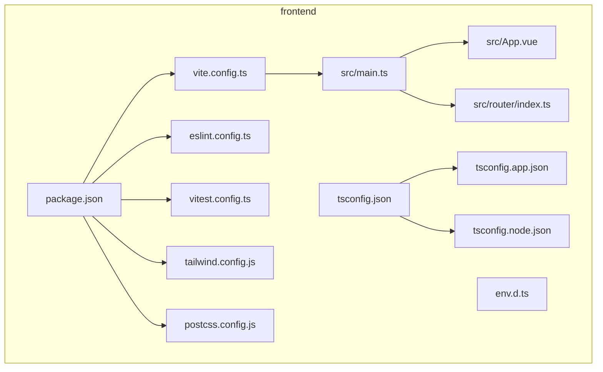
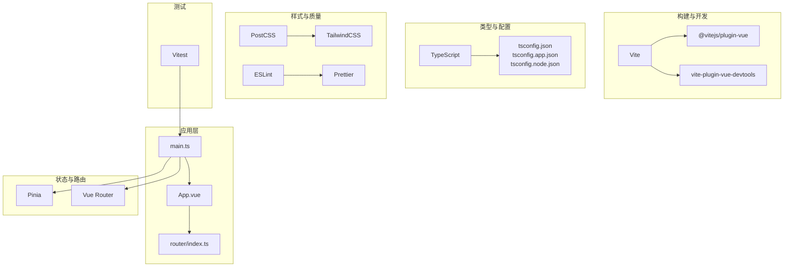
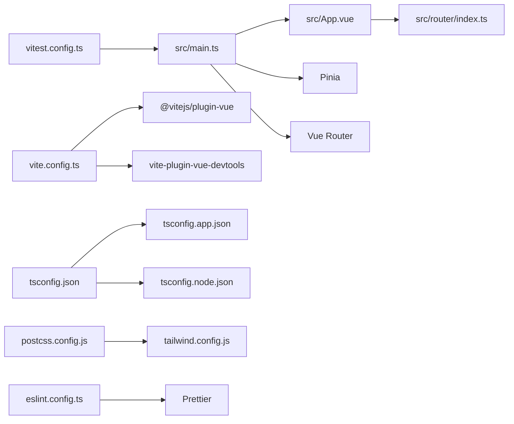

# 前端依赖安装

<cite>
**本文引用的文件**
- [frontend/package.json](file://frontend/package.json)
- [frontend/vite.config.ts](file://frontend/vite.config.ts)
- [frontend/src/main.ts](file://frontend/src/main.ts)
- [frontend/src/router/index.ts](file://frontend/src/router/index.ts)
- [frontend/src/App.vue](file://frontend/src/App.vue)
- [frontend/tsconfig.json](file://frontend/tsconfig.json)
- [frontend/tsconfig.app.json](file://frontend/tsconfig.app.json)
- [frontend/tsconfig.node.json](file://frontend/tsconfig.node.json)
- [frontend/tailwind.config.js](file://frontend/tailwind.config.js)
- [frontend/postcss.config.js](file://frontend/postcss.config.js)
- [frontend/eslint.config.ts](file://frontend/eslint.config.ts)
- [frontend/vitest.config.ts](file://frontend/vitest.config.ts)
- [frontend/env.d.ts](file://frontend/env.d.ts)
</cite>

## 目录
1. [简介](#简介)
2. [项目结构](#项目结构)
3. [核心组件](#核心组件)
4. [架构总览](#架构总览)
5. [详细组件分析](#详细组件分析)
6. [依赖关系分析](#依赖关系分析)
7. [性能与构建特性](#性能与构建特性)
8. [安装与环境要求](#安装与环境要求)
9. [常见问题排查](#常见问题排查)
10. [验证安装成功](#验证安装成功)
11. [结论](#结论)

## 简介
本指南面向前端开发者，提供在本仓库中安装与验证前端依赖的完整流程。重点包括：
- 使用 npm install 安装所有依赖
- 解释 package.json 中 dependencies 与 devDependencies 的区别
- 核心依赖（Vue 3、Pinia、Vue Router、Vite、TypeScript）的作用与定位
- Node.js 版本要求（engines 字段：^20.19.0 或 >=22.12.0）
- 常见安装失败问题的解决方案
- 验证安装成功的检查步骤（如运行 npm list vue）

## 项目结构
前端工程位于 frontend 目录，采用 Vite + Vue 3 + TypeScript 技术栈，并集成 Pinia、Vue Router、TailwindCSS、ESLint、Prettier、Vitest 等工具链。

图表来源
- [frontend/package.json](file://frontend/package.json#L1-L51)
- [frontend/vite.config.ts](file://frontend/vite.config.ts#L1-L19)
- [frontend/src/main.ts](file://frontend/src/main.ts#L1-L15)
- [frontend/src/router/index.ts](file://frontend/src/router/index.ts#L1-L24)
- [frontend/src/App.vue](file://frontend/src/App.vue#L1-L19)
- [frontend/tsconfig.json](file://frontend/tsconfig.json#L1-L15)
- [frontend/tsconfig.app.json](file://frontend/tsconfig.app.json#L1-L13)
- [frontend/tsconfig.node.json](file://frontend/tsconfig.node.json#L1-L20)
- [frontend/tailwind.config.js](file://frontend/tailwind.config.js#L1-L11)
- [frontend/postcss.config.js](file://frontend/postcss.config.js#L1-L6)
- [frontend/eslint.config.ts](file://frontend/eslint.config.ts#L1-L29)
- [frontend/vitest.config.ts](file://frontend/vitest.config.ts#L1-L15)
- [frontend/env.d.ts](file://frontend/env.d.ts#L1-L2)

章节来源
- [frontend/package.json](file://frontend/package.json#L1-L51)
- [frontend/vite.config.ts](file://frontend/vite.config.ts#L1-L19)
- [frontend/src/main.ts](file://frontend/src/main.ts#L1-L15)
- [frontend/src/router/index.ts](file://frontend/src/router/index.ts#L1-L24)
- [frontend/src/App.vue](file://frontend/src/App.vue#L1-L19)
- [frontend/tsconfig.json](file://frontend/tsconfig.json#L1-L15)
- [frontend/tsconfig.app.json](file://frontend/tsconfig.app.json#L1-L13)
- [frontend/tsconfig.node.json](file://frontend/tsconfig.node.json#L1-L20)
- [frontend/tailwind.config.js](file://frontend/tailwind.config.js#L1-L11)
- [frontend/postcss.config.js](file://frontend/postcss.config.js#L1-L6)
- [frontend/eslint.config.ts](file://frontend/eslint.config.ts#L1-L29)
- [frontend/vitest.config.ts](file://frontend/vitest.config.ts#L1-L15)
- [frontend/env.d.ts](file://frontend/env.d.ts#L1-L2)

## 核心组件
- 应用入口与状态管理
  - 在应用入口中创建并挂载 Vue 实例，注册 Pinia 与路由，随后挂载到 DOM。
  - 参考路径：[frontend/src/main.ts](file://frontend/src/main.ts#L1-L15)
- 路由配置
  - 使用 Vue Router 创建路由实例，配置首页与关于页，并启用历史模式。
  - 参考路径：[frontend/src/router/index.ts](file://frontend/src/router/index.ts#L1-L24)
- 视图容器
  - 应用根组件通过 RouterView 渲染当前路由视图。
  - 参考路径：[frontend/src/App.vue](file://frontend/src/App.vue#L1-L19)
- 构建与开发工具
  - Vite 提供开发服务器与打包能力；插件包括 @vitejs/plugin-vue 与 vite-plugin-vue-devtools。
  - 参考路径：[frontend/vite.config.ts](file://frontend/vite.config.ts#L1-L19)
- 类型系统与配置
  - tsconfig.json 作为多配置入口，分别引用 tsconfig.app.json 与 tsconfig.node.json。
  - tsconfig.app.json 配置 DOM 环境与路径别名。
  - tsconfig.node.json 配置 Node 工具链（Vite、Vitest 等）的编译选项。
  - 参考路径：
    - [frontend/tsconfig.json](file://frontend/tsconfig.json#L1-L15)
    - [frontend/tsconfig.app.json](file://frontend/tsconfig.app.json#L1-L13)
    - [frontend/tsconfig.node.json](file://frontend/tsconfig.node.json#L1-L20)
- CSS 工具链
  - TailwindCSS 与 Autoprefixer 通过 postcss.config.js 与 tailwind.config.js 集成。
  - 参考路径：
    - [frontend/tailwind.config.js](file://frontend/tailwind.config.js#L1-L11)
    - [frontend/postcss.config.js](file://frontend/postcss.config.js#L1-L6)
- 质量与测试
  - ESLint 与 Prettier 配置，以及 Vitest 单元测试配置。
  - 参考路径：
    - [frontend/eslint.config.ts](file://frontend/eslint.config.ts#L1-L29)
    - [frontend/vitest.config.ts](file://frontend/vitest.config.ts#L1-L15)
    - [frontend/env.d.ts](file://frontend/env.d.ts#L1-L2)

章节来源
- [frontend/src/main.ts](file://frontend/src/main.ts#L1-L15)
- [frontend/src/router/index.ts](file://frontend/src/router/index.ts#L1-L24)
- [frontend/src/App.vue](file://frontend/src/App.vue#L1-L19)
- [frontend/vite.config.ts](file://frontend/vite.config.ts#L1-L19)
- [frontend/tsconfig.json](file://frontend/tsconfig.json#L1-L15)
- [frontend/tsconfig.app.json](file://frontend/tsconfig.app.json#L1-L13)
- [frontend/tsconfig.node.json](file://frontend/tsconfig.node.json#L1-L20)
- [frontend/tailwind.config.js](file://frontend/tailwind.config.js#L1-L11)
- [frontend/postcss.config.js](file://frontend/postcss.config.js#L1-L6)
- [frontend/eslint.config.ts](file://frontend/eslint.config.ts#L1-L29)
- [frontend/vitest.config.ts](file://frontend/vitest.config.ts#L1-L15)
- [frontend/env.d.ts](file://frontend/env.d.ts#L1-L2)

## 架构总览
下图展示前端依赖与工具链之间的关系，以及它们如何支撑应用启动、开发与构建。

图表来源
- [frontend/src/App.vue](file://frontend/src/App.vue#L1-L19)
- [frontend/src/main.ts](file://frontend/src/main.ts#L1-L15)
- [frontend/src/router/index.ts](file://frontend/src/router/index.ts#L1-L24)
- [frontend/vite.config.ts](file://frontend/vite.config.ts#L1-L19)
- [frontend/tsconfig.json](file://frontend/tsconfig.json#L1-L15)
- [frontend/tsconfig.app.json](file://frontend/tsconfig.app.json#L1-L13)
- [frontend/tsconfig.node.json](file://frontend/tsconfig.node.json#L1-L20)
- [frontend/tailwind.config.js](file://frontend/tailwind.config.js#L1-L11)
- [frontend/postcss.config.js](file://frontend/postcss.config.js#L1-L6)
- [frontend/eslint.config.ts](file://frontend/eslint.config.ts#L1-L29)
- [frontend/vitest.config.ts](file://frontend/vitest.config.ts#L1-L15)

## 详细组件分析

### 依赖分类与作用
- dependencies（运行时依赖）
  - Vue 3：框架核心，提供响应式与组件化能力。
  - Pinia：轻量级状态管理库，用于集中管理应用状态。
  - Vue Router：官方路由库，支持历史模式与懒加载。
  - 参考路径：
    - [frontend/package.json](file://frontend/package.json#L19-L23)
    - [frontend/src/main.ts](file://frontend/src/main.ts#L1-L15)
    - [frontend/src/router/index.ts](file://frontend/src/router/index.ts#L1-L24)
- devDependencies（开发时依赖）
  - Vite：现代化构建工具与开发服务器。
  - TypeScript：类型系统与编译器。
  - @vitejs/plugin-vue：Vite 插件，支持 Vue SFC。
  - vite-plugin-vue-devtools：Vue DevTools 开发插件。
  - TailwindCSS、Autoprefixer：CSS 框架与自动前缀处理。
  - ESLint、@vue/eslint-config-typescript、@vue/eslint-config-prettier：代码规范与格式化。
  - Vitest、@vitejs/plugin-vue：单元测试与 Vue 支持。
  - vue-tsc：类型检查工具。
  - 参考路径：
    - [frontend/package.json](file://frontend/package.json#L24-L49)
    - [frontend/vite.config.ts](file://frontend/vite.config.ts#L1-L19)
    - [frontend/tailwind.config.js](file://frontend/tailwind.config.js#L1-L11)
    - [frontend/postcss.config.js](file://frontend/postcss.config.js#L1-L6)
    - [frontend/eslint.config.ts](file://frontend/eslint.config.ts#L1-L29)
    - [frontend/vitest.config.ts](file://frontend/vitest.config.ts#L1-L15)

章节来源
- [frontend/package.json](file://frontend/package.json#L19-L49)
- [frontend/vite.config.ts](file://frontend/vite.config.ts#L1-L19)
- [frontend/tailwind.config.js](file://frontend/tailwind.config.js#L1-L11)
- [frontend/postcss.config.js](file://frontend/postcss.config.js#L1-L6)
- [frontend/eslint.config.ts](file://frontend/eslint.config.ts#L1-L29)
- [frontend/vitest.config.ts](file://frontend/vitest.config.ts#L1-L15)

### 核心依赖作用与定位
- Vue 3
  - 作为应用框架，提供组件系统与响应式数据流。
  - 参考路径：[frontend/src/App.vue](file://frontend/src/App.vue#L1-L19)，[frontend/src/main.ts](file://frontend/src/main.ts#L1-L15)
- Pinia
  - 在应用入口注册并使用，提供全局状态管理。
  - 参考路径：[frontend/src/main.ts](file://frontend/src/main.ts#L1-L15)
- Vue Router
  - 路由定义与导航，支持历史模式与动态导入。
  - 参考路径：[frontend/src/router/index.ts](file://frontend/src/router/index.ts#L1-L24)
- Vite
  - 开发服务器与构建工具，配合 Vue 插件与 DevTools。
  - 参考路径：[frontend/vite.config.ts](file://frontend/vite.config.ts#L1-L19)
- TypeScript
  - 类型系统与编译配置，多 tsconfig 文件协同工作。
  - 参考路径：
    - [frontend/tsconfig.json](file://frontend/tsconfig.json#L1-L15)
    - [frontend/tsconfig.app.json](file://frontend/tsconfig.app.json#L1-L13)
    - [frontend/tsconfig.node.json](file://frontend/tsconfig.node.json#L1-L20)

章节来源
- [frontend/src/App.vue](file://frontend/src/App.vue#L1-L19)
- [frontend/src/main.ts](file://frontend/src/main.ts#L1-L15)
- [frontend/src/router/index.ts](file://frontend/src/router/index.ts#L1-L24)
- [frontend/vite.config.ts](file://frontend/vite.config.ts#L1-L19)
- [frontend/tsconfig.json](file://frontend/tsconfig.json#L1-L15)
- [frontend/tsconfig.app.json](file://frontend/tsconfig.app.json#L1-L13)
- [frontend/tsconfig.node.json](file://frontend/tsconfig.node.json#L1-L20)

## 依赖关系分析
- 运行时依赖链
  - main.ts 依赖 Vue、Pinia、Vue Router，最终挂载到 App.vue。
  - App.vue 通过 RouterView 渲染路由视图。
- 构建与开发链
  - vite.config.ts 引入 @vitejs/plugin-vue 与 vite-plugin-vue-devtools。
  - tsconfig.json 统一管理 tsconfig.app.json 与 tsconfig.node.json。
  - TailwindCSS 与 PostCSS 通过 postcss.config.js 与 tailwind.config.js 配置。
- 测试与质量链
  - Vitest 与 @vitejs/plugin-vue 共同支持单元测试。
  - ESLint 与 Prettier 保障代码风格与质量。

图表来源
- [frontend/src/main.ts](file://frontend/src/main.ts#L1-L15)
- [frontend/src/App.vue](file://frontend/src/App.vue#L1-L19)
- [frontend/src/router/index.ts](file://frontend/src/router/index.ts#L1-L24)
- [frontend/vite.config.ts](file://frontend/vite.config.ts#L1-L19)
- [frontend/tsconfig.json](file://frontend/tsconfig.json#L1-L15)
- [frontend/tsconfig.app.json](file://frontend/tsconfig.app.json#L1-L13)
- [frontend/tsconfig.node.json](file://frontend/tsconfig.node.json#L1-L20)
- [frontend/tailwind.config.js](file://frontend/tailwind.config.js#L1-L11)
- [frontend/postcss.config.js](file://frontend/postcss.config.js#L1-L6)
- [frontend/eslint.config.ts](file://frontend/eslint.config.ts#L1-L29)
- [frontend/vitest.config.ts](file://frontend/vitest.config.ts#L1-L15)

## 性能与构建特性
- Vite 作为构建工具，提供快速冷启动与热更新能力，适合现代前端开发体验。
- TypeScript 多配置分层（应用与 Node 工具链）有助于隔离不同环境的编译目标。
- TailwindCSS 与 PostCSS 配合，减少手写样式成本，提升开发效率。

章节来源
- [frontend/vite.config.ts](file://frontend/vite.config.ts#L1-L19)
- [frontend/tsconfig.json](file://frontend/tsconfig.json#L1-L15)
- [frontend/tailwind.config.js](file://frontend/tailwind.config.js#L1-L11)
- [frontend/postcss.config.js](file://frontend/postcss.config.js#L1-L6)

## 安装与环境要求

### Node.js 版本要求
- engines 字段要求 Node.js 版本为 ^20.19.0 或 >=22.12.0。
- 安装前请先确认本地 Node.js 版本满足该要求，否则可能导致安装或构建失败。

章节来源
- [frontend/package.json](file://frontend/package.json#L6-L8)

### 使用 npm install 安装依赖
- 在 frontend 目录执行 npm install，会根据 package.json 自动安装 dependencies 与 devDependencies。
- 安装完成后，可使用 npm list 查看已安装的依赖树，验证关键依赖是否正确安装。

章节来源
- [frontend/package.json](file://frontend/package.json#L19-L49)

### 依赖分类说明
- dependencies：应用运行时需要的依赖，生产构建与运行均需这些包。
- devDependencies：仅开发阶段需要的依赖，如构建工具、类型检查、测试与代码质量工具等。

章节来源
- [frontend/package.json](file://frontend/package.json#L19-L49)

### 关键依赖作用速览
- Vue 3：应用框架，提供组件与响应式能力。
- Pinia：状态管理。
- Vue Router：路由导航。
- Vite：开发服务器与打包工具。
- TypeScript：类型系统与编译。
- TailwindCSS/Autoprefixer：样式工具链。
- ESLint/Prettier：代码规范与格式化。
- Vitest：单元测试。

章节来源
- [frontend/package.json](file://frontend/package.json#L19-L49)
- [frontend/vite.config.ts](file://frontend/vite.config.ts#L1-L19)
- [frontend/src/main.ts](file://frontend/src/main.ts#L1-L15)
- [frontend/src/router/index.ts](file://frontend/src/router/index.ts#L1-L24)

## 常见问题排查

### 网络问题导致的包下载失败
- 现象：npm install 时部分包下载超时或失败。
- 排查与解决：
  - 切换为国内镜像源（如 cnpm、淘宝镜像）后重试安装。
  - 若仍失败，尝试清理缓存并重试安装。
  - 检查网络代理设置，必要时关闭代理后重试。

### 版本冲突
- 现象：安装过程中出现 peer dependency 冲突或版本不兼容。
- 排查与解决：
  - 优先使用项目提供的 engines 要求的 Node.js 版本。
  - 使用 npm ci 或锁定依赖版本的方式避免冲突。
  - 如确需升级某依赖，请同时评估其他相关依赖的兼容性。

### Node.js 版本不满足 engines 要求
- 现象：安装或构建时报错，提示 Node.js 版本不符合要求。
- 排查与解决：
  - 升级 Node.js 至满足 ^20.19.0 或 >=22.12.0 的版本。
  - 使用版本管理工具（如 nvm）切换到合适的 Node.js 版本后再安装。

### 构建或运行报错（TypeScript/Vite）
- 现象：构建或预览时报类型错误或 Vite 插件相关错误。
- 排查与解决：
  - 确认 TypeScript 与相关插件版本与项目配置一致。
  - 清理 node_modules 与缓存后重新安装。
  - 检查 tsconfig 与 vite 配置文件是否被修改，必要时恢复默认配置。

章节来源
- [frontend/package.json](file://frontend/package.json#L6-L8)
- [frontend/vite.config.ts](file://frontend/vite.config.ts#L1-L19)
- [frontend/tsconfig.json](file://frontend/tsconfig.json#L1-L15)

## 验证安装成功

### 基础验证
- 在 frontend 目录执行 npm list，查看已安装的依赖树，确认关键依赖存在且版本符合预期。
- 参考路径：[frontend/package.json](file://frontend/package.json#L19-L49)

### 运行时验证
- 启动开发服务器，确认应用能够正常渲染并访问路由页面。
- 参考路径：
  - [frontend/package.json](file://frontend/package.json#L9-L18)
  - [frontend/src/main.ts](file://frontend/src/main.ts#L1-L15)
  - [frontend/src/router/index.ts](file://frontend/src/router/index.ts#L1-L24)
  - [frontend/src/App.vue](file://frontend/src/App.vue#L1-L19)

### 类型检查验证
- 执行类型检查脚本，确保无类型错误。
- 参考路径：
  - [frontend/package.json](file://frontend/package.json#L9-L18)
  - [frontend/tsconfig.json](file://frontend/tsconfig.json#L1-L15)
  - [frontend/tsconfig.app.json](file://frontend/tsconfig.app.json#L1-L13)

### 构建验证
- 执行构建脚本，确认产物生成且无错误。
- 参考路径：
  - [frontend/package.json](file://frontend/package.json#L9-L18)
  - [frontend/vite.config.ts](file://frontend/vite.config.ts#L1-L19)

章节来源
- [frontend/package.json](file://frontend/package.json#L9-L18)
- [frontend/src/main.ts](file://frontend/src/main.ts#L1-L15)
- [frontend/src/router/index.ts](file://frontend/src/router/index.ts#L1-L24)
- [frontend/src/App.vue](file://frontend/src/App.vue#L1-L19)
- [frontend/tsconfig.json](file://frontend/tsconfig.json#L1-L15)
- [frontend/tsconfig.app.json](file://frontend/tsconfig.app.json#L1-L13)
- [frontend/vite.config.ts](file://frontend/vite.config.ts#L1-L19)

## 结论
本指南提供了在本仓库中安装与验证前端依赖的完整流程，明确了 dependencies 与 devDependencies 的差异，梳理了 Vue 3、Pinia、Vue Router、Vite、TypeScript 等核心依赖的作用，并给出了 Node.js 版本要求与常见问题的排查方法。建议在满足 engines 要求的前提下，按顺序执行安装与验证步骤，以确保开发环境稳定可靠。