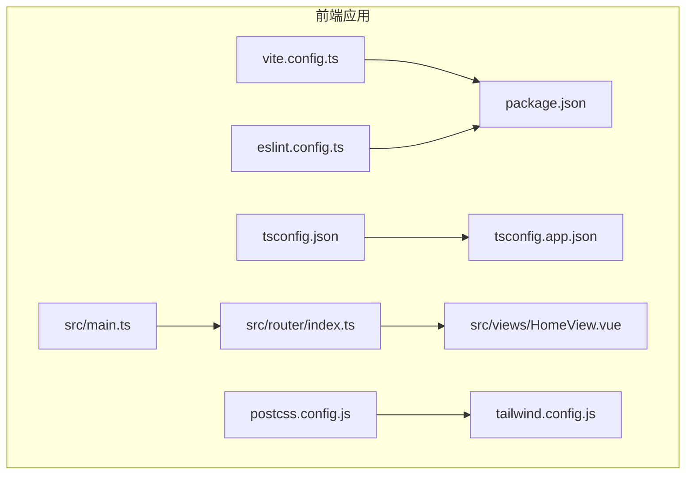
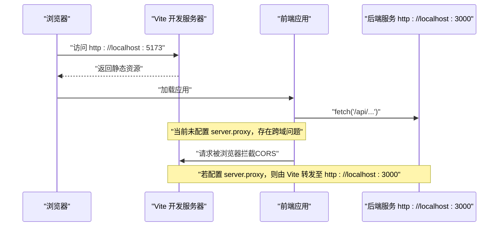
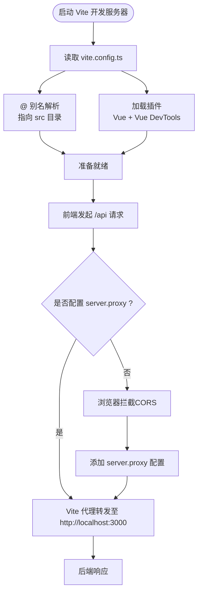
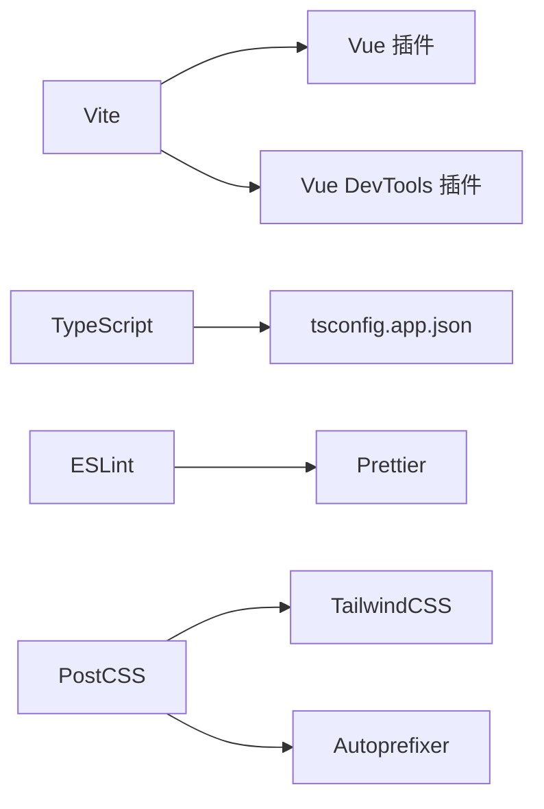

# 前端环境配置

<cite>
**本文引用的文件**
- [vite.config.ts](file://frontend/vite.config.ts)
- [package.json](file://frontend/package.json)
- [tsconfig.json](file://frontend/tsconfig.json)
- [tsconfig.app.json](file://frontend/tsconfig.app.json)
- [eslint.config.ts](file://frontend/eslint.config.ts)
- [postcss.config.js](file://frontend/postcss.config.js)
- [tailwind.config.js](file://frontend/tailwind.config.js)
- [src/main.ts](file://frontend/src/main.ts)
- [src/router/index.ts](file://frontend/src/router/index.ts)
- [src/views/HomeView.vue](file://frontend/src/views/HomeView.vue)
</cite>

## 目录
1. [简介](#简介)
2. [项目结构](#项目结构)
3. [核心组件](#核心组件)
4. [架构总览](#架构总览)
5. [详细组件分析](#详细组件分析)
6. [依赖关系分析](#依赖关系分析)
7. [性能考虑](#性能考虑)
8. [故障排查指南](#故障排查指南)
9. [结论](#结论)
10. [附录](#附录)

## 简介
本文件面向前端开发者，系统性说明前端开发环境的搭建与运行方式，重点围绕 Vite 开发服务器、依赖安装、构建流程、代码质量工具链，以及跨域代理配置。文档同时解释别名解析机制与当前配置中缺失的代理设置，并提供常见启动错误的排查建议，帮助快速定位与解决问题。

## 项目结构
前端工程位于 frontend 目录，采用 Vite + Vue 3 + TypeScript 技术栈，配合 TailwindCSS 与 Prettier/ESLint 组成现代化前端工作流。关键配置文件包括：
- 构建与开发：vite.config.ts、package.json
- 类型与路径：tsconfig.json、tsconfig.app.json
- 样式与工具：postcss.config.js、tailwind.config.js
- 质量工具：eslint.config.ts
- 应用入口：src/main.ts、src/router/index.ts
- 示例页面：src/views/HomeView.vue

图表来源
- [vite.config.ts](file://frontend/vite.config.ts#L1-L19)
- [package.json](file://frontend/package.json#L1-L51)
- [tsconfig.json](file://frontend/tsconfig.json#L1-L15)
- [tsconfig.app.json](file://frontend/tsconfig.app.json#L1-L13)
- [eslint.config.ts](file://frontend/eslint.config.ts#L1-L29)
- [postcss.config.js](file://frontend/postcss.config.js#L1-L6)
- [tailwind.config.js](file://frontend/tailwind.config.js#L1-L11)
- [src/main.ts](file://frontend/src/main.ts#L1-L15)
- [src/router/index.ts](file://frontend/src/router/index.ts#L1-L24)
- [src/views/HomeView.vue](file://frontend/src/views/HomeView.vue#L1-L232)

章节来源
- [vite.config.ts](file://frontend/vite.config.ts#L1-L19)
- [package.json](file://frontend/package.json#L1-L51)
- [tsconfig.json](file://frontend/tsconfig.json#L1-L15)
- [tsconfig.app.json](file://frontend/tsconfig.app.json#L1-L13)
- [eslint.config.ts](file://frontend/eslint.config.ts#L1-L29)
- [postcss.config.js](file://frontend/postcss.config.js#L1-L6)
- [tailwind.config.js](file://frontend/tailwind.config.js#L1-L11)
- [src/main.ts](file://frontend/src/main.ts#L1-L15)
- [src/router/index.ts](file://frontend/src/router/index.ts#L1-L24)
- [src/views/HomeView.vue](file://frontend/src/views/HomeView.vue#L1-L232)

## 核心组件
- Vite 配置与插件
  - 已启用 Vue 插件与 Vue DevTools 插件，支持单文件组件与开发调试增强。
  - 别名解析：将 @ 指向 src 目录，便于在代码中统一使用相对路径导入。
- 包脚本与构建流程
  - dev：启动 Vite 开发服务器，默认监听本地端口。
  - build：类型检查与打包构建。
  - preview：预览构建产物。
  - test:unit：单元测试。
  - type-check：类型检查。
  - lint：ESLint 扫描与修复。
  - format：Prettier 格式化。
- 类型与路径配置
  - tsconfig.json 通过 references 引入多份 tsconfig 文件，分别覆盖 node、app、vitest 环境。
  - tsconfig.app.json 在编译器选项中声明 @/* 映射，确保 IDE 与 tsc 行为一致。
- 样式与工具链
  - PostCSS 使用 TailwindCSS 与 Autoprefixer 插件，Tailwind 配置指定内容扫描范围。
- 质量工具链
  - ESLint Flat 配置启用 Vue 与 TypeScript 规则，并集成 Prettier 跳过格式化规则。

章节来源
- [vite.config.ts](file://frontend/vite.config.ts#L1-L19)
- [package.json](file://frontend/package.json#L1-L51)
- [tsconfig.json](file://frontend/tsconfig.json#L1-L15)
- [tsconfig.app.json](file://frontend/tsconfig.app.json#L1-L13)
- [postcss.config.js](file://frontend/postcss.config.js#L1-L6)
- [tailwind.config.js](file://frontend/tailwind.config.js#L1-L11)
- [eslint.config.ts](file://frontend/eslint.config.ts#L1-L29)

## 架构总览
下图展示从浏览器发起请求到后端 API 的典型调用链，以及当前配置中缺失的代理环节。

图表来源
- [vite.config.ts](file://frontend/vite.config.ts#L1-L19)
- [src/views/HomeView.vue](file://frontend/src/views/HomeView.vue#L1-L232)

## 详细组件分析

### Vite 配置与别名解析
- 插件加载
  - 启用 Vue 插件与 Vue DevTools 插件，满足开发调试与 SFC 支持。
- 别名解析
  - 通过 resolve.alias 将 @ 指向 src 目录，简化导入路径书写。
  - tsconfig.app.json 中同样声明 @/* 路径映射，保证 IDE 与 tsc 一致性。
- 代理配置（当前缺失）
  - 当前配置未包含 server.proxy，导致前端对 /api 的请求会触发浏览器 CORS 限制。
  - 需要手动在 vite.config.ts 中添加 server.proxy，将 /api 请求代理到 http://localhost:3000。

图表来源
- [vite.config.ts](file://frontend/vite.config.ts#L1-L19)
- [tsconfig.app.json](file://frontend/tsconfig.app.json#L1-L13)

章节来源
- [vite.config.ts](file://frontend/vite.config.ts#L1-L19)
- [tsconfig.app.json](file://frontend/tsconfig.app.json#L1-L13)

### 包脚本与构建流程
- 开发模式
  - npm run dev 启动 Vite 开发服务器，默认地址为 localhost:5173。
- 生产构建
  - npm run build 执行类型检查与打包构建，输出生产资源。
- 预览
  - npm run preview 预览构建产物，便于本地验证。
- 单元测试
  - npm run test:unit 运行 Vitest 测试。
- 类型检查
  - npm run type-check 仅执行类型检查。
- 代码质量
  - npm run lint 使用 ESLint 扫描并自动修复可修复问题。
  - npm run format 使用 Prettier 对 src 目录进行格式化。

章节来源
- [package.json](file://frontend/package.json#L1-L51)

### 类型与路径配置
- tsconfig.json 通过 references 引入 node/app/vitest 三套配置，分别用于不同运行时与测试场景。
- tsconfig.app.json 在 compilerOptions.paths 中声明 @/* -> ./src/*，确保路径解析与 IDE 提示一致。

章节来源
- [tsconfig.json](file://frontend/tsconfig.json#L1-L15)
- [tsconfig.app.json](file://frontend/tsconfig.app.json#L1-L13)

### 样式与工具链
- PostCSS 配置启用 TailwindCSS 与 Autoprefixer，Tailwind 配置指定内容扫描范围，确保按需生成样式。
- ESLint Flat 配置启用 Vue 与 TypeScript 推荐规则，并集成 Prettier 跳过格式化规则，避免冲突。

章节来源
- [postcss.config.js](file://frontend/postcss.config.js#L1-L6)
- [tailwind.config.js](file://frontend/tailwind.config.js#L1-L11)
- [eslint.config.ts](file://frontend/eslint.config.ts#L1-L29)

### 应用入口与路由
- 应用入口在 src/main.ts，创建 Vue 应用并挂载 Pinia 与路由。
- 路由在 src/router/index.ts，定义首页与关于页路由，其中关于页采用动态导入实现代码分割。

章节来源
- [src/main.ts](file://frontend/src/main.ts#L1-L15)
- [src/router/index.ts](file://frontend/src/router/index.ts#L1-L24)

### 示例页面与跨域问题
- HomeView.vue 中通过 fetch 访问 http://localhost:3000/api/v1 下的接口，若未配置代理，浏览器将因 CORS 被拦截。
- 解决方案：在 vite.config.ts 中添加 server.proxy，将 /api 请求转发至 http://localhost:3000。

章节来源
- [src/views/HomeView.vue](file://frontend/src/views/HomeView.vue#L1-L232)
- [vite.config.ts](file://frontend/vite.config.ts#L1-L19)

## 依赖关系分析
- Vite 作为核心构建与开发服务器，依赖 Vue 插件与 DevTools 插件。
- TypeScript 通过多份 tsconfig 文件分场景管理类型检查。
- ESLint 与 Prettier 共同维护代码风格与质量。
- PostCSS/Tailwind 与 Autoprefixer 负责样式处理与兼容性。

图表来源
- [vite.config.ts](file://frontend/vite.config.ts#L1-L19)
- [tsconfig.app.json](file://frontend/tsconfig.app.json#L1-L13)
- [eslint.config.ts](file://frontend/eslint.config.ts#L1-L29)
- [postcss.config.js](file://frontend/postcss.config.js#L1-L6)
- [tailwind.config.js](file://frontend/tailwind.config.js#L1-L11)

章节来源
- [vite.config.ts](file://frontend/vite.config.ts#L1-L19)
- [tsconfig.app.json](file://frontend/tsconfig.app.json#L1-L13)
- [eslint.config.ts](file://frontend/eslint.config.ts#L1-L29)
- [postcss.config.js](file://frontend/postcss.config.js#L1-L6)
- [tailwind.config.js](file://frontend/tailwind.config.js#L1-L11)

## 性能考虑
- 代码分割：路由层面对关于页采用动态导入，减少首屏体积。
- 路径别名：统一使用 @ 导入，提升可维护性与 IDE 效率。
- 代理优化：合理配置 server.proxy 可减少跨域带来的额外握手与错误重试成本。
- 样式按需：Tailwind 内容扫描仅针对实际使用的组件与模板，避免无用样式。

## 故障排查指南
- 启动失败（端口占用）
  - 现象：启动时报端口冲突或无法绑定。
  - 处理：修改 vite.config.ts 中的 port 或关闭占用进程。
  - 参考：[vite.config.ts](file://frontend/vite.config.ts#L1-L19)
- 跨域错误（CORS）
  - 现象：浏览器控制台出现跨域拦截，请求失败。
  - 原因：未配置 server.proxy，/api 请求被浏览器拦截。
  - 处理：在 vite.config.ts 中添加 server.proxy，将 /api 转发至 http://localhost:3000。
  - 参考：[vite.config.ts](file://frontend/vite.config.ts#L1-L19)，[src/views/HomeView.vue](file://frontend/src/views/HomeView.vue#L1-L232)
- 类型检查失败
  - 现象：npm run type-check 报错。
  - 处理：根据报错修正类型；必要时清理缓存后重试。
  - 参考：[package.json](file://frontend/package.json#L1-L51)，[tsconfig.app.json](file://frontend/tsconfig.app.json#L1-L13)
- ESLint 报错
  - 现象：npm run lint 报错。
  - 处理：根据提示修复；如需自动修复，再次运行 lint。
  - 参考：[eslint.config.ts](file://frontend/eslint.config.ts#L1-L29)，[package.json](file://frontend/package.json#L1-L51)
- Prettier 格式化未生效
  - 现象：npm run format 未改变文件。
  - 处理：确认 src 目录存在且权限正常；重新运行。
  - 参考：[package.json](file://frontend/package.json#L1-L51)
- 路由历史模式问题
  - 现象：刷新页面 404。
  - 处理：确认后端或 Vite 预览已正确配置回退路由；或切换为 hash 模式。
  - 参考：[src/router/index.ts](file://frontend/src/router/index.ts#L1-L24)

## 结论
本前端工程已具备完善的开发与构建基础：Vite + Vue + TypeScript + TailwindCSS + ESLint/Prettier。当前配置的关键缺失在于缺少 server.proxy，导致 /api 请求产生跨域问题。按照本文指引补充代理配置后，即可顺畅联调后端接口。同时，建议团队在日常开发中规范使用别名 @、统一格式化与类型检查，以提升协作效率与代码质量。

## 附录
- 快速操作清单
  - 安装依赖：npm install
  - 启动开发：npm run dev（默认 localhost:5173）
  - 生成构建：npm run build
  - 预览构建：npm run preview
  - 代码检查：npm run lint
  - 格式化：npm run format
- 代理配置要点
  - 在 vite.config.ts 中添加 server.proxy，将 /api 前缀转发至 http://localhost:3000。
  - 重启开发服务器使配置生效。
- 路径别名使用
  - 代码中统一使用 @/xxx 导入，IDE 与 tsc 将按 tsconfig.app.json 的 @/* 映射解析。