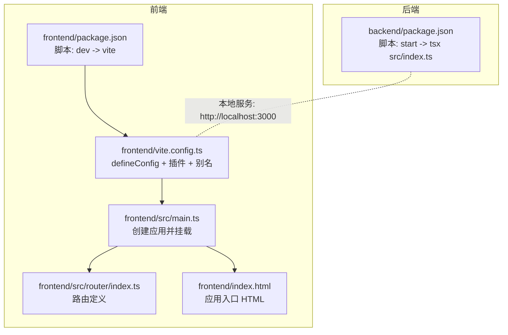
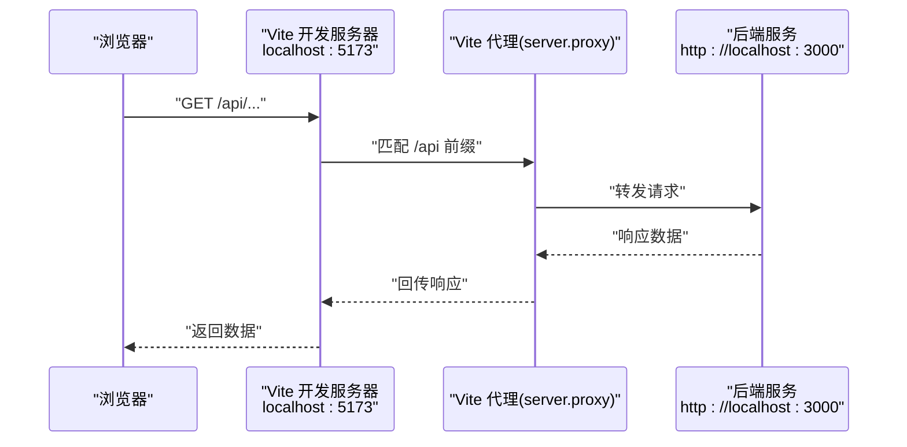
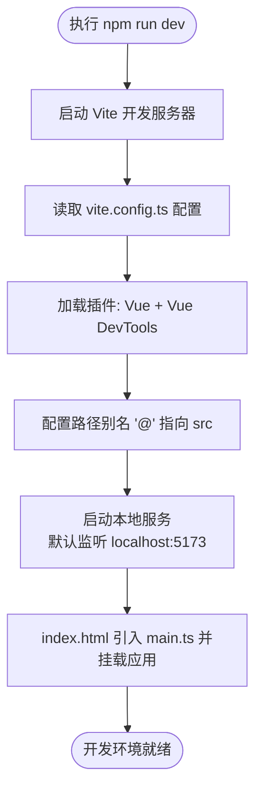

# 开发服务器启动

<cite>
**本文引用的文件**
- [frontend/vite.config.ts](file://frontend/vite.config.ts)
- [frontend/package.json](file://frontend/package.json)
- [frontend/src/main.ts](file://frontend/src/main.ts)
- [frontend/src/router/index.ts](file://frontend/src/router/index.ts)
- [frontend/index.html](file://frontend/index.html)
- [backend/package.json](file://backend/package.json)
</cite>

## 目录
1. [简介](#简介)
2. [项目结构](#项目结构)
3. [核心组件](#核心组件)
4. [架构总览](#架构总览)
5. [详细组件分析](#详细组件分析)
6. [依赖分析](#依赖分析)
7. [性能考虑](#性能考虑)
8. [故障排查指南](#故障排查指南)
9. [结论](#结论)

## 简介
本文件面向前端开发者，提供通过 npm 脚本启动 Vite 开发服务器的完整说明。默认情况下，Vite 将在本地启动开发服务器并监听 localhost:5173。本文还将深入解析 vite.config.ts 中 defineConfig 的配置结构，包括 Vue 插件与 Vue DevTools 插件的加载方式；说明 resolve.alias 中“@”指向 src 目录的路径别名机制及其对模块引用效率的提升；并重点指出当前配置缺少 server.proxy 设置，需要手动添加代理规则以将 /api 请求转发至后端 Express 服务（http://localhost:3000），从而避免跨域问题。最后给出修改后的配置要点与重启服务的必要性说明。

## 项目结构
前端采用 Vite + Vue 3 技术栈，入口脚本、路由与应用挂载位于前端目录；后端使用 Express 提供 API 服务。开发时，前端通过 Vite 启动本地开发服务器，后端通过独立脚本启动本地服务。两者通过本地代理实现同源请求，避免浏览器跨域限制。

图表来源
- [frontend/package.json](file://frontend/package.json#L1-L51)
- [frontend/vite.config.ts](file://frontend/vite.config.ts#L1-L19)
- [frontend/src/main.ts](file://frontend/src/main.ts#L1-L15)
- [frontend/src/router/index.ts](file://frontend/src/router/index.ts#L1-L24)
- [frontend/index.html](file://frontend/index.html#L1-L13)
- [backend/package.json](file://backend/package.json#L1-L30)

章节来源
- [frontend/package.json](file://frontend/package.json#L1-L51)
- [frontend/vite.config.ts](file://frontend/vite.config.ts#L1-L19)
- [frontend/src/main.ts](file://frontend/src/main.ts#L1-L15)
- [frontend/src/router/index.ts](file://frontend/src/router/index.ts#L1-L24)
- [frontend/index.html](file://frontend/index.html#L1-L13)
- [backend/package.json](file://backend/package.json#L1-L30)

## 核心组件
- 开发服务器启动：通过前端 package.json 中的 dev 脚本调用 vite 命令启动开发服务器，默认监听本地端口。
- 配置文件：vite.config.ts 使用 defineConfig 定义插件与路径别名，确保开发体验与模块导入效率。
- 应用入口：index.html 引入 main.ts，main.ts 创建并挂载 Vue 应用，注册 Pinia 与路由。
- 路由与视图：router/index.ts 定义页面路由，HomeView/AboutView 等视图组件按需加载。
- 后端服务：backend/package.json 提供本地启动脚本，用于提供 API 服务（http://localhost:3000）。

章节来源
- [frontend/package.json](file://frontend/package.json#L1-L51)
- [frontend/vite.config.ts](file://frontend/vite.config.ts#L1-L19)
- [frontend/src/main.ts](file://frontend/src/main.ts#L1-L15)
- [frontend/src/router/index.ts](file://frontend/src/router/index.ts#L1-L24)
- [frontend/index.html](file://frontend/index.html#L1-L13)
- [backend/package.json](file://backend/package.json#L1-L30)

## 架构总览
下图展示了从前端开发服务器到后端 API 的典型交互流程。前端通过 Vite 本地开发服务器提供静态资源与热更新能力；当业务请求命中 /api 前缀时，应经由代理转发至后端服务，从而避免浏览器跨域限制。

图表来源
- [frontend/vite.config.ts](file://frontend/vite.config.ts#L1-L19)
- [backend/package.json](file://backend/package.json#L1-L30)

## 详细组件分析

### 开发服务器启动流程
- 启动命令：在前端目录执行 npm run dev，该脚本会调用 Vite 开发服务器。
- 默认监听：Vite 开发服务器默认监听本地地址与端口，便于本地联调。
- 入口文件：index.html 引入 /src/main.ts，main.ts 创建 Vue 应用并挂载到 DOM。
- 路由初始化：main.ts 注册路由与状态管理，随后挂载应用。

图表来源
- [frontend/package.json](file://frontend/package.json#L1-L51)
- [frontend/vite.config.ts](file://frontend/vite.config.ts#L1-L19)
- [frontend/index.html](file://frontend/index.html#L1-L13)
- [frontend/src/main.ts](file://frontend/src/main.ts#L1-L15)

章节来源
- [frontend/package.json](file://frontend/package.json#L1-L51)
- [frontend/index.html](file://frontend/index.html#L1-L13)
- [frontend/src/main.ts](file://frontend/src/main.ts#L1-L15)

### vite.config.ts 中 defineConfig 的配置结构
- defineConfig：作为 Vite 配置的统一入口，集中声明插件、构建选项与开发服务器行为。
- 插件加载：
  - Vue 插件：为 Vue SFC 提供编译与热更新支持。
  - Vue DevTools 插件：在开发阶段集成 Vue DevTools 能力，便于调试。
- 路径别名：
  - resolve.alias 中的“@”映射到 src 目录，简化模块导入路径，提升可读性与维护性。
- 当前配置未包含 server.proxy，需补充代理规则以转发 /api 请求至后端服务。

章节来源
- [frontend/vite.config.ts](file://frontend/vite.config.ts#L1-L19)

### resolve.alias 中“@”指向 src 的路径别名机制
- 目的：通过“@”作为 src 的简写，减少相对路径书写，提高模块引用效率与一致性。
- 影响：在组件、工具函数、类型定义等多处导入时，可直接使用“@/xxx”，降低路径层级复杂度。
- 效果：缩短导入路径长度，减少拼写错误，提升团队协作效率。

章节来源
- [frontend/vite.config.ts](file://frontend/vite.config.ts#L1-L19)

### 代理配置缺失与跨域问题
- 现状：当前 vite.config.ts 缺少 server.proxy 设置，导致前端对 /api 的请求会直接访问开发服务器，而非后端服务。
- 风险：浏览器同源策略会阻止跨域请求，导致接口调用失败。
- 解决方案：在 vite.config.ts 中添加 server.proxy，将 /api 前缀请求转发至后端服务地址（http://localhost:3000）。
- 重启必要性：修改配置后需重启开发服务器，使新代理规则生效。

章节来源
- [frontend/vite.config.ts](file://frontend/vite.config.ts#L1-L19)
- [backend/package.json](file://backend/package.json#L1-L30)

### 修改后的配置示例与说明
- 在 vite.config.ts 中新增 server.proxy 配置，将 /api 前缀请求转发至 http://localhost:3000。
- 重启开发服务器：修改配置后必须重启，以便加载新的代理规则。
- 注意事项：
  - 代理仅影响开发环境，生产构建不会包含该配置。
  - 如后端服务端口或域名变更，请同步更新代理目标地址。

章节来源
- [frontend/vite.config.ts](file://frontend/vite.config.ts#L1-L19)
- [backend/package.json](file://backend/package.json#L1-L30)

## 依赖分析
- 前端依赖：
  - Vite：开发服务器与构建工具。
  - @vitejs/plugin-vue：Vue SFC 支持。
  - vite-plugin-vue-devtools：Vue DevTools 集成。
  - Vue 生态：Vue、Vue Router、Pinia。
- 后端依赖：
  - Express：提供本地 API 服务。
  - Prisma：数据库 ORM。
  - sqlite3：SQLite 驱动。
  - ts-node：TS 运行时支持。

图表来源
- [frontend/vite.config.ts](file://frontend/vite.config.ts#L1-L19)
- [backend/package.json](file://backend/package.json#L1-L30)

章节来源
- [frontend/package.json](file://frontend/package.json#L1-L51)
- [backend/package.json](file://backend/package.json#L1-L30)

## 性能考虑
- 使用路径别名“@”可减少深层相对路径的书写，间接降低模块解析成本与拼写开销。
- 合理拆分路由组件与按需加载，有助于减小首屏体积与提升首屏渲染速度。
- 代理仅在开发环境启用，生产构建不包含代理逻辑，避免额外网络往返。

## 故障排查指南
- 无法访问 /api 接口
  - 现象：浏览器控制台出现跨域错误或请求被拦截。
  - 排查：确认 vite.config.ts 已添加 server.proxy，将 /api 转发至 http://localhost:3000。
  - 处理：添加代理配置并重启开发服务器。
- 代理未生效
  - 现象：修改配置后仍无法转发。
  - 排查：确认已完全重启开发服务器；检查代理规则是否覆盖 /api 前缀。
- 后端服务未启动
  - 现象：代理转发失败。
  - 排查：在 backend 目录执行后端启动脚本，确保服务监听在 http://localhost:3000。

章节来源
- [frontend/vite.config.ts](file://frontend/vite.config.ts#L1-L19)
- [backend/package.json](file://backend/package.json#L1-L30)

## 结论
通过 npm run dev 启动 Vite 开发服务器即可进入本地开发环境。当前配置已正确加载 Vue 与 Vue DevTools 插件，并设置了“@”到 src 的路径别名。为避免跨域问题，需在 vite.config.ts 中补充 server.proxy，将 /api 请求转发至后端服务（http://localhost:3000）。完成配置修改后请务必重启开发服务器，以确保代理规则生效。此改动将显著改善前后端联调体验，减少跨域带来的调试障碍。