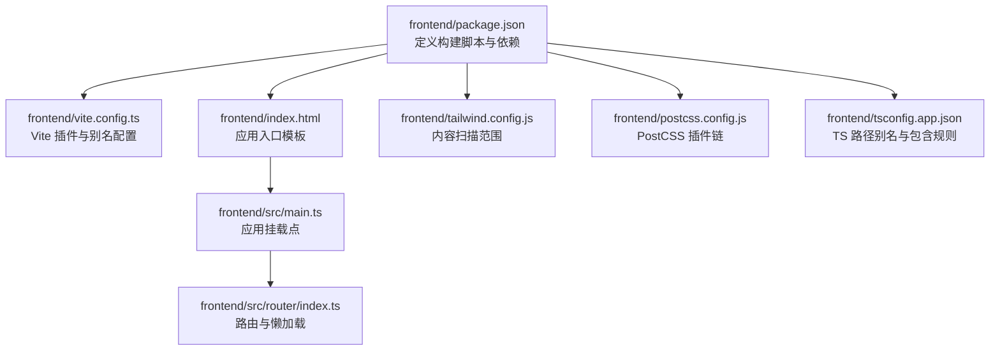
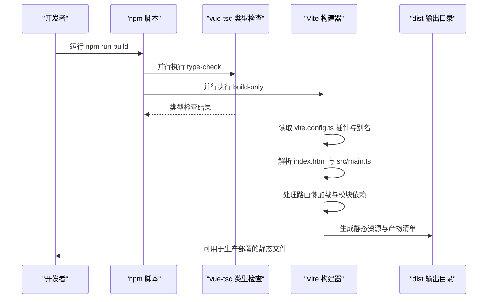
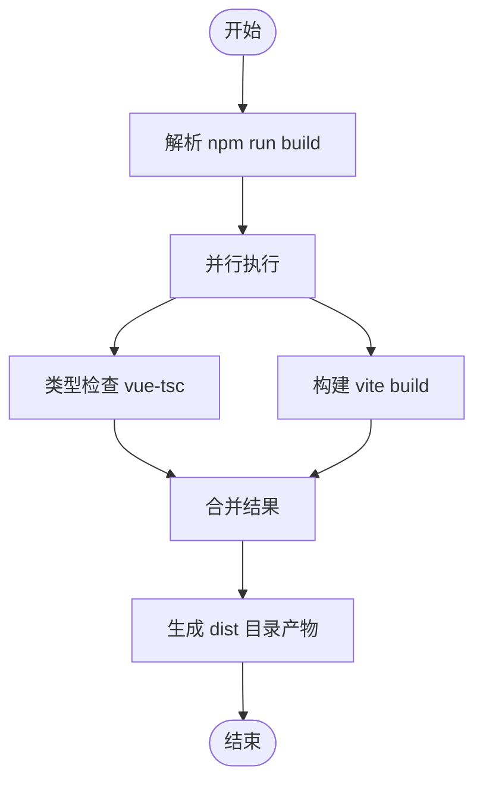
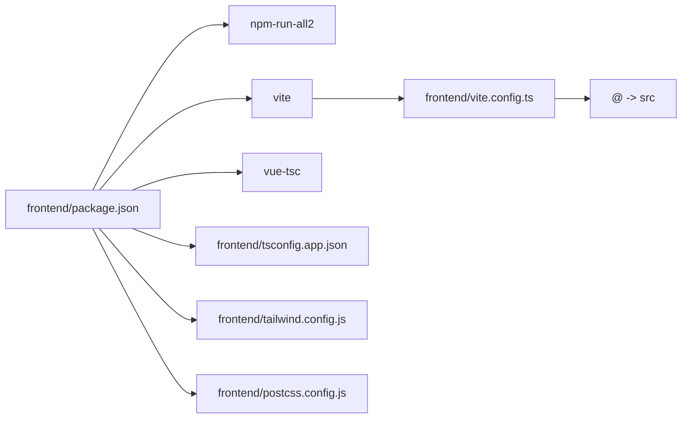

# 构建与生产部署

<cite>
**本文引用的文件**
- [frontend/package.json](file://frontend/package.json)
- [frontend/vite.config.ts](file://frontend/vite.config.ts)
- [frontend/index.html](file://frontend/index.html)
- [frontend/src/main.ts](file://frontend/src/main.ts)
- [frontend/src/router/index.ts](file://frontend/src/router/index.ts)
- [frontend/tailwind.config.js](file://frontend/tailwind.config.js)
- [frontend/postcss.config.js](file://frontend/postcss.config.js)
- [frontend/tsconfig.app.json](file://frontend/tsconfig.app.json)
- [frontend/README.md](file://frontend/README.md)
</cite>

## 目录
1. [简介](#简介)
2. [项目结构](#项目结构)
3. [核心组件](#核心组件)
4. [架构总览](#架构总览)
5. [详细组件分析](#详细组件分析)
6. [依赖分析](#依赖分析)
7. [性能考量](#性能考量)
8. [故障排查指南](#故障排查指南)
9. [结论](#结论)
10. [附录](#附录)

## 简介
本指南面向前端开发者，围绕使用 npm run build 命令生成生产环境优化的静态资源展开，重点说明：
- 默认输出目录为 dist 的构建行为
- package.json 中 build、build-only、type-check 脚本的执行顺序与依赖关系
- Vite 在构建过程中对代码的压缩、Tree Shaking 和资源优化机制
- 生产部署时的静态文件服务配置建议（Nginx 或 Node.js 静态服务器）
- 部署前的验证步骤与资源路径检查要点

## 项目结构
前端工程位于 frontend 目录，采用 Vue 3 + TypeScript + Vite 技术栈，配合 Tailwind CSS 与 PostCSS 进行样式处理。关键配置文件包括：
- 构建与开发脚本：frontend/package.json
- Vite 配置：frontend/vite.config.ts
- 入口 HTML：frontend/index.html
- 应用入口：frontend/src/main.ts
- 路由配置：frontend/src/router/index.ts
- 样式工具链：frontend/tailwind.config.js、frontend/postcss.config.js
- 类型配置：frontend/tsconfig.app.json

图表来源
- [frontend/package.json](file://frontend/package.json#L1-L51)
- [frontend/vite.config.ts](file://frontend/vite.config.ts#L1-L19)
- [frontend/index.html](file://frontend/index.html#L1-L14)
- [frontend/src/main.ts](file://frontend/src/main.ts#L1-L15)
- [frontend/src/router/index.ts](file://frontend/src/router/index.ts#L1-L24)
- [frontend/tailwind.config.js](file://frontend/tailwind.config.js#L1-L11)
- [frontend/postcss.config.js](file://frontend/postcss.config.js#L1-L6)
- [frontend/tsconfig.app.json](file://frontend/tsconfig.app.json#L1-L13)

章节来源
- [frontend/package.json](file://frontend/package.json#L1-L51)
- [frontend/vite.config.ts](file://frontend/vite.config.ts#L1-L19)
- [frontend/index.html](file://frontend/index.html#L1-L14)
- [frontend/src/main.ts](file://frontend/src/main.ts#L1-L15)
- [frontend/src/router/index.ts](file://frontend/src/router/index.ts#L1-L24)
- [frontend/tailwind.config.js](file://frontend/tailwind.config.js#L1-L11)
- [frontend/postcss.config.js](file://frontend/postcss.config.js#L1-L6)
- [frontend/tsconfig.app.json](file://frontend/tsconfig.app.json#L1-L13)

## 核心组件
- 构建脚本与依赖
  - build：并行执行类型检查与构建，确保先通过类型检查再进行打包
  - build-only：调用 Vite 执行实际打包
  - type-check：使用 vue-tsc 进行类型检查
- Vite 配置
  - 插件：@vitejs/plugin-vue、vite-plugin-vue-devtools
  - 路径别名：@ 指向 src
- 入口与路由
  - index.html 引入 /src/main.ts
  - main.ts 创建应用并挂载到 #app
  - 路由使用 history 模式，且基于 import.meta.env.BASE_URL
- 样式工具链
  - Tailwind CSS 内容扫描范围包含 index.html 与 src 下的各类文件
  - PostCSS 通过 tailwindcss 与 autoprefixer 处理

章节来源
- [frontend/package.json](file://frontend/package.json#L9-L18)
- [frontend/vite.config.ts](file://frontend/vite.config.ts#L1-L19)
- [frontend/index.html](file://frontend/index.html#L1-L14)
- [frontend/src/main.ts](file://frontend/src/main.ts#L1-L15)
- [frontend/src/router/index.ts](file://frontend/src/router/index.ts#L1-L24)
- [frontend/tailwind.config.js](file://frontend/tailwind.config.js#L1-L11)
- [frontend/postcss.config.js](file://frontend/postcss.config.js#L1-L6)
- [frontend/tsconfig.app.json](file://frontend/tsconfig.app.json#L1-L13)

## 架构总览
下图展示从 npm run build 到产出 dist 的整体流程，以及关键配置对构建的影响。

图表来源
- [frontend/package.json](file://frontend/package.json#L9-L18)
- [frontend/vite.config.ts](file://frontend/vite.config.ts#L1-L19)
- [frontend/index.html](file://frontend/index.html#L1-L14)
- [frontend/src/main.ts](file://frontend/src/main.ts#L1-L15)
- [frontend/src/router/index.ts](file://frontend/src/router/index.ts#L1-L24)

## 详细组件分析

### 构建脚本与执行流程
- build
  - 作用：并行执行类型检查与构建，保证先通过类型校验再打包
  - 依赖：npm-run-all2 提供并行执行能力；@ 作为占位符传递给 build-only
- build-only
  - 作用：调用 Vite 执行打包
  - 位置：frontend/package.json 中定义
- type-check
  - 作用：使用 vue-tsc 对项目进行类型检查
  - 位置：frontend/package.json 中定义

图表来源
- [frontend/package.json](file://frontend/package.json#L9-L18)

章节来源
- [frontend/package.json](file://frontend/package.json#L9-L18)

### Vite 配置与别名
- 插件
  - @vitejs/plugin-vue：支持 .vue 单文件组件
  - vite-plugin-vue-devtools：开发期调试工具
- 路径别名
  - @ 指向 src，便于在代码中使用相对路径导入

章节来源
- [frontend/vite.config.ts](file://frontend/vite.config.ts#L1-L19)
- [frontend/tsconfig.app.json](file://frontend/tsconfig.app.json#L1-L13)

### 入口与路由
- index.html
  - 通过 script type="module" 引入 /src/main.ts
  - 作为应用的根节点，提供 #app 容器
- main.ts
  - 创建应用实例，注册 Pinia 与路由
  - 将应用挂载到 #app
- 路由
  - 使用 history 模式，基于 import.meta.env.BASE_URL
  - About 页面采用懒加载，按需生成独立 chunk

章节来源
- [frontend/index.html](file://frontend/index.html#L1-L14)
- [frontend/src/main.ts](file://frontend/src/main.ts#L1-L15)
- [frontend/src/router/index.ts](file://frontend/src/router/index.ts#L1-L24)

### 样式工具链
- Tailwind CSS
  - content 扫描范围包含 index.html 与 src 下的各类文件，确保未使用的样式被移除
- PostCSS
  - 通过 tailwindcss 与 autoprefixer 自动处理样式

章节来源
- [frontend/tailwind.config.js](file://frontend/tailwind.config.js#L1-L11)
- [frontend/postcss.config.js](file://frontend/postcss.config.js#L1-L6)

### 构建产物与默认输出
- 默认输出目录
  - Vite 默认输出目录为 dist（遵循 Vite 约定）
- 验证方式
  - 可通过本地预览或直接打开 dist 下的 index.html 进行验证

章节来源
- [frontend/README.md](file://frontend/README.md#L38-L43)

## 依赖分析
- 脚本依赖
  - build 依赖 npm-run-all2 实现并行执行
  - build-only 依赖 Vite
  - type-check 依赖 vue-tsc
- 配置依赖
  - vite.config.ts 决定插件与别名
  - tsconfig.app.json 影响路径别名与包含规则
  - tailwind.config.js 与 postcss.config.js 影响样式处理

图表来源
- [frontend/package.json](file://frontend/package.json#L9-L18)
- [frontend/vite.config.ts](file://frontend/vite.config.ts#L1-L19)
- [frontend/tsconfig.app.json](file://frontend/tsconfig.app.json#L1-L13)
- [frontend/tailwind.config.js](file://frontend/tailwind.config.js#L1-L11)
- [frontend/postcss.config.js](file://frontend/postcss.config.js#L1-L6)

章节来源
- [frontend/package.json](file://frontend/package.json#L9-L18)
- [frontend/vite.config.ts](file://frontend/vite.config.ts#L1-L19)
- [frontend/tsconfig.app.json](file://frontend/tsconfig.app.json#L1-L13)
- [frontend/tailwind.config.js](file://frontend/tailwind.config.js#L1-L11)
- [frontend/postcss.config.js](file://frontend/postcss.config.js#L1-L6)

## 性能考量
- Tree Shaking
  - 通过 ES 模块导入导出与构建器的死代码消除，减少最终包体
- 代码压缩
  - 生产构建默认启用压缩，减小传输体积
- 资源优化
  - 路由懒加载按需加载，降低首屏体积
  - Tailwind CSS 仅提取使用到的样式，避免全量引入
- 资源路径
  - 使用 import.meta.env.BASE_URL 作为路由基础路径，有助于在子路径部署时保持资源引用正确

章节来源
- [frontend/src/router/index.ts](file://frontend/src/router/index.ts#L1-L24)
- [frontend/tailwind.config.js](file://frontend/tailwind.config.js#L1-L11)

## 故障排查指南
- 构建失败
  - 先确认类型检查是否通过（npm run type-check），再尝试构建（npm run build-only）
- 路由空白或资源 404
  - 检查 import.meta.env.BASE_URL 是否与部署路径一致
  - 确认 index.html 中的 script 引用路径与实际 dist 结构一致
- 样式异常
  - 检查 tailwind.config.js 的 content 范围是否覆盖到实际使用的文件
  - 确认 PostCSS 插件链未被意外修改
- 预览验证
  - 使用本地预览命令（npm run preview）验证 dist 产物可正常运行

章节来源
- [frontend/package.json](file://frontend/package.json#L9-L18)
- [frontend/src/router/index.ts](file://frontend/src/router/index.ts#L1-L24)
- [frontend/index.html](file://frontend/index.html#L1-L14)
- [frontend/tailwind.config.js](file://frontend/tailwind.config.js#L1-L11)
- [frontend/postcss.config.js](file://frontend/postcss.config.js#L1-L6)

## 结论
- 使用 npm run build 可一次性完成类型检查与生产构建，确保质量与效率
- Vite 默认输出 dist，结合路由 BASE_URL 与懒加载策略，适合移动端 H5 部署
- 部署前务必验证 dist 产物，检查资源路径与路由基础路径一致性

## 附录
- 部署建议
  - Nginx：将 dist 目录作为静态根目录，设置正确的 index 与 try_files 规则
  - Node.js 静态服务器：使用静态文件中间件提供 dist 目录
- 验证清单
  - 打开 dist/index.html 确认页面可加载
  - 访问各路由页面，确认懒加载资源可正常加载
  - 检查网络面板，确认无 404 资源
  - 如使用子路径部署，核对 import.meta.env.BASE_URL 与实际部署路径一致