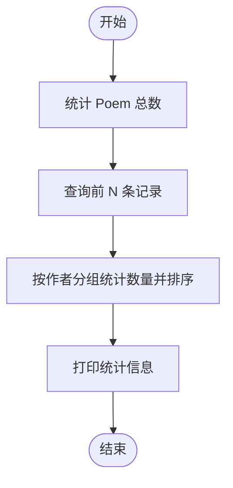

# 后端数据种子

<cite>
**本文引用的文件**
- [backend/prisma/seed.ts](file://backend/prisma/seed.ts)
- [backend/prisma/seedNew.ts](file://backend/prisma/seedNew.ts)
- [backend/prisma/checkData.ts](file://backend/prisma/checkData.ts)
- [backend/prisma/migrations/20251104061144_init/migration.sql](file://backend/prisma/migrations/20251104061144_init/migration.sql)
- [backend/prisma.config.ts](file://backend/prisma.config.ts)
- [backend/package.json](file://backend/package.json)
- [backend/src/index.ts](file://backend/src/index.ts)
- [backend/prisma/唐.csv](file://backend/prisma/唐.csv)
</cite>

## 目录
1. [简介](#简介)
2. [项目结构](#项目结构)
3. [核心组件](#核心组件)
4. [架构总览](#架构总览)
5. [详细组件分析](#详细组件分析)
6. [依赖关系分析](#依赖关系分析)
7. [性能考量](#性能考量)
8. [故障排查指南](#故障排查指南)
9. [结论](#结论)
10. [附录](#附录)

## 简介
本文件系统性梳理后端“数据种子”（Seed）能力，覆盖种子脚本、数据结构、迁移与运行方式，并结合实际业务接口说明数据如何被使用。目标读者包括开发者与运维人员，既关注技术细节，也强调可操作性与可维护性。

## 项目结构
后端采用 Prisma 作为 ORM，数据模型通过迁移定义，种子脚本负责初始化数据，服务入口提供游戏相关 API。关键目录与文件如下：
- 数据模型与迁移：prisma/migrations/20251104061144_init/migration.sql
- 种子脚本：
  - prisma/seed.ts：内置示例数据的快速种子
  - prisma/seedNew.ts：从 CSV 文件批量导入的种子
  - prisma/checkData.ts：数据检查与统计
- 运行配置：prisma.config.ts
- 后端服务：src/index.ts
- 包管理与脚本：package.json

图表来源
- [backend/prisma/migrations/20251104061144_init/migration.sql](file://backend/prisma/migrations/20251104061144_init/migration.sql#L1-L8)
- [backend/prisma/seed.ts](file://backend/prisma/seed.ts#L1-L53)
- [backend/prisma/seedNew.ts](file://backend/prisma/seedNew.ts#L1-L91)
- [backend/prisma/checkData.ts](file://backend/prisma/checkData.ts#L1-L54)
- [backend/prisma.config.ts](file://backend/prisma.config.ts#L1-L14)
- [backend/package.json](file://backend/package.json#L1-L32)
- [backend/src/index.ts](file://backend/src/index.ts#L1-L234)

章节来源
- [backend/prisma/migrations/20251104061144_init/migration.sql](file://backend/prisma/migrations/20251104061144_init/migration.sql#L1-L8)
- [backend/package.json](file://backend/package.json#L1-L32)

## 核心组件
- 数据模型（Poem）
  - 字段：id（自增）、title（标题）、author（作者）、content（全文内容）
  - 作用：承载诗词数据，供游戏逻辑检索与展示
- 种子脚本
  - seed.ts：清理现有数据，写入内置示例数据
  - seedNew.ts：按批次从 CSV 导入，支持大规模数据
  - checkData.ts：统计总数、展示前若干条、统计作者分布
- 运行配置
  - prisma.config.ts：指定 schema、迁移路径、引擎模式与数据源 URL
- 后端服务
  - 提供随机令字、验证诗句、AI 出句、开始游戏、提示等 API，均基于 Poem 表进行查询

章节来源
- [backend/prisma/migrations/20251104061144_init/migration.sql](file://backend/prisma/migrations/20251104061144_init/migration.sql#L1-L8)
- [backend/prisma/seed.ts](file://backend/prisma/seed.ts#L1-L53)
- [backend/prisma/seedNew.ts](file://backend/prisma/seedNew.ts#L1-L91)
- [backend/prisma/checkData.ts](file://backend/prisma/checkData.ts#L1-L54)
- [backend/prisma.config.ts](file://backend/prisma.config.ts#L1-L14)
- [backend/src/index.ts](file://backend/src/index.ts#L1-L234)

## 架构总览
种子流程与服务交互如下：
- 迁移创建 Poem 表
- 种子脚本写入数据
- 服务启动后，API 查询 Poem 表完成游戏功能

图表来源
- [backend/prisma/seed.ts](file://backend/prisma/seed.ts#L1-L53)
- [backend/prisma/seedNew.ts](file://backend/prisma/seedNew.ts#L1-L91)
- [backend/src/index.ts](file://backend/src/index.ts#L1-L234)

## 详细组件分析

### 组件A：种子脚本（seed.ts）
- 功能概述
  - 清空现有 Poem 数据
  - 将内置示例数据转换为标准字段并批量写入
- 关键流程
  - 初始化 PrismaClient
  - deleteMany 清空
  - map 格式化为 {title, author, content}
  - createMany 写入
  - 断开连接
- 错误处理
  - 捕获异常并退出进程
- 性能特征
  - 示例数据量较小，适合快速演示
- 使用建议
  - 本地开发或测试环境快速填充
  - 生产环境建议使用 seedNew.ts

图表来源
- [backend/prisma/seed.ts](file://backend/prisma/seed.ts#L1-L53)

章节来源
- [backend/prisma/seed.ts](file://backend/prisma/seed.ts#L1-L53)

### 组件B：种子脚本（seedNew.ts）
- 功能概述
  - 从 CSV 文件读取并解析
  - 分批插入，避免一次性写入过多导致超时或内存压力
- 关键流程
  - 读取 CSV 文件（UTF-8）
  - 跳过标题行，按逗号拆分字段，去除引号
  - 格式化为 {title, author, content}
  - 分批 createMany 插入
  - 输出批次进度
- 错误处理
  - 异常捕获并退出
- 性能特征
  - 大数据量场景下的稳健性
  - 批次大小可调
- 使用建议
  - 推荐用于生产或大规模测试
  - 确保 CSV 字段顺序与解析逻辑一致

图表来源
- [backend/prisma/seedNew.ts](file://backend/prisma/seedNew.ts#L1-L91)

章节来源
- [backend/prisma/seedNew.ts](file://backend/prisma/seedNew.ts#L1-L91)
- [backend/prisma/唐.csv](file://backend/prisma/唐.csv#L1-L200)

### 组件C：数据检查脚本（checkData.ts）
- 功能概述
  - 统计 Poem 总数
  - 展示前若干条记录
  - 按作者分组统计数量并排序
- 使用场景
  - 验证种子是否成功
  - 快速核对数据完整性
- 输出要点
  - 总数
  - 前 N 条摘要
  - 作者 Top N

图表来源
- [backend/prisma/checkData.ts](file://backend/prisma/checkData.ts#L1-L54)

章节来源
- [backend/prisma/checkData.ts](file://backend/prisma/checkData.ts#L1-L54)

### 组件D：数据模型与迁移（Poem）
- 模型定义
  - id：自增主键
  - title：标题
  - author：作者
  - content：全文内容
- 迁移执行
  - 创建 Poem 表
- 与种子的关系
  - 种子脚本写入的数据字段与模型保持一致

图表来源
- [backend/prisma/migrations/20251104061144_init/migration.sql](file://backend/prisma/migrations/20251104061144_init/migration.sql#L1-L8)

章节来源
- [backend/prisma/migrations/20251104061144_init/migration.sql](file://backend/prisma/migrations/20251104061144_init/migration.sql#L1-L8)

### 组件E：服务端 API 与数据使用
- API 一览（与种子数据直接相关）
  - GET /api/v1/game/random-char：随机返回一个令字
  - POST /api/v1/game/verify：验证用户诗句是否存在于数据库
  - POST /api/v1/game/ai-turn：根据令字生成 AI 诗句
  - POST /api/v1/game/start：开始游戏，返回首句
  - POST /api/v1/game/hint：按提示级别返回提示
- 数据使用方式
  - 查询 Poem 表，按条件筛选（包含某字、排除已用诗句）
  - 限制返回字段与数量，保证性能
- 与种子的关系
  - API 的正确行为依赖种子成功写入数据

图表来源
- [backend/src/index.ts](file://backend/src/index.ts#L1-L234)

章节来源
- [backend/src/index.ts](file://backend/src/index.ts#L1-L234)

## 依赖关系分析
- 种子脚本依赖
  - PrismaClient：连接数据库
  - 文件系统：seedNew.ts 读取 CSV
  - 脚本命令：package.json 中的 seed、seed:new、check:data
- 配置依赖
  - prisma.config.ts 指定 schema、迁移路径与数据源 URL
- 服务依赖
  - API 依赖 Poem 表结构与数据完整性

图表来源
- [backend/package.json](file://backend/package.json#L1-L32)
- [backend/prisma.config.ts](file://backend/prisma.config.ts#L1-L14)
- [backend/prisma/seed.ts](file://backend/prisma/seed.ts#L1-L53)
- [backend/prisma/seedNew.ts](file://backend/prisma/seedNew.ts#L1-L91)
- [backend/prisma/checkData.ts](file://backend/prisma/checkData.ts#L1-L54)
- [backend/src/index.ts](file://backend/src/index.ts#L1-L234)

章节来源
- [backend/package.json](file://backend/package.json#L1-L32)
- [backend/prisma.config.ts](file://backend/prisma.config.ts#L1-L14)

## 性能考量
- 种子阶段
  - seed.ts：数据量小，性能影响可忽略
  - seedNew.ts：采用分批插入，降低单次写入压力
- 服务阶段
  - 查询限制：随机令字与 AI 出句均限制了查询数量，避免全表扫描
  - 字段选择：仅选择必要字段，减少网络与序列化开销
- 建议
  - 大规模数据导入优先使用 seedNew.ts
  - 对高频查询可考虑在 content 上建立索引（如适用）

[本节为通用性能讨论，无需列出具体文件来源]

## 故障排查指南
- 种子失败
  - 检查数据库连接字符串（prisma.config.ts 中的 DATABASE_URL）
  - 确认迁移已执行，Poem 表存在
  - 查看 seed.ts/seedNew.ts 的异常输出
- 数据缺失
  - 使用 checkData.ts 核对总数与前若干条
  - 检查 CSV 字段顺序与解析逻辑
- 服务异常
  - 确认服务已启动并监听端口
  - 检查 API 参数（如令字长度、已用诗句数组）
  - 观察日志定位错误

章节来源
- [backend/prisma/checkData.ts](file://backend/prisma/checkData.ts#L1-L54)
- [backend/prisma.config.ts](file://backend/prisma.config.ts#L1-L14)
- [backend/src/index.ts](file://backend/src/index.ts#L1-L234)

## 结论
- 数据种子提供了两种路径：内置示例（seed.ts）与 CSV 批量（seedNew.ts），满足不同场景需求
- 数据模型简洁明确，服务 API 基于该模型实现核心玩法
- 配置清晰，脚本命令统一，便于本地与 CI/CD 场景使用
- 建议在生产环境使用 seedNew.ts 并配合 checkData.ts 进行验证

[本节为总结性内容，无需列出具体文件来源]

## 附录
- 常用命令
  - npm run seed：执行内置示例种子
  - npm run seed:new：执行 CSV 批量种子
  - npm run check:data：检查数据
  - npm run start：启动服务
- 数据 CSV 字段说明
  - 题目：title
  - 朝代：dynasty（当前种子脚本未使用）
  - 作者：author
  - 内容：content

章节来源
- [backend/package.json](file://backend/package.json#L1-L32)
- [backend/prisma/唐.csv](file://backend/prisma/唐.csv#L1-L200)