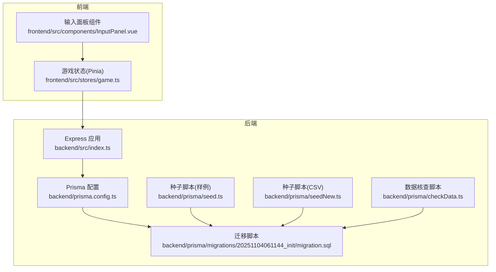
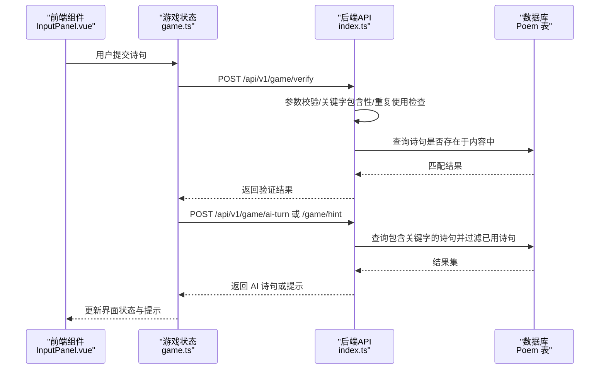
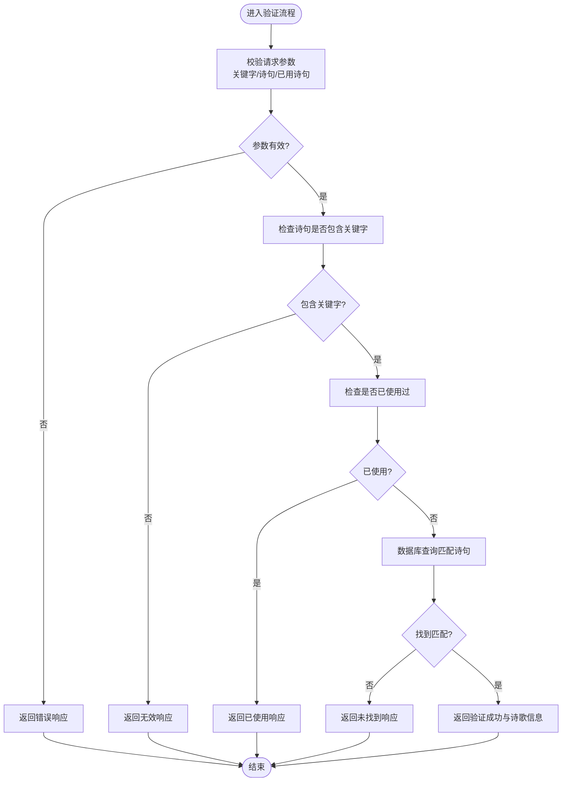
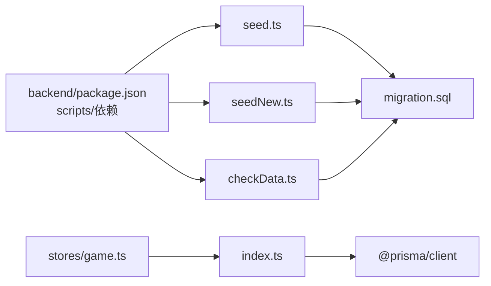

# 数据库验证

<cite>
**本文引用的文件**
- [backend/src/index.ts](file://backend/src/index.ts)
- [backend/prisma/checkData.ts](file://backend/prisma/checkData.ts)
- [backend/prisma/seed.ts](file://backend/prisma/seed.ts)
- [backend/prisma/seedNew.ts](file://backend/prisma/seedNew.ts)
- [backend/prisma/migrations/20251104061144_init/migration.sql](file://backend/prisma/migrations/20251104061144_init/migration.sql)
- [backend/prisma.config.ts](file://backend/prisma.config.ts)
- [backend/package.json](file://backend/package.json)
- [frontend/src/stores/game.ts](file://frontend/src/stores/game.ts)
- [frontend/src/components/InputPanel.vue](file://frontend/src/components/InputPanel.vue)
- [GEMINI.md](file://GEMINI.md)
</cite>

## 目录
1. [简介](#简介)
2. [项目结构](#项目结构)
3. [核心组件](#核心组件)
4. [架构总览](#架构总览)
5. [详细组件分析](#详细组件分析)
6. [依赖关系分析](#依赖关系分析)
7. [性能考量](#性能考量)
8. [故障排查指南](#故障排查指南)
9. [结论](#结论)
10. [附录](#附录)

## 简介
本文件聚焦于“数据库验证”主题，围绕后端基于 Prisma 的数据模型与校验流程、种子数据导入与数据核查脚本、以及前后端联调中的数据一致性保障展开。目标是帮助开发者理解如何通过数据库层与业务层协同，确保诗句匹配、关键字约束、重复使用限制等规则得到正确执行，并为后续扩展与维护提供可追溯的参考。

## 项目结构
后端采用 Node.js + Express + Prisma 的技术栈，数据库迁移脚本定义了诗歌表结构，提供了两类种子数据脚本（本地样例与 CSV 批量导入），并通过工具脚本进行数据核查。前端使用 Pinia 管理游戏状态，通过 API 与后端交互完成验证与提示逻辑。

图表来源
- [backend/src/index.ts](file://backend/src/index.ts#L1-L234)
- [backend/prisma.config.ts](file://backend/prisma.config.ts#L1-L14)
- [backend/prisma/migrations/20251104061144_init/migration.sql](file://backend/prisma/migrations/20251104061144_init/migration.sql#L1-L8)
- [backend/prisma/seed.ts](file://backend/prisma/seed.ts#L1-L53)
- [backend/prisma/seedNew.ts](file://backend/prisma/seedNew.ts#L1-L91)
- [backend/prisma/checkData.ts](file://backend/prisma/checkData.ts#L1-L54)
- [frontend/src/stores/game.ts](file://frontend/src/stores/game.ts#L1-L220)
- [frontend/src/components/InputPanel.vue](file://frontend/src/components/InputPanel.vue#L1-L106)

章节来源
- [GEMINI.md](file://GEMINI.md#L1-L21)
- [backend/package.json](file://backend/package.json#L1-L32)

## 核心组件
- 数据模型与迁移
  - 诗歌表包含自增主键、标题、作者、内容字段，满足基本检索与展示需求。
- 种子数据
  - 样例种子脚本用于快速初始化少量示例数据。
  - CSV 导入脚本支持批量导入，具备分批写入与字段清洗能力。
- 数据核查
  - 提供计数、取样、按作者聚合统计等基础核查能力，便于验证数据完整性。
- 后端 API 与验证逻辑
  - 关键字校验、诗句包含性校验、重复使用限制、AI 出句与提示生成均在后端完成，保证一致性与安全性。
- 前端状态与交互
  - Pinia 管理游戏状态与历史记录，组件负责输入与提示展示，通过 API 与后端交互。

章节来源
- [backend/prisma/migrations/20251104061144_init/migration.sql](file://backend/prisma/migrations/20251104061144_init/migration.sql#L1-L8)
- [backend/prisma/seed.ts](file://backend/prisma/seed.ts#L1-L53)
- [backend/prisma/seedNew.ts](file://backend/prisma/seedNew.ts#L1-L91)
- [backend/prisma/checkData.ts](file://backend/prisma/checkData.ts#L1-L54)
- [backend/src/index.ts](file://backend/src/index.ts#L1-L234)
- [frontend/src/stores/game.ts](file://frontend/src/stores/game.ts#L1-L220)
- [frontend/src/components/InputPanel.vue](file://frontend/src/components/InputPanel.vue#L1-L106)

## 架构总览
后端通过 Prisma 访问 SQLite 数据库，提供统一的 API 前缀，前端通过 Pinia 发起请求并更新界面状态。数据库验证贯穿于请求处理流程：参数校验、关键字与诗句匹配、重复使用过滤、AI 出句与提示生成。

图表来源
- [frontend/src/components/InputPanel.vue](file://frontend/src/components/InputPanel.vue#L1-L106)
- [frontend/src/stores/game.ts](file://frontend/src/stores/game.ts#L1-L220)
- [backend/src/index.ts](file://backend/src/index.ts#L1-L234)

## 详细组件分析

### 数据模型与迁移
- 模型字段
  - 主键：自增整数
  - 标题、作者、内容：文本字段，满足基本检索与展示
- 迁移脚本
  - 定义了 Poem 表结构，确保数据库 schema 与 Prisma 模型一致
- 配置
  - Prisma 配置指向 schema 文件与迁移目录，并通过环境变量设置数据源 URL

章节来源
- [backend/prisma/migrations/20251104061144_init/migration.sql](file://backend/prisma/migrations/20251104061144_init/migration.sql#L1-L8)
- [backend/prisma.config.ts](file://backend/prisma.config.ts#L1-L14)

### 种子数据与数据核查
- 样例种子脚本
  - 清空现有数据后批量创建示例诗歌，字段映射为 title、author、content
- CSV 导入脚本
  - 支持读取 CSV 文件，逐批写入数据库，避免一次性写入过多导致性能问题
  - 字段清洗与分批插入策略提升导入稳定性
- 数据核查脚本
  - 输出总数、取样前五条、按作者聚合统计，便于快速验证数据质量

章节来源
- [backend/prisma/seed.ts](file://backend/prisma/seed.ts#L1-L53)
- [backend/prisma/seedNew.ts](file://backend/prisma/seedNew.ts#L1-L91)
- [backend/prisma/checkData.ts](file://backend/prisma/checkData.ts#L1-L54)

### 后端 API 与数据库验证流程
- 关键字校验
  - 请求体需包含关键字，长度为 1 的汉字，否则返回错误
- 诗句验证
  - 必须包含关键字；若已在已用诗句列表中则判定无效
  - 使用包含查询定位诗句，返回匹配到的标题与作者信息
- AI 出句
  - 基于关键字构建包含查询，排除已用诗句
  - 对结果进行分句筛选，优先返回包含关键字的句子，否则返回首句
- 提示生成
  - 根据提示级别返回作者、出处或首字提示
- 随机令字
  - 随机选择诗句与字符，用于游戏初始化

图表来源
- [backend/src/index.ts](file://backend/src/index.ts#L33-L76)

章节来源
- [backend/src/index.ts](file://backend/src/index.ts#L1-L234)

### 前端状态管理与交互
- Pinia 状态
  - 管理关键字、游戏状态、回合数、剩余机会、历史记录、已用诗句、统计信息与提示等级
- 提交与验证
  - 触发验证 API，根据返回结果更新历史与统计
- AI 回合与提示
  - 成功后触发 AI 出句，失败或提示升级时调用提示接口
- 输入面板
  - 负责用户输入、提示与错误信息展示，提供事件暴露给父组件

章节来源
- [frontend/src/stores/game.ts](file://frontend/src/stores/game.ts#L1-L220)
- [frontend/src/components/InputPanel.vue](file://frontend/src/components/InputPanel.vue#L1-L106)

## 依赖关系分析
- 后端依赖
  - Express 提供 Web 服务与路由
  - Prisma 提供数据库访问与 ORM 能力
  - CORS 允许跨域请求
- 前端依赖
  - Vue3 + Pinia 管理状态
  - axios 用于网络请求（在 store 中直接使用 fetch）
- 脚本与工具
  - seed、seed:new、check:data 三个脚本分别负责样例数据、CSV 导入与数据核查
  - package.json scripts 定义了启动与调试命令

图表来源
- [backend/package.json](file://backend/package.json#L1-L32)
- [backend/prisma/seed.ts](file://backend/prisma/seed.ts#L1-L53)
- [backend/prisma/seedNew.ts](file://backend/prisma/seedNew.ts#L1-L91)
- [backend/prisma/checkData.ts](file://backend/prisma/checkData.ts#L1-L54)
- [backend/prisma/migrations/20251104061144_init/migration.sql](file://backend/prisma/migrations/20251104061144_init/migration.sql#L1-L8)
- [backend/src/index.ts](file://backend/src/index.ts#L1-L234)
- [frontend/src/stores/game.ts](file://frontend/src/stores/game.ts#L1-L220)

章节来源
- [backend/package.json](file://backend/package.json#L1-L32)

## 性能考量
- 查询限制
  - 随机令字与 AI 出句均设置了结果集上限，避免全表扫描带来的性能问题
- 分句与过滤
  - AI 出句阶段先做包含查询，再在内存中按标点分句并筛选包含关键字的句子，减少数据库压力
- 批量导入
  - CSV 导入采用分批写入策略，降低单次事务压力
- 前端状态驱动
  - 前端通过 Pinia 管理历史与统计，减少不必要的网络往返

章节来源
- [backend/src/index.ts](file://backend/src/index.ts#L13-L31)
- [backend/src/index.ts](file://backend/src/index.ts#L78-L132)
- [backend/prisma/seedNew.ts](file://backend/prisma/seedNew.ts#L64-L80)

## 故障排查指南
- 数据库连接与迁移
  - 确认 Prisma 配置中的数据源 URL 正确，迁移路径与 schema 文件存在
- 种子数据导入失败
  - 检查 CSV 文件格式与字段数量，确认分隔符与引号处理逻辑
  - 分批导入时关注批次大小与日志输出
- API 返回错误
  - 关键字长度与类型校验失败时会直接返回错误
  - 诗句未包含关键字或已使用过会返回相应提示
  - 数据库无匹配或 AI 无法生成时返回相应错误信息
- 前端状态异常
  - 确认 API 基础地址与路由前缀一致
  - 检查 Pinia 状态重置与历史记录更新逻辑

章节来源
- [backend/prisma.config.ts](file://backend/prisma.config.ts#L1-L14)
- [backend/prisma/seedNew.ts](file://backend/prisma/seedNew.ts#L21-L48)
- [backend/src/index.ts](file://backend/src/index.ts#L134-L181)
- [frontend/src/stores/game.ts](file://frontend/src/stores/game.ts#L34-L81)

## 结论
本项目通过明确的数据模型、完善的种子与核查脚本、严谨的后端验证逻辑以及清晰的前后端协作机制，实现了可靠的数据库验证与游戏体验。建议在后续迭代中：
- 引入更细粒度的索引与查询优化，提升大规模数据下的查询效率
- 增加参数与数据格式的前端校验，减轻后端压力
- 将提示与 AI 出句的策略抽象为可配置规则，便于扩展与维护

## 附录
- API 路由前缀统一为 /api/v1，便于扩展与版本管理
- 前端组件与状态管理职责清晰，便于单元测试与集成测试

章节来源
- [GEMINI.md](file://GEMINI.md#L1-L21)