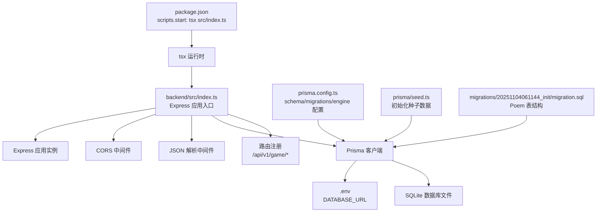
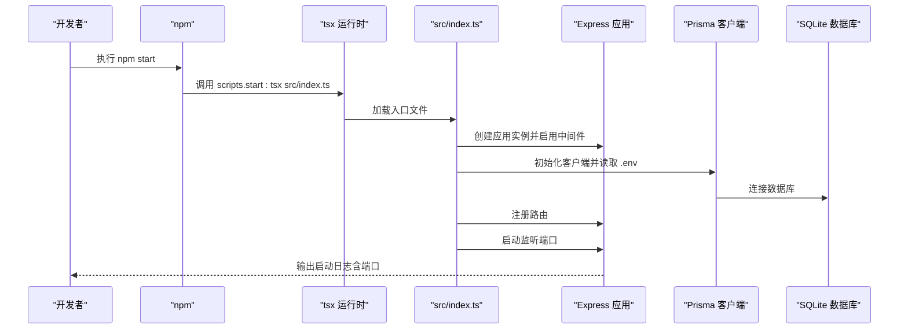
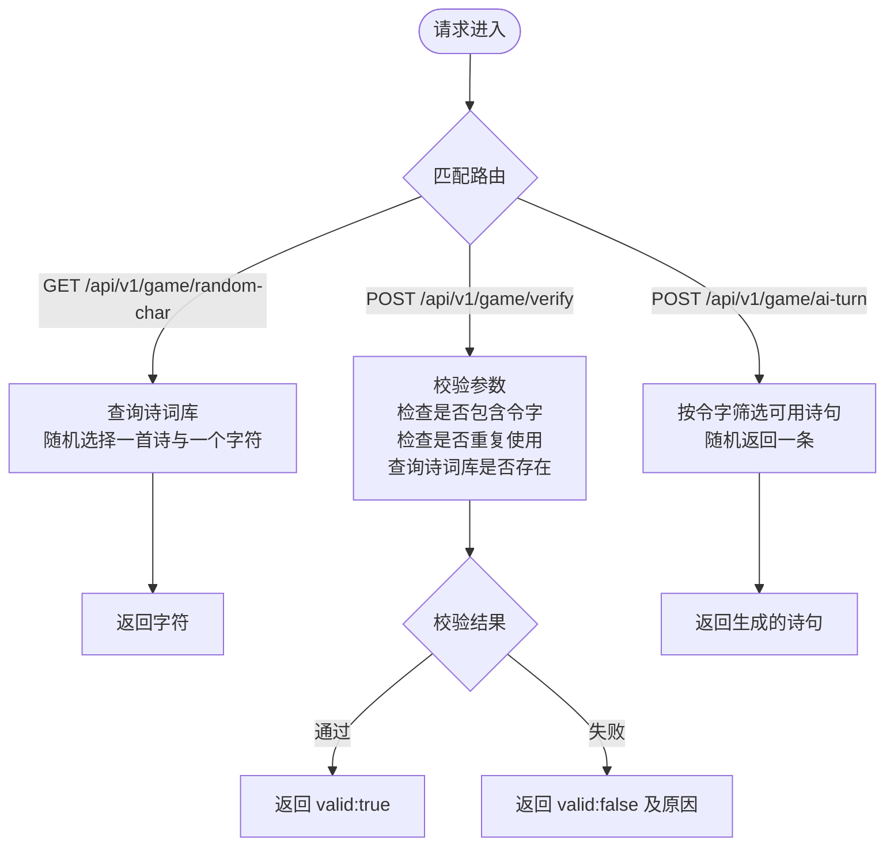
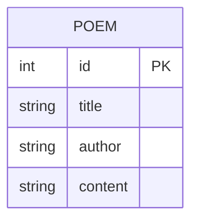
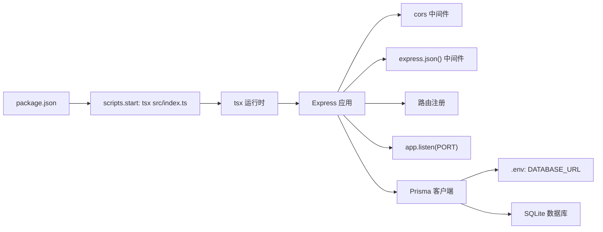

# 后端服务启动

<cite>
**本文引用的文件**
- [backend/src/index.ts](file://backend/src/index.ts)
- [backend/package.json](file://backend/package.json)
- [backend/.env](file://backend/.env)
- [backend/prisma.config.ts](file://backend/prisma.config.ts)
- [backend/prisma/seed.ts](file://backend/prisma/seed.ts)
- [backend/prisma/migrations/20251104061144_init/migration.sql](file://backend/prisma/migrations/20251104061144_init/migration.sql)
</cite>

## 目录
1. [简介](#简介)
2. [项目结构](#项目结构)
3. [核心组件](#核心组件)
4. [架构总览](#架构总览)
5. [详细组件分析](#详细组件分析)
6. [依赖关系分析](#依赖关系分析)
7. [性能与可扩展性](#性能与可扩展性)
8. [故障排查指南](#故障排查指南)
9. [结论](#结论)

## 简介
本文件面向后端开发者，系统性说明后端服务的启动流程与运行机制，重点覆盖以下内容：
- 执行 npm start 命令后，如何通过 tsx 运行时启动 src/index.ts 中的 Express 应用
- 服务监听端口（默认 3000）及环境变量配置
- CORS 跨域配置、JSON 解析中间件的启用
- API 路由注册情况：随机令字、诗句验证、AI 生成诗句
- 如何验证服务是否正常运行（curl 或浏览器访问示例）
- 启动常见问题与解决方案：端口占用、依赖未安装、tsx 未全局安装等

## 项目结构
后端采用 Node.js + Express + Prisma 的典型结构，入口文件位于 backend/src/index.ts，通过 package.json 的 scripts.start 指向 tsx 运行时直接执行该入口文件。数据库使用 SQLite，并通过 Prisma 管理迁移与种子数据。

图表来源
- [backend/package.json](file://backend/package.json#L1-L30)
- [backend/src/index.ts](file://backend/src/index.ts#L1-L78)
- [backend/.env](file://backend/.env#L1-L1)
- [backend/prisma.config.ts](file://backend/prisma.config.ts#L1-L14)
- [backend/prisma/seed.ts](file://backend/prisma/seed.ts#L1-L53)
- [backend/prisma/migrations/20251104061144_init/migration.sql](file://backend/prisma/migrations/20251104061144_init/migration.sql#L1-L8)

章节来源
- [backend/package.json](file://backend/package.json#L1-L30)
- [backend/src/index.ts](file://backend/src/index.ts#L1-L78)
- [backend/.env](file://backend/.env#L1-L1)
- [backend/prisma.config.ts](file://backend/prisma.config.ts#L1-L14)
- [backend/prisma/seed.ts](file://backend/prisma/seed.ts#L1-L53)
- [backend/prisma/migrations/20251104061144_init/migration.sql](file://backend/prisma/migrations/20251104061144_init/migration.sql#L1-L8)

## 核心组件
- 入口与服务器
  - 通过 package.json 的 scripts.start 指定 tsx 运行 backend/src/index.ts
  - 在入口文件中创建 Express 实例，设置端口（优先使用环境变量 PORT，默认 3000），并启动监听
- 中间件
  - CORS：允许跨域请求
  - JSON 解析：解析 application/json 请求体
- 路由
  - GET /api/v1/game/random-char：返回一个随机令字
  - POST /api/v1/game/verify：校验用户输入的诗句是否包含令字、是否重复使用、是否存在于诗词库
  - POST /api/v1/game/ai-turn：根据令字从可用诗词中生成一句新诗句
- 数据层
  - 使用 Prisma 客户端连接 SQLite 数据库（通过 .env 的 DATABASE_URL）
  - 通过 prisma/seed.ts 初始化种子数据，迁移文件定义 Poem 表结构

章节来源
- [backend/package.json](file://backend/package.json#L1-L30)
- [backend/src/index.ts](file://backend/src/index.ts#L1-L78)
- [backend/.env](file://backend/.env#L1-L1)
- [backend/prisma/seed.ts](file://backend/prisma/seed.ts#L1-L53)
- [backend/prisma/migrations/20251104061144_init/migration.sql](file://backend/prisma/migrations/20251104061144_init/migration.sql#L1-L8)

## 架构总览
下图展示了从 npm start 到服务可用的关键步骤与组件交互。

图表来源
- [backend/package.json](file://backend/package.json#L1-L30)
- [backend/src/index.ts](file://backend/src/index.ts#L1-L78)
- [backend/.env](file://backend/.env#L1-L1)

## 详细组件分析

### 启动流程与入口文件
- 启动命令
  - npm start 会调用 tsx src/index.ts，tsx 作为 TypeScript 运行时直接执行入口文件，无需预编译
- 应用初始化
  - 创建 Express 实例
  - 读取端口：优先使用环境变量 PORT，否则默认 3000
  - 启动监听并在控制台输出服务地址
- 中间件
  - 启用 CORS，便于前端跨域访问
  - 启用 JSON 解析中间件，支持 application/json 请求体
- 路由注册
  - 随机令字接口：GET /api/v1/game/random-char
  - 诗句验证接口：POST /api/v1/game/verify
  - AI 生成接口：POST /api/v1/game/ai-turn
- 数据访问
  - 使用 Prisma 客户端访问 SQLite 数据库
  - 通过 prisma/seed.ts 初始化种子数据，确保接口有数据可用

章节来源
- [backend/package.json](file://backend/package.json#L1-L30)
- [backend/src/index.ts](file://backend/src/index.ts#L1-L78)
- [backend/.env](file://backend/.env#L1-L1)
- [backend/prisma/seed.ts](file://backend/prisma/seed.ts#L1-L53)

### CORS 配置
- 在入口文件中启用 CORS 中间件，允许来自任意源的跨域请求
- 若需限制特定源，可在中间件初始化时传入相应配置

章节来源
- [backend/src/index.ts](file://backend/src/index.ts#L1-L78)

### JSON 解析中间件
- 在入口文件中启用 express.json()，用于解析 application/json 类型的请求体
- 该中间件为后续路由处理提供 req.body

章节来源
- [backend/src/index.ts](file://backend/src/index.ts#L1-L78)

### API 路由注册
- 随机令字
  - 方法：GET
  - 路径：/api/v1/game/random-char
  - 功能：从诗词库中随机选择一首诗与一个字符，返回该字符
- 诗句验证
  - 方法：POST
  - 路径：/api/v1/game/verify
  - 请求体字段：sentence（诗句）、char（令字）、usedPoems（已用诗句数组）
  - 返回：valid、message；若缺少参数返回 400
- AI 生成
  - 方法：POST
  - 路径：/api/v1/game/ai-turn
  - 请求体字段：char（令字）、usedPoems（已用诗句数组）
  - 功能：从包含令字的诗词中筛选可用诗句，返回一条新诗句

图表来源
- [backend/src/index.ts](file://backend/src/index.ts#L1-L78)

章节来源
- [backend/src/index.ts](file://backend/src/index.ts#L1-L78)

### 数据库与迁移
- 数据库连接
  - 通过 .env 的 DATABASE_URL 指向 SQLite 文件路径
  - Prisma 客户端在入口文件中初始化并连接数据库
- 迁移
  - 迁移目录位于 prisma/migrations，包含初始迁移脚本
  - 迁移脚本定义了 Poem 表结构（id、title、author、content）
- 种子数据
  - prisma/seed.ts 将多首诗词写入数据库，供接口使用

图表来源
- [backend/prisma/migrations/20251104061144_init/migration.sql](file://backend/prisma/migrations/20251104061144_init/migration.sql#L1-L8)
- [backend/prisma/seed.ts](file://backend/prisma/seed.ts#L1-L53)

章节来源
- [backend/.env](file://backend/.env#L1-L1)
- [backend/prisma.config.ts](file://backend/prisma.config.ts#L1-L14)
- [backend/prisma/migrations/20251104061144_init/migration.sql](file://backend/prisma/migrations/20251104061144_init/migration.sql#L1-L8)
- [backend/prisma/seed.ts](file://backend/prisma/seed.ts#L1-L53)

## 依赖关系分析
- 启动链路
  - npm start -> tsx -> src/index.ts -> Express 应用
- 运行时依赖
  - Express、CORS、Prisma 客户端、SQLite3、TypeScript、ts-node
- 开发依赖
  - @types/express、@types/cors、@types/node
- 环境变量
  - DATABASE_URL 指向 SQLite 文件路径

图表来源
- [backend/package.json](file://backend/package.json#L1-L30)
- [backend/src/index.ts](file://backend/src/index.ts#L1-L78)
- [backend/.env](file://backend/.env#L1-L1)

章节来源
- [backend/package.json](file://backend/package.json#L1-L30)
- [backend/src/index.ts](file://backend/src/index.ts#L1-L78)
- [backend/.env](file://backend/.env#L1-L1)

## 性能与可扩展性
- 当前实现为开发/演示用途，未引入缓存、连接池等优化
- 建议在生产环境：
  - 使用进程管理器（如 PM2）与反向代理（如 Nginx）
  - 为 Prisma 配置连接池与查询超时
  - 对高频接口增加缓存策略
  - 对路由进行限流与安全加固（CSRF、速率限制）

[本节为通用建议，不涉及具体文件分析]

## 故障排查指南
- 端口占用
  - 现象：启动时报端口冲突
  - 处理：修改环境变量 PORT 或释放占用端口
  - 参考：入口文件读取端口逻辑
- 依赖未安装
  - 现象：tsx 无法找到模块或运行时报错
  - 处理：在 backend 目录执行安装命令，确保所有依赖已安装
  - 参考：package.json 中 dependencies 与 devDependencies
- tsx 未安装
  - 现象：npm start 报错找不到 tsx
  - 处理：全局安装 tsx 或使用 npx 执行
  - 参考：package.json 的 scripts.start
- 数据库连接失败
  - 现象：Prisma 初始化失败或路由报错
  - 处理：确认 .env 的 DATABASE_URL 是否正确；必要时先执行种子脚本初始化数据
  - 参考：.env、prisma.config.ts、prisma/seed.ts
- 路由无响应或 404
  - 现象：访问 /api/v1/game/random-char 返回 404
  - 处理：确认已执行种子脚本，确保诗词库非空；检查路由是否正确注册
  - 参考：src/index.ts 的路由注册

章节来源
- [backend/src/index.ts](file://backend/src/index.ts#L1-L78)
- [backend/package.json](file://backend/package.json#L1-L30)
- [backend/.env](file://backend/.env#L1-L1)
- [backend/prisma/seed.ts](file://backend/prisma/seed.ts#L1-L53)

## 结论
后端服务通过 npm start 命令启动，tsx 运行时直接执行 src/index.ts，Express 应用在默认 3000 端口监听。入口文件启用了 CORS 与 JSON 解析中间件，并注册了三条游戏相关 API 路由。Prisma 客户端负责连接 SQLite 数据库，迁移与种子数据确保接口具备可用数据。启动过程简单清晰，适合快速开发与演示；生产部署建议补充进程管理、反向代理、连接池与缓存等优化措施。