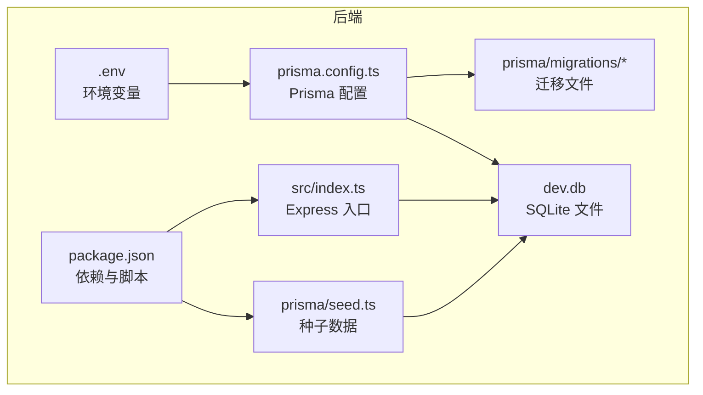
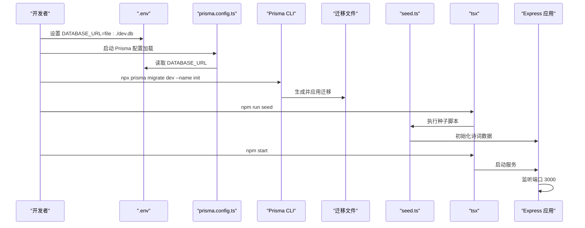
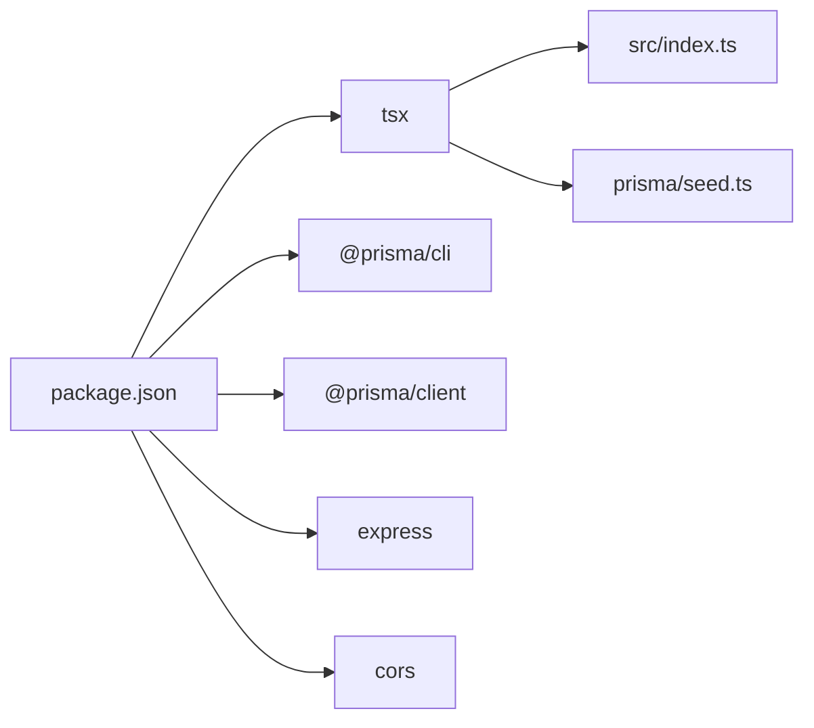

# 后端环境配置

<cite>
**本文引用的文件**
- [backend/.env](file://backend/.env)
- [backend/prisma.config.ts](file://backend/prisma.config.ts)
- [backend/package.json](file://backend/package.json)
- [backend/src/index.ts](file://backend/src/index.ts)
- [backend/prisma/seed.ts](file://backend/prisma/seed.ts)
- [backend/prisma/migrations/migration_lock.toml](file://backend/prisma/migrations/migration_lock.toml)
- [backend/prisma/migrations/20251104061144_init/migration.sql](file://backend/prisma/migrations/20251104061144_init/migration.sql)
- [GEMINI.md](file://GEMINI.md)
</cite>

## 目录
1. [简介](#简介)
2. [项目结构](#项目结构)
3. [核心组件](#核心组件)
4. [架构总览](#架构总览)
5. [详细组件分析](#详细组件分析)
6. [依赖关系分析](#依赖关系分析)
7. [性能与运行建议](#性能与运行建议)
8. [故障排查指南](#故障排查指南)
9. [结论](#结论)
10. [附录](#附录)

## 简介
本指南面向后端开发者，围绕 backend 目录下的环境配置与运行流程进行系统化说明，重点包括：
- 如何通过 backend/.env 文件配置 DATABASE_URL 环境变量（示例值为 file:./dev.db）以指向 SQLite 数据库文件；
- prisma.config.ts 如何加载该环境变量并配置 Prisma 数据源；
- 安装依赖（npm install）、运行 Prisma 迁移（npx prisma migrate dev --name init）、初始化诗词数据（npm run seed）的完整步骤；
- 后端服务启动命令（npm start）及依赖的 tsx 运行时，确保 Express 服务在端口 3000 正常运行；
- 常见问题（如数据库连接失败、迁移冲突）的排查与修复思路。

## 项目结构
后端采用 Node.js + Express + Prisma 的技术栈，核心文件分布如下：
- 环境变量：backend/.env
- Prisma 配置：backend/prisma.config.ts
- 依赖与脚本：backend/package.json
- 后端入口与路由：backend/src/index.ts
- 数据迁移与种子：backend/prisma/migrations/* 与 backend/prisma/seed.ts
- 项目背景与约定：GEMINI.md

图表来源
- [backend/.env](file://backend/.env#L1-L1)
- [backend/prisma.config.ts](file://backend/prisma.config.ts#L1-L14)
- [backend/package.json](file://backend/package.json#L1-L30)
- [backend/src/index.ts](file://backend/src/index.ts#L1-L78)
- [backend/prisma/seed.ts](file://backend/prisma/seed.ts#L1-L53)
- [backend/prisma/migrations/migration_lock.toml](file://backend/prisma/migrations/migration_lock.toml#L1-L4)
- [backend/prisma/migrations/20251104061144_init/migration.sql](file://backend/prisma/migrations/20251104061144_init/migration.sql#L1-L8)

章节来源
- [GEMINI.md](file://GEMINI.md#L1-L21)

## 核心组件
- 环境变量与数据库连接
  - 在 backend/.env 中设置 DATABASE_URL，示例值为 file:./dev.db，用于指定 SQLite 数据库文件路径。
  - prisma.config.ts 通过 dotenv 加载 .env，并从环境变量读取 DATABASE_URL，将其注入到 Prisma 数据源配置中。
- Prisma 迁移与模型
  - prisma.config.ts 指定 schema 位置与迁移目录，迁移锁定文件表明当前使用 sqlite provider。
  - 初始迁移文件创建了 Poem 表，包含 id、title、author、content 字段。
- 种子数据
  - prisma/seed.ts 通过 Prisma Client 清空现有数据并批量插入预设的诗词条目。
- 后端服务
  - src/index.ts 创建 Express 应用，启用 CORS 与 JSON 解析，监听端口 3000，并提供若干 API 接口。
  - package.json 中定义了 npm start 与 npm run seed 的脚本，均通过 tsx 执行。

章节来源
- [backend/.env](file://backend/.env#L1-L1)
- [backend/prisma.config.ts](file://backend/prisma.config.ts#L1-L14)
- [backend/prisma/migrations/migration_lock.toml](file://backend/prisma/migrations/migration_lock.toml#L1-L4)
- [backend/prisma/migrations/20251104061144_init/migration.sql](file://backend/prisma/migrations/20251104061144_init/migration.sql#L1-L8)
- [backend/prisma/seed.ts](file://backend/prisma/seed.ts#L1-L53)
- [backend/src/index.ts](file://backend/src/index.ts#L1-L78)
- [backend/package.json](file://backend/package.json#L1-L30)

## 架构总览
下图展示了从环境变量到数据库、再到服务启动与数据初始化的整体流程。

图表来源
- [backend/.env](file://backend/.env#L1-L1)
- [backend/prisma.config.ts](file://backend/prisma.config.ts#L1-L14)
- [backend/prisma/migrations/20251104061144_init/migration.sql](file://backend/prisma/migrations/20251104061144_init/migration.sql#L1-L8)
- [backend/prisma/seed.ts](file://backend/prisma/seed.ts#L1-L53)
- [backend/package.json](file://backend/package.json#L1-L30)
- [backend/src/index.ts](file://backend/src/index.ts#L1-L78)

## 详细组件分析

### 环境变量与数据库连接
- DATABASE_URL 的作用
  - 通过 DATABASE_URL 指定数据库连接字符串，示例值 file:./dev.db 表示使用 SQLite 并将数据库文件保存在项目根目录下的 dev.db。
- prisma.config.ts 的加载机制
  - 通过 dotenv 加载 .env 文件中的变量；
  - 将 env("DATABASE_URL") 注入到 datasource.url，使 Prisma 在生成客户端与执行迁移时使用该连接。
- 迁移锁定与 Provider
  - migration_lock.toml 中的 provider = "sqlite" 表明当前迁移与引擎适配 sqlite。

章节来源
- [backend/.env](file://backend/.env#L1-L1)
- [backend/prisma.config.ts](file://backend/prisma.config.ts#L1-L14)
- [backend/prisma/migrations/migration_lock.toml](file://backend/prisma/migrations/migration_lock.toml#L1-L4)

### Prisma 迁移与模型
- 迁移生成与应用
  - 使用 npx prisma migrate dev --name init 会根据 prisma/schema.prisma 生成迁移文件并应用到数据库。
  - 仓库中已存在初始迁移文件，其中包含 Poem 表的建表语句。
- 数据模型
  - 初始迁移创建了 Poem 表，字段包括 id、title、author、content，满足后端接口对诗词内容的存储需求。

章节来源
- [backend/prisma/migrations/20251104061144_init/migration.sql](file://backend/prisma/migrations/20251104061144_init/migration.sql#L1-L8)

### 种子数据初始化
- seed.ts 的职责
  - 通过 Prisma Client 删除现有数据并批量插入预设的诗词条目，形成可直接使用的测试数据。
- 执行方式
  - 通过 npm run seed 调用 tsx prisma/seed.ts，tsx 作为运行时执行 seed.ts。

章节来源
- [backend/prisma/seed.ts](file://backend/prisma/seed.ts#L1-L53)
- [backend/package.json](file://backend/package.json#L1-L30)

### Express 后端服务
- 启动命令与运行时
  - npm start 对应 tsx src/index.ts，tsx 作为运行时负责编译与执行 TypeScript 源码。
- 服务行为
  - 启动后监听端口 3000，提供 CORS 支持与 JSON 请求体解析；
  - 提供随机令字获取、诗句验证、AI 生成诗句等接口，内部通过 Prisma Client 访问数据库。

章节来源
- [backend/src/index.ts](file://backend/src/index.ts#L1-L78)
- [backend/package.json](file://backend/package.json#L1-L30)

## 依赖关系分析
- 外部依赖
  - @prisma/client、prisma：提供数据库访问与迁移工具；
  - express、cors：提供 Web 服务与跨域支持；
  - tsx：运行时，用于直接执行 TypeScript 源码；
  - sqlite3：SQLite 驱动（Prisma 引擎或客户端可能需要）。
- 内部脚本
  - scripts.seed 与 scripts.start 分别绑定 tsx 与 src/index.ts 或 seed.ts。

图表来源
- [backend/package.json](file://backend/package.json#L1-L30)

章节来源
- [backend/package.json](file://backend/package.json#L1-L30)

## 性能与运行建议
- 数据库文件位置
  - DATABASE_URL 使用相对路径 file:./dev.db，便于本地开发；生产环境建议使用绝对路径或专用数据库服务。
- 迁移与数据一致性
  - 初次运行建议先执行迁移再执行种子，确保表结构与数据一致。
- 服务监听端口
  - 默认监听 3000，若端口被占用，可在启动前释放或调整端口配置。

[本节为通用建议，无需列出具体文件来源]

## 故障排查指南
- 数据库连接失败
  - 检查 backend/.env 是否正确设置了 DATABASE_URL，且值为 file:./dev.db；
  - 确认 prisma.config.ts 已通过 dotenv 加载 .env；
  - 若使用 sqlite，请确认系统具备 sqlite3 相关依赖（Prisma 引擎或驱动）。
- 迁移冲突
  - 若提示迁移冲突，优先查看 prisma/migrations 目录下是否存在未应用或异常的迁移文件；
  - 可尝试删除迁移锁定文件（谨慎操作）并重新执行迁移，或回滚到上一版本后再重试。
- 服务无法启动
  - 确认已安装依赖（npm install）；
  - 确认 tsx 可用，npm start 能正常执行；
  - 检查端口 3000 是否被占用。
- 种子数据未生效
  - 确认已执行 npm run seed；
  - 检查 seed.ts 是否抛出错误并在 finally 中断开 Prisma 连接。

章节来源
- [backend/.env](file://backend/.env#L1-L1)
- [backend/prisma.config.ts](file://backend/prisma.config.ts#L1-L14)
- [backend/prisma/migrations/migration_lock.toml](file://backend/prisma/migrations/migration_lock.toml#L1-L4)
- [backend/prisma/seed.ts](file://backend/prisma/seed.ts#L1-L53)
- [backend/src/index.ts](file://backend/src/index.ts#L1-L78)
- [backend/package.json](file://backend/package.json#L1-L30)

## 结论
通过 backend/.env 的 DATABASE_URL 与 prisma.config.ts 的环境变量注入，后端能够正确连接 SQLite 数据库。结合 Prisma 迁移与种子脚本，开发者可以快速完成数据库结构初始化与测试数据填充。配合 npm start 与 tsx 运行时，Express 服务可在端口 3000 正常对外提供接口。遇到连接失败或迁移冲突时，按本文提供的排查步骤逐一核对配置与依赖即可定位问题。

[本节为总结性内容，无需列出具体文件来源]

## 附录

### 快速操作清单
- 安装依赖：在 backend 目录执行 npm install
- 应用迁移：npx prisma migrate dev --name init
- 初始化种子数据：npm run seed
- 启动后端服务：npm start

章节来源
- [backend/package.json](file://backend/package.json#L1-L30)