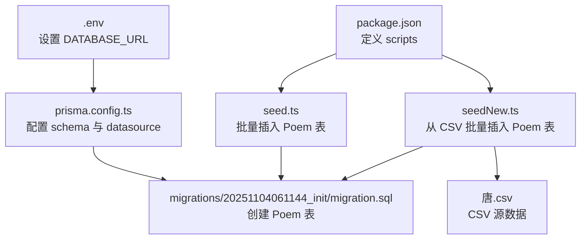
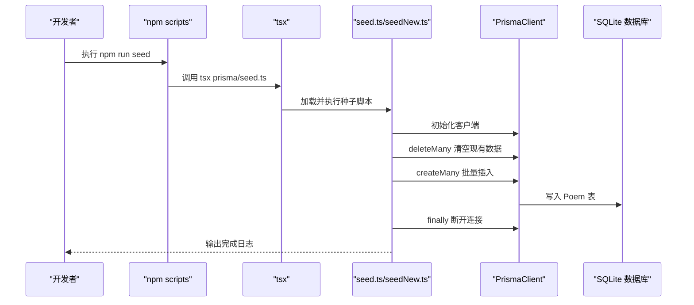
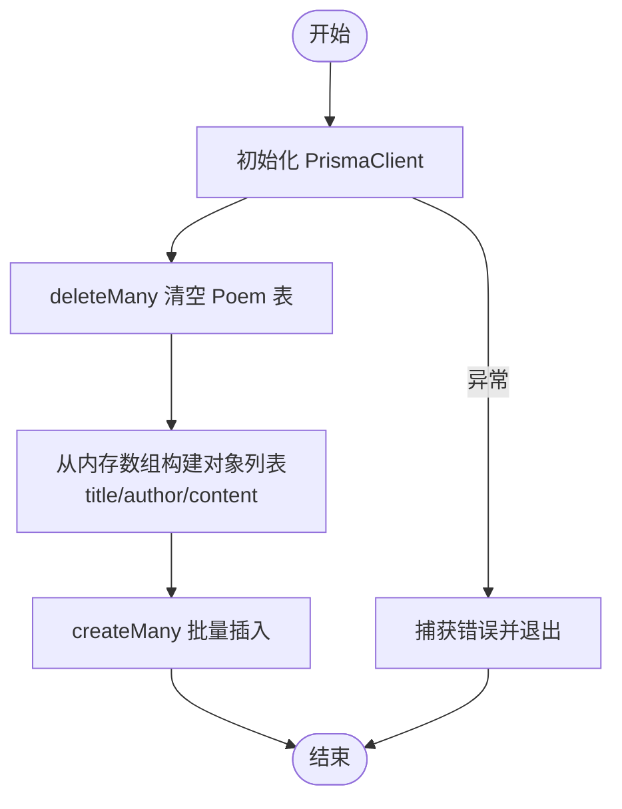
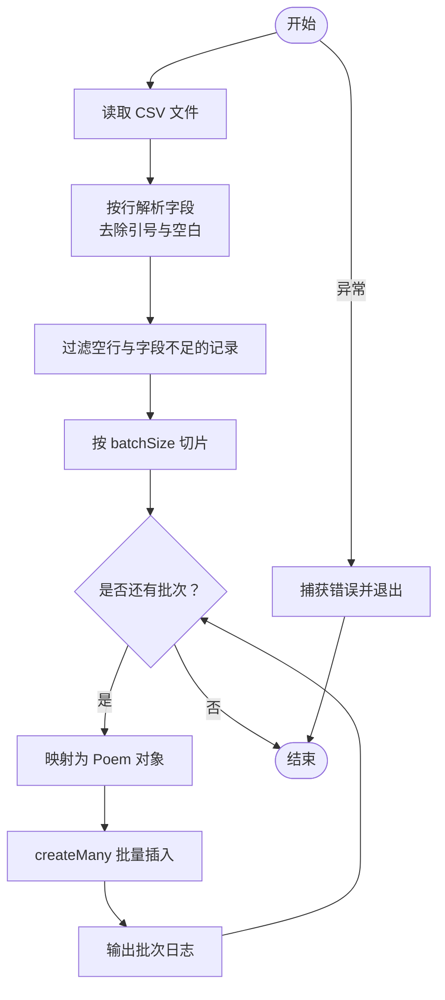
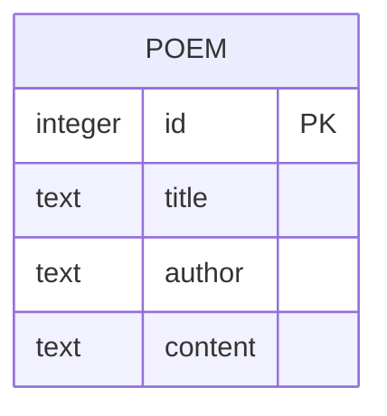
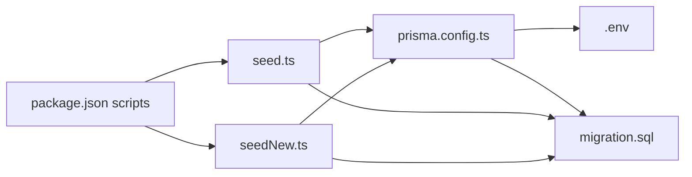

# 数据初始化

<cite>
**本文引用的文件**
- [backend/package.json](file://backend/package.json)
- [backend/prisma/seed.ts](file://backend/prisma/seed.ts)
- [backend/prisma/seedNew.ts](file://backend/prisma/seedNew.ts)
- [backend/prisma/poems.json](file://backend/prisma/poems.json)
- [backend/prisma/唐.csv](file://backend/prisma/唐.csv)
- [backend/prisma.config.ts](file://backend/prisma.config.ts)
- [backend/prisma/migrations/20251104061144_init/migration.sql](file://backend/prisma/migrations/20251104061144_init/migration.sql)
- [backend/.env](file://backend/.env)
</cite>

## 目录
1. [简介](#简介)
2. [项目结构](#项目结构)
3. [核心组件](#核心组件)
4. [架构总览](#架构总览)
5. [详细组件分析](#详细组件分析)
6. [依赖关系分析](#依赖关系分析)
7. [性能考量](#性能考量)
8. [故障排查指南](#故障排查指南)
9. [结论](#结论)

## 简介
本文件面向开发者，系统性说明如何通过 npm run seed 命令触发 Prisma 种子脚本，将诗词数据批量导入数据库的 Poem 表。文档覆盖以下要点：
- 如何正确执行种子命令（包括前置条件：数据库迁移完成、环境变量可用）
- seed.ts 中 PrismaClient 的使用方式、数据读取与转换逻辑、异常处理与资源释放
- JSON/CSV 数据格式要求与常见问题定位
- 调试数据插入失败的常见原因与解决思路

## 项目结构
后端采用 Prisma 管理 SQLite 数据库，种子脚本位于 backend/prisma 目录，包含两种种子方案：
- seed.ts：直接从内存数组构造数据并批量插入
- seedNew.ts：从 CSV 文件解析数据并分批插入

图表来源
- [backend/package.json](file://backend/package.json#L1-L30)
- [backend/prisma/seed.ts](file://backend/prisma/seed.ts#L1-L53)
- [backend/prisma/seedNew.ts](file://backend/prisma/seedNew.ts#L1-L86)
- [backend/prisma.config.ts](file://backend/prisma.config.ts#L1-L14)
- [backend/prisma/migrations/20251104061144_init/migration.sql](file://backend/prisma/migrations/20251104061144_init/migration.sql#L1-L8)
- [backend/.env](file://backend/.env#L1-L1)

章节来源
- [backend/package.json](file://backend/package.json#L1-L30)
- [backend/prisma.config.ts](file://backend/prisma.config.ts#L1-L14)
- [backend/prisma/migrations/20251104061144_init/migration.sql](file://backend/prisma/migrations/20251104061144_init/migration.sql#L1-L8)
- [backend/.env](file://backend/.env#L1-L1)

## 核心组件
- 种子脚本 seed.ts
  - 使用 PrismaClient 连接数据库
  - 清空现有 Poem 数据
  - 将内存中的数组转换为 Poem 字段并批量插入
  - 统一捕获异常并断开连接
- 种子脚本 seedNew.ts
  - 从 CSV 文件读取并解析
  - 分批插入，降低单次压力
  - 异常处理与连接释放
- 数据源
  - seed.ts：内存数组（示例数据）
  - seedNew.ts：唐.csv（CSV 格式）
- 数据库迁移
  - migrations/20251104061144_init/migration.sql 创建 Poem 表（包含 id、title、author、content）

章节来源
- [backend/prisma/seed.ts](file://backend/prisma/seed.ts#L1-L53)
- [backend/prisma/seedNew.ts](file://backend/prisma/seedNew.ts#L1-L86)
- [backend/prisma/migrations/20251104061144_init/migration.sql](file://backend/prisma/migrations/20251104061144_init/migration.sql#L1-L8)

## 架构总览
种子流程从 npm scripts 触发，经 Prisma 配置加载数据库连接，最终写入 Poem 表。

图表来源
- [backend/package.json](file://backend/package.json#L1-L30)
- [backend/prisma/seed.ts](file://backend/prisma/seed.ts#L1-L53)
- [backend/prisma/seedNew.ts](file://backend/prisma/seedNew.ts#L1-L86)

## 详细组件分析

### seed.ts：内存数组批量插入
- PrismaClient 使用
  - 在脚本顶部实例化客户端，用于后续查询与写入
- 数据读取与转换
  - 从内存数组读取 title、author、paragraphs
  - 将 paragraphs 合并为 content 字段
  - 形成与 Poem 表字段一致的对象集合
- 批量插入
  - 先 deleteMany 清空历史数据
  - 再 createMany 批量写入
- 异常处理与资源释放
  - main 函数外层 catch 捕获错误并退出进程
  - finally 中断开 Prisma 连接，避免进程悬挂

图表来源
- [backend/prisma/seed.ts](file://backend/prisma/seed.ts#L1-L53)

章节来源
- [backend/prisma/seed.ts](file://backend/prisma/seed.ts#L1-L53)

### seedNew.ts：CSV 批量插入
- 数据读取与解析
  - 读取 CSV 文件，跳过标题行
  - 使用正则拆分字段，去除引号并清洗空白
  - 仅保留 title、author、content 三个字段
- 分批插入
  - 每批固定大小，循环切片插入，避免单次过大事务
  - 插入过程中输出批次进度
- 异常处理与资源释放
  - 捕获错误并退出
  - finally 断开 Prisma 连接

图表来源
- [backend/prisma/seedNew.ts](file://backend/prisma/seedNew.ts#L1-L86)
- [backend/prisma/唐.csv](file://backend/prisma/唐.csv#L1-L200)

章节来源
- [backend/prisma/seedNew.ts](file://backend/prisma/seedNew.ts#L1-L86)
- [backend/prisma/唐.csv](file://backend/prisma/唐.csv#L1-L200)

### 数据模型与迁移
- Poem 表结构
  - 字段：id、title、author、content
  - 由迁移脚本创建
- 数据源差异
  - seed.ts：内存数组（示例数据）
  - seedNew.ts：CSV 文件（实际数据）

图表来源
- [backend/prisma/migrations/20251104061144_init/migration.sql](file://backend/prisma/migrations/20251104061144_init/migration.sql#L1-L8)

章节来源
- [backend/prisma/migrations/20251104061144_init/migration.sql](file://backend/prisma/migrations/20251104061144_init/migration.sql#L1-L8)

## 依赖关系分析
- 命令入口
  - package.json 中 scripts.seed 指向 tsx prisma/seed.ts
- 数据库配置
  - prisma.config.ts 指定 schema 与 migrations 路径，并从 .env 读取 DATABASE_URL
- 数据库连接
  - .env 提供 SQLite 文件路径 DATABASE_URL="file:./dev.db"
- 迁移与表结构
  - migrations/20251104061144_init/migration.sql 定义 Poem 表

图表来源
- [backend/package.json](file://backend/package.json#L1-L30)
- [backend/prisma.config.ts](file://backend/prisma.config.ts#L1-L14)
- [backend/.env](file://backend/.env#L1-L1)
- [backend/prisma/migrations/20251104061144_init/migration.sql](file://backend/prisma/migrations/20251104061144_init/migration.sql#L1-L8)

章节来源
- [backend/package.json](file://backend/package.json#L1-L30)
- [backend/prisma.config.ts](file://backend/prisma.config.ts#L1-L14)
- [backend/.env](file://backend/.env#L1-L1)
- [backend/prisma/migrations/20251104061144_init/migration.sql](file://backend/prisma/migrations/20251104061144_init/migration.sql#L1-L8)

## 性能考量
- 批量插入
  - seed.ts 使用 createMany 一次性写入，适合小规模数据
  - seedNew.ts 使用分批插入，适合大规模 CSV 数据，降低内存与事务压力
- 清空策略
  - seed.ts 先 deleteMany 清空，避免重复数据
- 连接管理
  - finally 中断开连接，防止进程无法退出

章节来源
- [backend/prisma/seed.ts](file://backend/prisma/seed.ts#L1-L53)
- [backend/prisma/seedNew.ts](file://backend/prisma/seedNew.ts#L1-L86)

## 故障排查指南

### 前置条件检查
- 确认数据库迁移已完成
  - 迁移脚本已创建 Poem 表
- 确认 .env 配置正确
  - DATABASE_URL 指向有效 SQLite 文件路径
- 确认 Prisma 已安装
  - 依赖中包含 @prisma/client 与 prisma

章节来源
- [backend/prisma/migrations/20251104061144_init/migration.sql](file://backend/prisma/migrations/20251104061144_init/migration.sql#L1-L8)
- [backend/.env](file://backend/.env#L1-L1)
- [backend/package.json](file://backend/package.json#L1-L30)

### 常见问题与定位
- JSON/CSV 格式错误
  - seed.ts：内存数组格式需包含 title、author、paragraphs 字段；paragraphs 应为字符串数组
  - seedNew.ts：CSV 必须包含标题行，且至少包含“题目”、“作者”、“内容”三列；字段可能包含引号，解析器已做基本处理
- 字段不匹配
  - seed.ts：最终写入字段为 title、author、content；请确保内存数组字段名称与映射一致
  - seedNew.ts：仅保留 title、author、content 三列；其他列会被忽略
- 数据库连接异常
  - 检查 DATABASE_URL 是否指向可写文件路径
  - 确认 SQLite 文件权限正常
- 大数据量插入失败
  - 若 CSV 过大，建议使用 seedNew.ts 并保持默认分批大小
  - 关注控制台输出的批次日志，定位卡顿位置
- 异常退出
  - 脚本在 catch 中会打印错误并退出进程；根据错误信息定位具体步骤

章节来源
- [backend/prisma/seed.ts](file://backend/prisma/seed.ts#L1-L53)
- [backend/prisma/seedNew.ts](file://backend/prisma/seedNew.ts#L1-L86)
- [backend/prisma/唐.csv](file://backend/prisma/唐.csv#L1-L200)

## 结论
- 执行顺序建议
  - 先确保数据库迁移完成，再执行 npm run seed
  - 若使用 CSV 数据，请确认 seedNew.ts 可用且 CSV 文件存在
- 最佳实践
  - 使用 seedNew.ts 处理大规模 CSV 数据，利用分批插入与进度日志
  - 在生产环境前先在本地验证数据格式与字段映射
  - 关注异常日志与连接释放，避免资源泄漏