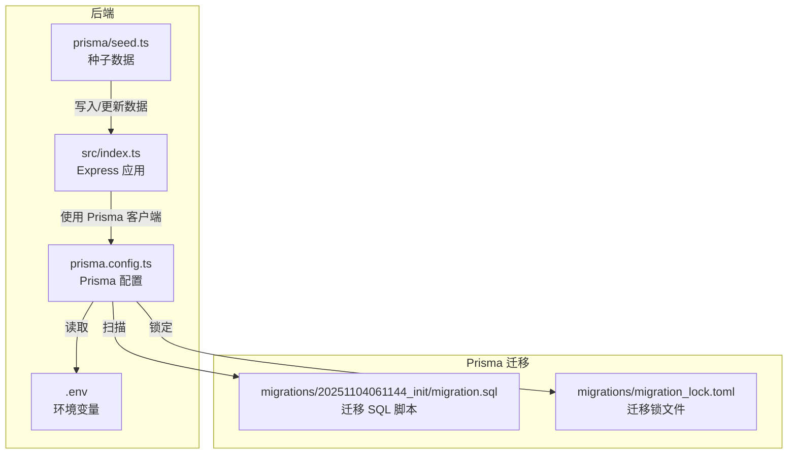
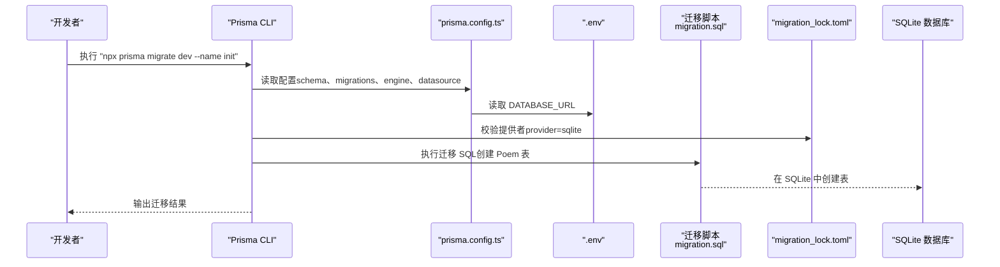
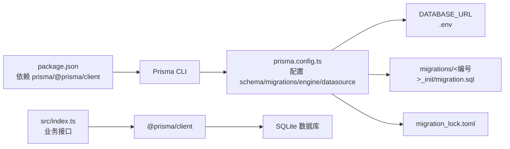

# 数据库迁移配置

<cite>
**本文引用的文件**
- [backend/prisma/migrations/20251104061144_init/migration.sql](file://backend/prisma/migrations/20251104061144_init/migration.sql)
- [backend/prisma/migrations/migration_lock.toml](file://backend/prisma/migrations/migration_lock.toml)
- [backend/prisma.config.ts](file://backend/prisma.config.ts)
- [backend/package.json](file://backend/package.json)
- [backend/.env](file://backend/.env)
- [backend/src/index.ts](file://backend/src/index.ts)
- [backend/prisma/seed.ts](file://backend/prisma/seed.ts)
</cite>

## 目录
1. [简介](#简介)
2. [项目结构](#项目结构)
3. [核心组件](#核心组件)
4. [架构总览](#架构总览)
5. [详细组件分析](#详细组件分析)
6. [依赖关系分析](#依赖关系分析)
7. [性能考虑](#性能考虑)
8. [故障排查指南](#故障排查指南)
9. [结论](#结论)
10. [附录](#附录)

## 简介
本文件面向开发者，系统性说明如何在本仓库中执行 Prisma 数据库迁移，重点围绕以下目标展开：
- 指导运行 npx prisma migrate dev --name init 命令，基于 prisma/migrations 目录下的迁移脚本（尤其是 20251104061144_init 中的 migration.sql）在 SQLite 数据库中创建 Poem 表结构。
- 解释迁移过程中的校验机制与锁文件 migration_lock.toml 的作用。
- 结合 package.json 中对 Prisma CLI 的依赖，说明推荐的迁移工作流。
- 提供处理迁移冲突或重复执行的解决方案。

## 项目结构
后端使用 Prisma 作为 ORM 和迁移工具，数据库为 SQLite。关键配置与迁移文件分布如下：
- 迁移脚本：backend/prisma/migrations/20251104061144_init/migration.sql
- 迁移锁文件：backend/prisma/migrations/migration_lock.toml
- Prisma 配置：backend/prisma.config.ts
- 环境变量：backend/.env
- 后端入口与业务接口：backend/src/index.ts
- 种子数据脚本：backend/prisma/seed.ts
- 依赖与脚本：backend/package.json

图表来源
- [backend/src/index.ts](file://backend/src/index.ts#L1-L78)
- [backend/prisma.config.ts](file://backend/prisma.config.ts#L1-L14)
- [backend/.env](file://backend/.env#L1-L1)
- [backend/prisma/migrations/20251104061144_init/migration.sql](file://backend/prisma/migrations/20251104061144_init/migration.sql#L1-L8)
- [backend/prisma/migrations/migration_lock.toml](file://backend/prisma/migrations/migration_lock.toml#L1-L4)
- [backend/prisma/seed.ts](file://backend/prisma/seed.ts#L1-L53)

章节来源
- [backend/prisma.config.ts](file://backend/prisma.config.ts#L1-L14)
- [backend/.env](file://backend/.env#L1-L1)
- [backend/package.json](file://backend/package.json#L1-L30)

## 核心组件
- 迁移 SQL 脚本：定义了 Poem 表的结构与字段，用于在 SQLite 上创建该表。
- 迁移锁文件：标记当前迁移所使用的数据库提供者（sqlite），防止跨提供者误用导致的数据不一致。
- Prisma 配置：指定 schema、迁移目录、引擎模式以及数据源 URL（来自 .env）。
- 环境变量：提供 DATABASE_URL，指向本地 SQLite 文件路径。
- 后端应用：通过 Prisma 客户端访问 Poem 表，验证迁移是否生效。
- 种子脚本：向 Poem 表插入示例数据，便于开发测试。

章节来源
- [backend/prisma/migrations/20251104061144_init/migration.sql](file://backend/prisma/migrations/20251104061144_init/migration.sql#L1-L8)
- [backend/prisma/migrations/migration_lock.toml](file://backend/prisma/migrations/migration_lock.toml#L1-L4)
- [backend/prisma.config.ts](file://backend/prisma.config.ts#L1-L14)
- [backend/.env](file://backend/.env#L1-L1)
- [backend/src/index.ts](file://backend/src/index.ts#L1-L78)
- [backend/prisma/seed.ts](file://backend/prisma/seed.ts#L1-L53)

## 架构总览
下图展示了从命令行到数据库的迁移执行链路，以及迁移后的数据访问路径。

图表来源
- [backend/prisma.config.ts](file://backend/prisma.config.ts#L1-L14)
- [backend/.env](file://backend/.env#L1-L1)
- [backend/prisma/migrations/migration_lock.toml](file://backend/prisma/migrations/migration_lock.toml#L1-L4)
- [backend/prisma/migrations/20251104061144_init/migration.sql](file://backend/prisma/migrations/20251104061144_init/migration.sql#L1-L8)

## 详细组件分析

### 迁移 SQL 脚本（Poem 表）
- 作用：在 SQLite 中创建名为 Poem 的表，包含主键与若干文本字段。
- 关键点：该脚本位于 prisma/migrations/20251104061144_init/migration.sql，是本次初始化迁移的核心内容。
- 影响范围：后续 Prisma 客户端可直接通过模型访问该表；后端接口也会查询该表以实现功能。

章节来源
- [backend/prisma/migrations/20251104061144_init/migration.sql](file://backend/prisma/migrations/20251104061144_init/migration.sql#L1-L8)

### 迁移锁文件（migration_lock.toml）
- 作用：声明当前迁移所使用的数据库提供者为 sqlite，确保跨团队协作或 CI 环境下不会误用其他提供者。
- 重要性：避免不同数据库提供者之间的迁移差异导致的数据不一致问题。
- 维护建议：该文件应纳入版本控制，禁止手动修改。

章节来源
- [backend/prisma/migrations/migration_lock.toml](file://backend/prisma/migrations/migration_lock.toml#L1-L4)

### Prisma 配置（prisma.config.ts）
- 作用：集中管理 Prisma 的 schema 路径、迁移目录、引擎模式与数据源 URL。
- 数据源 URL：从 .env 读取 DATABASE_URL，指向 SQLite 文件路径。
- 引擎模式：classic，适用于开发环境。
- 迁移目录：prisma/migrations，与迁移脚本所在位置一致。

章节来源
- [backend/prisma.config.ts](file://backend/prisma.config.ts#L1-L14)
- [backend/.env](file://backend/.env#L1-L1)

### 环境变量（.env）
- 作用：提供 DATABASE_URL，指示 SQLite 数据库文件的位置。
- 默认值：file:./dev.db，表示在项目根目录下创建或使用 dev.db 文件。

章节来源
- [backend/.env](file://backend/.env#L1-L1)

### 后端应用与数据访问
- 作用：通过 Prisma 客户端访问 Poem 表，提供随机字符、验证诗句、AI 生成等接口。
- 验证迁移：若接口能正常返回 Poem 数据，则表明迁移已成功创建表并可用。

章节来源
- [backend/src/index.ts](file://backend/src/index.ts#L1-L78)

### 种子脚本（seed.ts）
- 作用：在迁移完成后，向 Poem 表写入示例数据，便于开发与演示。
- 注意：脚本会先清空现有数据，再批量插入格式化后的 Poem 记录。

章节来源
- [backend/prisma/seed.ts](file://backend/prisma/seed.ts#L1-L53)

## 依赖关系分析
- package.json 中声明了 prisma 与 @prisma/client 依赖，因此可通过 npx prisma 或本地安装的 CLI 执行迁移命令。
- prisma.config.ts 指定 schema、迁移目录与数据源 URL，确保 CLI 能正确解析与执行迁移。
- .env 提供 DATABASE_URL，决定 SQLite 文件的实际位置。
- 后端应用通过 Prisma 客户端访问数据库，间接验证迁移是否成功。

图表来源
- [backend/package.json](file://backend/package.json#L1-L30)
- [backend/prisma.config.ts](file://backend/prisma.config.ts#L1-L14)
- [backend/.env](file://backend/.env#L1-L1)
- [backend/prisma/migrations/20251104061144_init/migration.sql](file://backend/prisma/migrations/20251104061144_init/migration.sql#L1-L8)
- [backend/prisma/migrations/migration_lock.toml](file://backend/prisma/migrations/migration_lock.toml#L1-L4)
- [backend/src/index.ts](file://backend/src/index.ts#L1-L78)

章节来源
- [backend/package.json](file://backend/package.json#L1-L30)
- [backend/prisma.config.ts](file://backend/prisma.config.ts#L1-L14)
- [backend/.env](file://backend/.env#L1-L1)

## 性能考虑
- 开发阶段使用 classic 引擎与 SQLite，性能开销较低，适合快速迭代。
- 迁移执行时间主要取决于 SQLite 文件大小与磁盘 I/O；建议在本地开发时保持 SQLite 文件较小。
- 若后续需要扩展到生产环境，请评估提供者切换与迁移策略（例如使用关系型数据库时的迁移并发与锁机制）。

## 故障排查指南
- 迁移未生效
  - 检查 prisma.config.ts 是否正确设置 schema 与 migrations 路径。
  - 确认 .env 中 DATABASE_URL 指向正确的 SQLite 文件路径。
  - 确保 migration_lock.toml 的 provider 为 sqlite，避免跨提供者误用。
- 重复执行迁移
  - Prisma 迁移具备幂等性检查，重复执行通常会被跳过或提示已应用。
  - 若出现异常，清理迁移状态或回滚后再重试。
- 冲突与并发
  - 使用 migration_lock.toml 锁定提供者，避免多人协作时的不一致。
  - 在团队中约定迁移命名规范与提交流程，减少冲突概率。
- 数据不一致
  - 确保迁移脚本与 Prisma 模型定义一致。
  - 如需修复，建议新增迁移而非直接修改历史脚本。

章节来源
- [backend/prisma.config.ts](file://backend/prisma.config.ts#L1-L14)
- [backend/.env](file://backend/.env#L1-L1)
- [backend/prisma/migrations/migration_lock.toml](file://backend/prisma/migrations/migration_lock.toml#L1-L4)

## 结论
本仓库已完整配置 Prisma 迁移与 SQLite 数据库，迁移脚本已在 prisma/migrations/20251104061144_init/migration.sql 中定义 Poem 表结构。通过 prisma.config.ts 与 .env 的配合，迁移锁文件 migration_lock.toml 确保提供者一致性。推荐的迁移工作流包括：先确认配置与环境变量，再执行迁移命令，最后通过后端接口或种子脚本验证数据。遇到冲突或重复执行时，遵循幂等性原则与团队约定进行处理。

## 附录
- 推荐迁移工作流
  1) 确认 prisma.config.ts 与 .env 配置无误。
  2) 执行迁移命令：npx prisma migrate dev --name init。
  3) 校验迁移结果：检查 SQLite 文件是否存在且包含 Poem 表。
  4) 可选：执行种子脚本导入示例数据。
  5) 验证接口：调用后端接口确认数据可用。

章节来源
- [backend/prisma.config.ts](file://backend/prisma.config.ts#L1-L14)
- [backend/.env](file://backend/.env#L1-L1)
- [backend/prisma/migrations/20251104061144_init/migration.sql](file://backend/prisma/migrations/20251104061144_init/migration.sql#L1-L8)
- [backend/prisma/seed.ts](file://backend/prisma/seed.ts#L1-L53)
- [backend/src/index.ts](file://backend/src/index.ts#L1-L78)