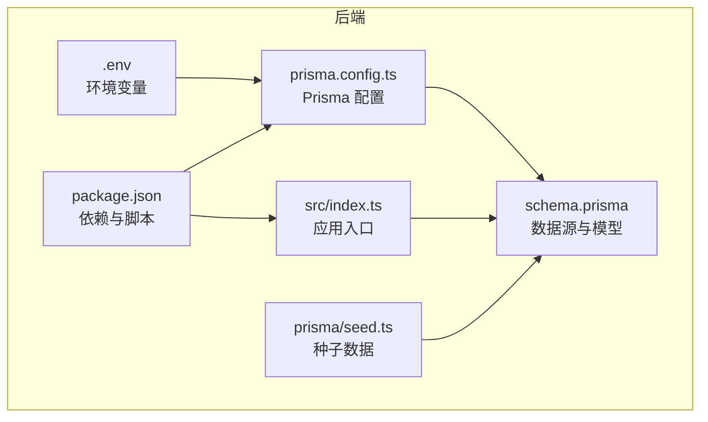
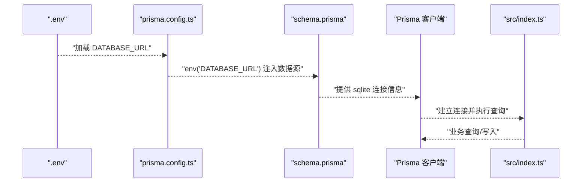
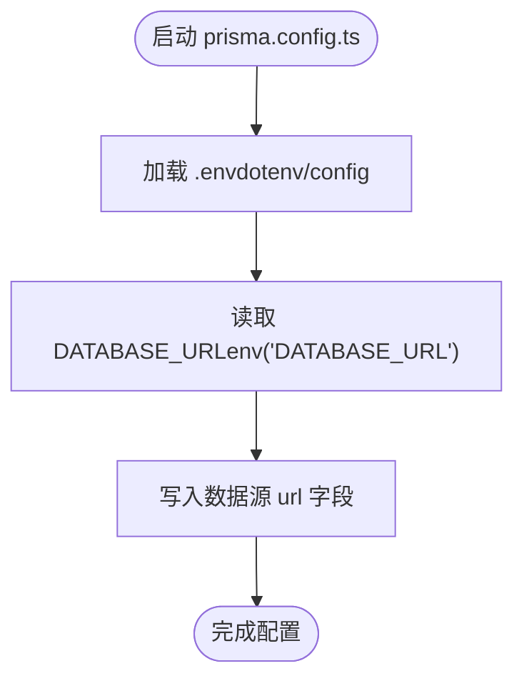
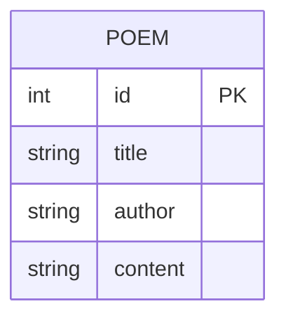
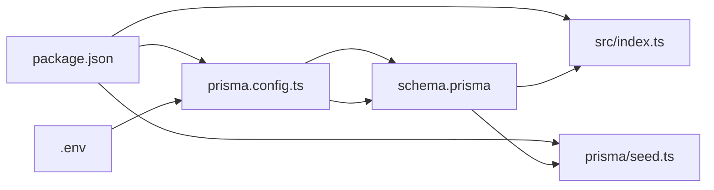

# 环境变量配置

<cite>
**本文引用的文件**
- [backend/.env](file://backend/.env)
- [backend/prisma.config.ts](file://backend/prisma.config.ts)
- [backend/prisma/schema.prisma](file://backend/prisma/schema.prisma)
- [backend/package.json](file://backend/package.json)
- [backend/src/index.ts](file://backend/src/index.ts)
- [backend/prisma/seed.ts](file://backend/prisma/seed.ts)
</cite>

## 目录
1. [简介](#简介)
2. [项目结构](#项目结构)
3. [核心组件](#核心组件)
4. [架构总览](#架构总览)
5. [详细组件分析](#详细组件分析)
6. [依赖关系分析](#依赖关系分析)
7. [性能与稳定性建议](#性能与稳定性建议)
8. [故障排查指南](#故障排查指南)
9. [结论](#结论)

## 简介
本文件面向后端开发者，系统性说明如何通过环境变量配置 SQLite 数据库连接，重点围绕 backend/.env 中 DATABASE_URL 的设置方式（如 file:./dev.db），以及该变量在 prisma.config.ts 中经 dotenv/config 加载并通过 Prisma 的 env() 函数读取，最终用于配置数据源。文档还提供常见问题排查方法，帮助避免因路径错误或权限问题导致的连接失败。

## 项目结构
后端采用 Prisma 作为 ORM，使用 SQLite 作为本地开发数据库。关键配置文件如下：
- 环境变量文件：backend/.env
- Prisma 配置：backend/prisma.config.ts
- 数据库模式定义：backend/prisma/schema.prisma
- 启动入口：backend/src/index.ts
- 种子脚本：backend/prisma/seed.ts
- 依赖声明：backend/package.json

图表来源
- [backend/.env](file://backend/.env#L1-L1)
- [backend/prisma.config.ts](file://backend/prisma.config.ts#L1-L14)
- [backend/prisma/schema.prisma](file://backend/prisma/schema.prisma#L1-L19)
- [backend/src/index.ts](file://backend/src/index.ts#L1-L78)
- [backend/prisma/seed.ts](file://backend/prisma/seed.ts#L1-L53)
- [backend/package.json](file://backend/package.json#L1-L30)

章节来源
- [backend/.env](file://backend/.env#L1-L1)
- [backend/prisma.config.ts](file://backend/prisma.config.ts#L1-L14)
- [backend/prisma/schema.prisma](file://backend/prisma/schema.prisma#L1-L19)
- [backend/src/index.ts](file://backend/src/index.ts#L1-L78)
- [backend/prisma/seed.ts](file://backend/prisma/seed.ts#L1-L53)
- [backend/package.json](file://backend/package.json#L1-L30)

## 核心组件
- 环境变量文件 backend/.env：存放 DATABASE_URL，格式为 file:./dev.db，指向 SQLite 文件路径。
- Prisma 配置 backend/prisma.config.ts：通过 dotenv/config 自动加载 .env；使用 env("DATABASE_URL") 读取变量，并将其注入到数据源配置中。
- 数据库模式 backend/prisma/schema.prisma：定义 sqlite 提供程序与数据源 URL 来自环境变量。
- 应用入口 backend/src/index.ts：创建 PrismaClient 并启动服务，实际使用 Prisma 客户端进行数据库访问。
- 种子脚本 backend/prisma/seed.ts：演示如何通过 PrismaClient 写入初始数据。
- 依赖声明 backend/package.json：包含 prisma、@prisma/client、sqlite3 等依赖，保证运行时可用。

章节来源
- [backend/.env](file://backend/.env#L1-L1)
- [backend/prisma.config.ts](file://backend/prisma.config.ts#L1-L14)
- [backend/prisma/schema.prisma](file://backend/prisma/schema.prisma#L1-L19)
- [backend/src/index.ts](file://backend/src/index.ts#L1-L78)
- [backend/prisma/seed.ts](file://backend/prisma/seed.ts#L1-L53)
- [backend/package.json](file://backend/package.json#L1-L30)

## 架构总览
下图展示从环境变量到数据库连接的关键链路：.env -> prisma.config.ts -> schema.prisma -> Prisma 客户端 -> 应用逻辑。

图表来源
- [backend/.env](file://backend/.env#L1-L1)
- [backend/prisma.config.ts](file://backend/prisma.config.ts#L1-L14)
- [backend/prisma/schema.prisma](file://backend/prisma/schema.prisma#L1-L19)
- [backend/src/index.ts](file://backend/src/index.ts#L1-L78)

## 详细组件分析

### 环境变量 DATABASE_URL 的设置与作用
- 设置位置：backend/.env
- 常见值示例：file:./dev.db
- 作用：为 Prisma 指定 SQLite 数据库文件路径，支持相对路径与绝对路径。
- 注意事项：
  - 使用 file: 前缀表示 SQLite 文件路径。
  - 相对路径基于当前工作目录解析；建议使用明确的相对路径或绝对路径，避免运行时目录变化导致解析异常。
  - 确保目标目录存在且具备读写权限，否则连接会失败。

章节来源
- [backend/.env](file://backend/.env#L1-L1)

### Prisma 配置加载流程（prisma.config.ts）
- 加载机制：通过 dotenv/config 在模块初始化时自动加载 .env。
- 变量读取：env("DATABASE_URL") 将 .env 中的 DATABASE_URL 注入到数据源配置。
- 数据源配置：将 url 字段绑定到 env("DATABASE_URL")，从而影响 Prisma 的连接行为。

图表来源
- [backend/prisma.config.ts](file://backend/prisma.config.ts#L1-L14)

章节来源
- [backend/prisma.config.ts](file://backend/prisma.config.ts#L1-L14)

### 数据库模式（schema.prisma）
- 提供程序：sqlite
- 数据源 URL：来自 env("DATABASE_URL")，即 .env 中的 DATABASE_URL
- 模型：Poem（标题、作者、内容等字段）

图表来源
- [backend/prisma/schema.prisma](file://backend/prisma/schema.prisma#L1-L19)

章节来源
- [backend/prisma/schema.prisma](file://backend/prisma/schema.prisma#L1-L19)

### 应用入口与 Prisma 客户端
- 创建 PrismaClient 实例，用于与数据库交互。
- 通过 Express 提供 REST 接口，内部调用 Prisma 查询/写入。
- 该客户端在运行时会依据 Prisma 配置与 schema.prisma 的数据源设置进行连接。

章节来源
- [backend/src/index.ts](file://backend/src/index.ts#L1-L78)

### 种子脚本（seed.ts）
- 使用 PrismaClient 清空并写入初始数据，验证数据库连接与写入能力。
- 适合在首次运行或重置数据库后执行，确保 schema 与数据一致。

章节来源
- [backend/prisma/seed.ts](file://backend/prisma/seed.ts#L1-L53)

## 依赖关系分析
- package.json 声明了 prisma、@prisma/client、sqlite3 等依赖，确保 Prisma 工具链与运行时可用。
- prisma.config.ts 依赖 dotenv/config，负责加载 .env。
- schema.prisma 依赖 env("DATABASE_URL")，将变量注入到数据源。
- src/index.ts 依赖 @prisma/client，创建 PrismaClient 并执行业务逻辑。

图表来源
- [backend/package.json](file://backend/package.json#L1-L30)
- [backend/prisma.config.ts](file://backend/prisma.config.ts#L1-L14)
- [backend/prisma/schema.prisma](file://backend/prisma/schema.prisma#L1-L19)
- [backend/src/index.ts](file://backend/src/index.ts#L1-L78)
- [backend/prisma/seed.ts](file://backend/prisma/seed.ts#L1-L53)
- [backend/.env](file://backend/.env#L1-L1)

章节来源
- [backend/package.json](file://backend/package.json#L1-L30)
- [backend/prisma.config.ts](file://backend/prisma.config.ts#L1-L14)
- [backend/prisma/schema.prisma](file://backend/prisma/schema.prisma#L1-L19)
- [backend/src/index.ts](file://backend/src/index.ts#L1-L78)
- [backend/prisma/seed.ts](file://backend/prisma/seed.ts#L1-L53)
- [backend/.env](file://backend/.env#L1-L1)

## 性能与稳定性建议
- 路径稳定性：优先使用明确的相对路径或绝对路径，避免因工作目录变化导致的连接失败。
- 文件权限：确保数据库文件所在目录具备读写权限，防止连接或迁移阶段出现权限错误。
- 开发与生产分离：在不同环境使用不同的 DATABASE_URL，避免混用同一文件导致并发写入冲突。
- 迁移与锁：若使用迁移，请确认迁移锁文件未被占用，避免并发迁移失败。
- 日志与监控：在应用启动时记录数据库连接状态，便于快速定位连接问题。

[本节为通用建议，无需特定文件引用]

## 故障排查指南
- 连接失败（找不到文件或无权限）
  - 检查 DATABASE_URL 是否指向正确的 SQLite 文件路径。
  - 确认目标文件存在且具备读写权限。
  - 若使用相对路径，确认运行时工作目录与预期一致。
  - 参考路径解析与权限相关实现位置：
    - 环境变量设置：[backend/.env](file://backend/.env#L1-L1)
    - 配置加载与变量读取：[backend/prisma.config.ts](file://backend/prisma.config.ts#L1-L14)
    - 数据源注入：[backend/prisma/schema.prisma](file://backend/prisma/schema.prisma#L1-L19)
- 迁移或种子脚本失败
  - 确认 Prisma 工具链已安装且版本兼容。
  - 检查迁移目录与锁文件状态，避免并发冲突。
  - 参考依赖声明与脚本命令：
    - 依赖与脚本：[backend/package.json](file://backend/package.json#L1-L30)
    - 种子脚本入口：[backend/prisma/seed.ts](file://backend/prisma/seed.ts#L1-L53)
- 运行时连接异常
  - 确认应用启动时已加载 .env（dotenv/config）。
  - 检查 PrismaClient 初始化是否成功。
  - 参考应用入口与客户端初始化：
    - 应用入口与 PrismaClient：[backend/src/index.ts](file://backend/src/index.ts#L1-L78)

章节来源
- [backend/.env](file://backend/.env#L1-L1)
- [backend/prisma.config.ts](file://backend/prisma.config.ts#L1-L14)
- [backend/prisma/schema.prisma](file://backend/prisma/schema.prisma#L1-L19)
- [backend/package.json](file://backend/package.json#L1-L30)
- [backend/prisma/seed.ts](file://backend/prisma/seed.ts#L1-L53)
- [backend/src/index.ts](file://backend/src/index.ts#L1-L78)

## 结论
通过在 backend/.env 中设置 DATABASE_URL（如 file:./dev.db），并配合 prisma.config.ts 的 dotenv/config 加载与 env() 读取，可以将环境变量注入到 Prisma 的数据源配置中。结合 schema.prisma 的 sqlite 提供程序，即可完成数据库连接。为确保稳定运行，建议统一管理不同环境的 DATABASE_URL，严格控制文件权限与路径解析，并在出现问题时按“故障排查指南”逐项检查。