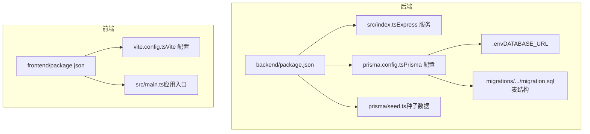
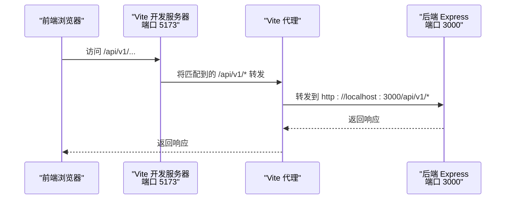
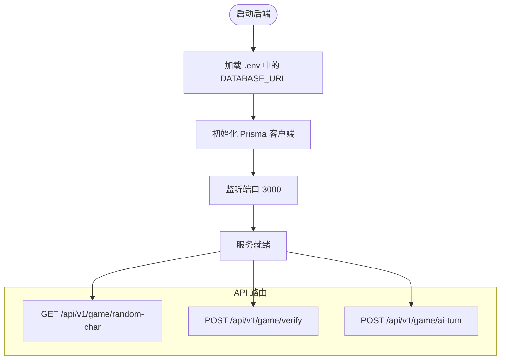
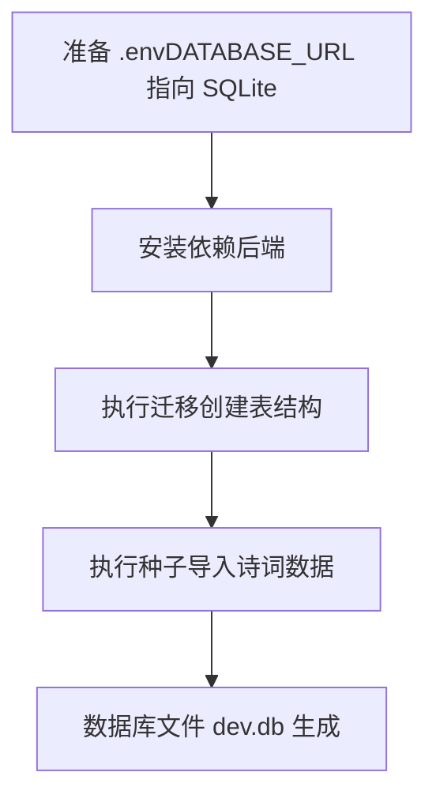
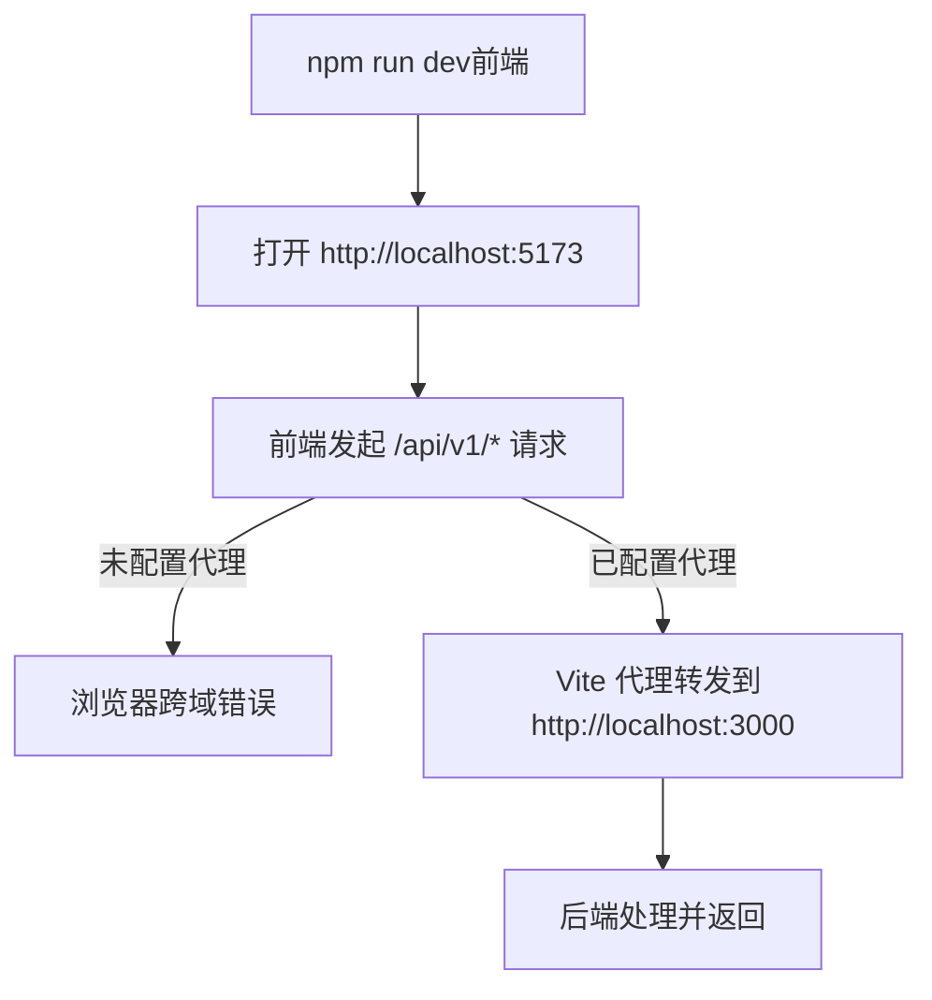
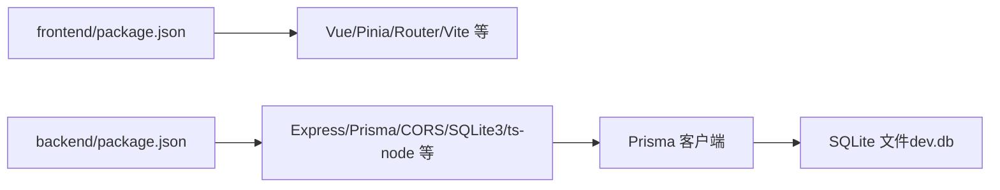

# 环境配置与部署

<cite>
**本文引用的文件**
- [backend/.env](file://backend/.env)
- [backend/package.json](file://backend/package.json)
- [backend/src/index.ts](file://backend/src/index.ts)
- [backend/prisma/seed.ts](file://backend/prisma/seed.ts)
- [backend/prisma/migrations/20251104061144_init/migration.sql](file://backend/prisma/migrations/20251104061144_init/migration.sql)
- [backend/prisma.config.ts](file://backend/prisma.config.ts)
- [frontend/package.json](file://frontend/package.json)
- [frontend/vite.config.ts](file://frontend/vite.config.ts)
- [frontend/src/main.ts](file://frontend/src/main.ts)
- [GEMINI.md](file://GEMINI.md)
</cite>

## 目录
1. [简介](#简介)
2. [项目结构](#项目结构)
3. [核心组件](#核心组件)
4. [架构总览](#架构总览)
5. [详细组件分析](#详细组件分析)
6. [依赖关系分析](#依赖关系分析)
7. [性能考虑](#性能考虑)
8. [故障排查指南](#故障排查指南)
9. [结论](#结论)
10. [附录](#附录)

## 简介
本指南面向需要在本地快速搭建并部署“飞花令”项目的开发者，覆盖后端数据库与API服务、前端Vite开发服务器、以及生产构建与部署建议。文档重点包括：
- 如何配置后端 DATABASE_URL 指向本地 SQLite 文件
- 如何执行 Prisma 迁移与种子数据初始化
- 如何启动后端与前端服务，以及它们的端口与交互方式
- 如何通过 Vite 的代理解决跨域问题
- 生产环境构建与部署思路（后端 Node.js 托管、前端静态资源）

## 项目结构
项目采用前后端分离架构：
- 后端：Node.js + Express + Prisma（SQLite）
- 前端：Vue 3 + Vite（开发服务器）
- 数据：Prisma 管理的 SQLite 文件（默认位于后端根目录）

图表来源
- [backend/package.json](file://backend/package.json#L1-L30)
- [backend/.env](file://backend/.env#L1-L1)
- [backend/src/index.ts](file://backend/src/index.ts#L1-L78)
- [backend/prisma.config.ts](file://backend/prisma.config.ts#L1-L14)
- [backend/prisma/migrations/20251104061144_init/migration.sql](file://backend/prisma/migrations/20251104061144_init/migration.sql#L1-L8)
- [backend/prisma/seed.ts](file://backend/prisma/seed.ts#L1-L53)
- [frontend/package.json](file://frontend/package.json#L1-L51)
- [frontend/vite.config.ts](file://frontend/vite.config.ts#L1-L19)
- [frontend/src/main.ts](file://frontend/src/main.ts#L1-L15)

章节来源
- [GEMINI.md](file://GEMINI.md#L1-L21)
- [backend/package.json](file://backend/package.json#L1-L30)
- [frontend/package.json](file://frontend/package.json#L1-L51)

## 核心组件
- 后端 Express 服务：提供飞花令相关 API（随机令字、诗句验证、AI 出句等），监听端口 3000。
- Prisma 数据层：管理 SQLite 数据库，包含 Poem 表；通过迁移脚本创建表结构；通过种子脚本初始化诗词数据。
- 前端 Vite 应用：Vue 3 + TypeScript，开发服务器默认端口 5173；当前未配置代理，需在开发阶段注意跨域。

章节来源
- [backend/src/index.ts](file://backend/src/index.ts#L1-L78)
- [backend/prisma/migrations/20251104061144_init/migration.sql](file://backend/prisma/migrations/20251104061144_init/migration.sql#L1-L8)
- [backend/prisma/seed.ts](file://backend/prisma/seed.ts#L1-L53)
- [frontend/vite.config.ts](file://frontend/vite.config.ts#L1-L19)

## 架构总览
后端提供 REST API，前端通过 HTTP 请求调用后端接口。开发阶段前端访问后端时可能遇到跨域问题，可通过 Vite 代理转发到后端端口解决。

图表来源
- [frontend/vite.config.ts](file://frontend/vite.config.ts#L1-L19)
- [backend/src/index.ts](file://backend/src/index.ts#L1-L78)

## 详细组件分析

### 后端服务与数据库
- 端口：后端默认监听 3000，可在环境变量中覆盖。
- 数据库：通过 DATABASE_URL 指向本地 SQLite 文件（默认为 dev.db）。
- API 列表（示例）：
  - GET /api/v1/game/random-char：获取一个随机令字
  - POST /api/v1/game/verify：验证用户诗句
  - POST /api/v1/game/ai-turn：AI 出句（基于令字筛选）

图表来源
- [backend/src/index.ts](file://backend/src/index.ts#L1-L78)
- [backend/.env](file://backend/.env#L1-L1)

章节来源
- [backend/src/index.ts](file://backend/src/index.ts#L1-L78)
- [backend/.env](file://backend/.env#L1-L1)

### Prisma 迁移与种子数据
- 迁移：使用 Prisma 迁移脚本创建数据库表结构（Poem 表）。
- 种子：执行种子脚本写入初始诗词数据。

图表来源
- [backend/prisma.config.ts](file://backend/prisma.config.ts#L1-L14)
- [backend/prisma/migrations/20251104061144_init/migration.sql](file://backend/prisma/migrations/20251104061144_init/migration.sql#L1-L8)
- [backend/prisma/seed.ts](file://backend/prisma/seed.ts#L1-L53)
- [backend/package.json](file://backend/package.json#L1-L30)

章节来源
- [backend/prisma.config.ts](file://backend/prisma.config.ts#L1-L14)
- [backend/prisma/migrations/20251104061144_init/migration.sql](file://backend/prisma/migrations/20251104061144_init/migration.sql#L1-L8)
- [backend/prisma/seed.ts](file://backend/prisma/seed.ts#L1-L53)
- [backend/package.json](file://backend/package.json#L1-L30)

### 前端开发服务器与代理
- 启动：前端使用 npm run dev 启动 Vite 开发服务器，默认端口 5173。
- 代理：当前 Vite 配置未设置代理，若前端直接请求后端 API 可能出现跨域。建议在开发阶段添加代理，将 /api/v1/* 转发至后端 3000 端口。

图表来源
- [frontend/vite.config.ts](file://frontend/vite.config.ts#L1-L19)
- [frontend/package.json](file://frontend/package.json#L1-L51)
- [backend/src/index.ts](file://backend/src/index.ts#L1-L78)

章节来源
- [frontend/vite.config.ts](file://frontend/vite.config.ts#L1-L19)
- [frontend/package.json](file://frontend/package.json#L1-L51)

## 依赖关系分析
- 后端依赖：Express、Prisma、CORS、SQLite3、ts-node 等。
- 前端依赖：Vue 3、Vue Router、Pinia、Vite、Tailwind CSS 等。
- 数据依赖：Prisma 通过 DATABASE_URL 连接 SQLite 文件。

图表来源
- [frontend/package.json](file://frontend/package.json#L1-L51)
- [backend/package.json](file://backend/package.json#L1-L30)

章节来源
- [frontend/package.json](file://frontend/package.json#L1-L51)
- [backend/package.json](file://backend/package.json#L1-L30)

## 性能考虑
- 开发阶段：Vite 热更新与按需编译可显著提升前端开发体验；后端 Express 在本地 SQLite 上运行，I/O 通常不是瓶颈。
- 数据量：当前种子脚本仅导入少量诗词，生产环境可根据需要扩展数据规模。
- 并发与缓存：生产环境建议引入缓存层或数据库连接池优化查询性能。

## 故障排查指南
- 后端无法连接数据库
  - 检查 DATABASE_URL 是否正确指向 SQLite 文件路径
  - 确认已执行迁移并生成 dev.db
- 前端跨域
  - 未配置代理时，浏览器控制台会显示跨域错误；请在 Vite 中添加代理将 /api/v1/* 转发到后端 3000 端口
- API 404 或 400
  - 确认已启动后端服务并在 3000 端口监听
  - 确认前端请求路径与后端路由一致（/api/v1/...）

章节来源
- [backend/.env](file://backend/.env#L1-L1)
- [backend/src/index.ts](file://backend/src/index.ts#L1-L78)
- [frontend/vite.config.ts](file://frontend/vite.config.ts#L1-L19)

## 结论
本指南提供了从零开始搭建本地开发环境、执行数据库迁移与种子数据、启动前后端服务、以及解决跨域问题的完整流程。生产部署阶段可将后端以 Node.js 托管，前端进行静态构建并通过静态托管服务发布。

## 附录

### 本地开发环境搭建步骤
- 后端
  - 确保 DATABASE_URL 指向本地 SQLite 文件（例如 file:./dev.db）
  - 安装后端依赖
  - 执行迁移以创建数据库表结构
  - 执行种子脚本初始化诗词数据
  - 启动后端服务（默认端口 3000）
- 前端
  - 安装前端依赖
  - 启动 Vite 开发服务器（默认端口 5173）
  - 若前端直接请求后端 API，请在 Vite 中配置代理将 /api/v1/* 转发到后端 3000 端口

章节来源
- [backend/.env](file://backend/.env#L1-L1)
- [backend/package.json](file://backend/package.json#L1-L30)
- [backend/prisma.config.ts](file://backend/prisma.config.ts#L1-L14)
- [backend/prisma/migrations/20251104061144_init/migration.sql](file://backend/prisma/migrations/20251104061144_init/migration.sql#L1-L8)
- [backend/prisma/seed.ts](file://backend/prisma/seed.ts#L1-L53)
- [backend/src/index.ts](file://backend/src/index.ts#L1-L78)
- [frontend/package.json](file://frontend/package.json#L1-L51)
- [frontend/vite.config.ts](file://frontend/vite.config.ts#L1-L19)

### 生产构建与部署建议
- 后端
  - 使用 Node.js 运行后端服务（Express）
  - 将 Prisma 生成的客户端与数据库文件打包到生产环境
- 前端
  - 使用 npm run build 生成静态资源
  - 将构建产物部署到静态托管平台（如 Nginx、CDN 或云托管）

章节来源
- [GEMINI.md](file://GEMINI.md#L1-L21)
- [backend/package.json](file://backend/package.json#L1-L30)
- [frontend/package.json](file://frontend/package.json#L1-L51)