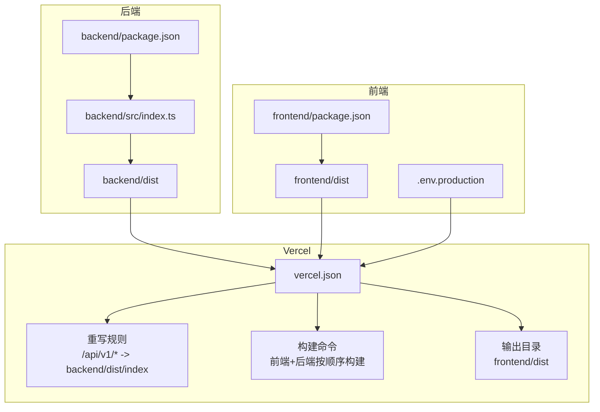
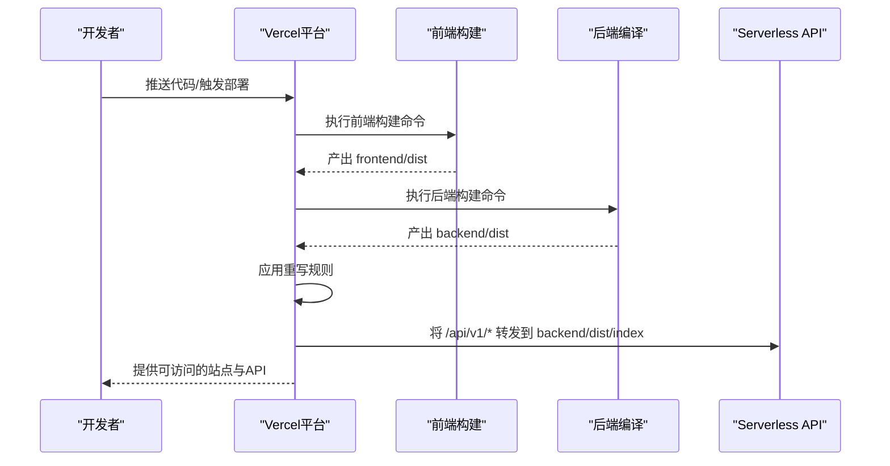
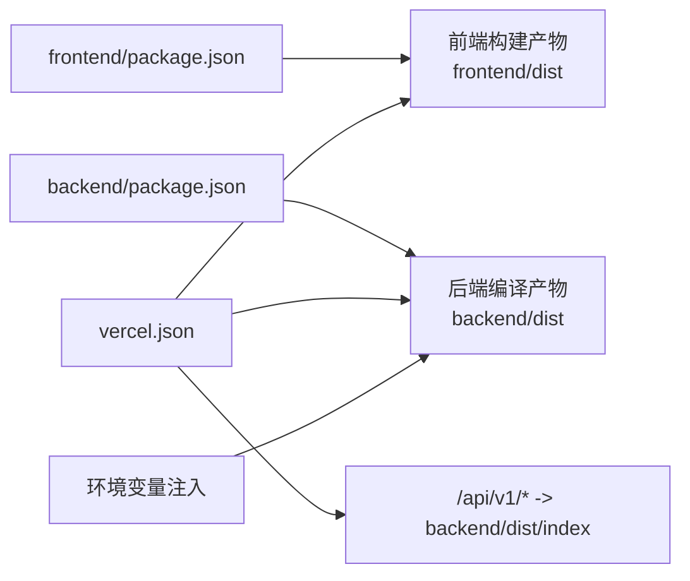

# Vercel部署配置

<cite>
**本文引用的文件**
- [vercel.json](file://vercel.json)
- [DEPLOY.md](file://DEPLOY.md)
- [README.md](file://README.md)
- [deploy-prepare.sh](file://deploy-prepare.sh)
- [start-dev.sh](file://start-dev.sh)
- [frontend/package.json](file://frontend/package.json)
- [backend/package.json](file://backend/package.json)
- [backend/src/index.ts](file://backend/src/index.ts)
- [api/package.json](file://api/package.json)
- [.env.production](file://frontend/.env.production)
</cite>

## 目录
1. [简介](#简介)
2. [项目结构](#项目结构)
3. [核心组件](#核心组件)
4. [架构总览](#架构总览)
5. [详细组件分析](#详细组件分析)
6. [依赖关系分析](#依赖关系分析)
7. [性能考量](#性能考量)
8. [故障排查指南](#故障排查指南)
9. [结论](#结论)
10. [附录](#附录)

## 简介
本文件系统性梳理飞花令项目的Vercel部署配置与流程，覆盖前端静态资源托管、后端Express API作为Serverless Functions的部署、路由重写规则、环境变量注入、以及本地开发与自动化部署的最佳实践。目标是帮助开发者快速理解并稳定地在Vercel上部署与维护该全栈应用。

## 项目结构
该项目采用前后端分离的多包结构，并通过Vercel的单仓库多包部署能力实现一体化构建与发布。关键要点如下：
- 前端：Vue 3 + Vite，产物输出至frontend/dist，由Vercel托管为静态站点。
- 后端：Express + Prisma，编译产物位于backend/dist，通过Vercel重写规则映射到Serverless API。
- 部署准备：deploy-prepare.sh负责安装依赖、生成Prisma客户端、编译后端并同步到api目录，同时生成前端生产环境变量文件。
- 环境变量：通过Vercel Dashboard或CLI注入，包括数据库连接串与运行环境标识。

图表来源
- [vercel.json](file://vercel.json#L1-L13)
- [frontend/package.json](file://frontend/package.json#L1-L54)
- [backend/package.json](file://backend/package.json#L1-L37)
- [backend/src/index.ts](file://backend/src/index.ts#L1-L373)
- [.env.production](file://frontend/.env.production#L1-L1)

章节来源
- [vercel.json](file://vercel.json#L1-L13)
- [frontend/package.json](file://frontend/package.json#L1-L54)
- [backend/package.json](file://backend/package.json#L1-L37)
- [backend/src/index.ts](file://backend/src/index.ts#L1-L373)
- [.env.production](file://frontend/.env.production#L1-L1)

## 核心组件
- vercel.json：定义构建命令、输出目录、路由重写、环境变量注入等部署行为。
- deploy-prepare.sh：自动化准备阶段，安装依赖、生成Prisma客户端、编译后端、复制产物到api目录、生成前端生产环境变量。
- README.md/DEPLOY.md：提供Dashboard与CLI两种部署路径、环境变量配置、常见问题排查与性能优化建议。
- 前端与后端package.json：分别声明构建脚本与依赖，支撑Vercel的自动构建与打包。
- backend/src/index.ts：Express服务入口，提供/api/v1前缀的REST API，配合Vercel重写规则对外暴露。

章节来源
- [vercel.json](file://vercel.json#L1-L13)
- [deploy-prepare.sh](file://deploy-prepare.sh#L1-L94)
- [README.md](file://README.md#L224-L288)
- [DEPLOY.md](file://DEPLOY.md#L42-L155)
- [frontend/package.json](file://frontend/package.json#L1-L54)
- [backend/package.json](file://backend/package.json#L1-L37)
- [backend/src/index.ts](file://backend/src/index.ts#L1-L373)

## 架构总览
下图展示Vercel部署期间的关键交互：前端构建产物被Vercel托管，后端编译产物通过重写规则映射到Serverless API，前端通过VITE_API_BASE_URL指向/api/v1前缀。

图表来源
- [vercel.json](file://vercel.json#L1-L13)
- [frontend/package.json](file://frontend/package.json#L1-L54)
- [backend/package.json](file://backend/package.json#L1-L37)
- [backend/src/index.ts](file://backend/src/index.ts#L1-L373)

## 详细组件分析

### Vercel配置文件（vercel.json）
- 构建命令：按顺序执行前端安装与构建、后端安装与构建，确保前后端产物均就绪。
- 输出目录：frontend/dist，Vercel将此目录作为静态站点根目录。
- 路由重写：将/api/v1/*请求转发到backend/dist/index，使Express服务作为Serverless Function对外提供API。
- 框架：显式设为null，表示使用通用Node运行时。
- 环境变量：当前为空，实际通过Vercel Dashboard或CLI注入。

章节来源
- [vercel.json](file://vercel.json#L1-L13)

### 部署准备脚本（deploy-prepare.sh）
- 安装后端依赖并生成Prisma客户端。
- 编译后端代码并将dist目录同步到api目录，同时复制后端package.json。
- 在frontend目录生成.env.production，设置VITE_API_BASE_URL=/api/v1。
- 安装API与前端依赖并测试前端构建，确保产物完整。
- 该脚本用于本地预检与CI准备，最终部署仍由Vercel根据vercel.json执行。

章节来源
- [deploy-prepare.sh](file://deploy-prepare.sh#L1-L94)

### 前端构建与环境变量
- 前端package.json定义了vercel-build脚本，用于Vercel自动构建。
- .env.production中设置VITE_API_BASE_URL=/api/v1，保证前端请求统一走/api/v1前缀，与vercel.json重写规则一致。
- Vercel将frontend/dist作为静态站点输出，路由交由重写规则处理。

章节来源
- [frontend/package.json](file://frontend/package.json#L1-L54)
- [.env.production](file://frontend/.env.production#L1-L1)

### 后端Express服务与Serverless映射
- backend/src/index.ts提供/api/v1前缀的REST API，包括随机令字、开始游戏、验证诗句、AI出句、提示、语音识别等接口。
- vercel.json将/api/v1/*重写到backend/dist/index，即Express服务入口，实现Serverless API。
- 后端依赖与构建脚本在backend/package.json中定义，vercel.json构建命令会触发编译。

章节来源
- [backend/src/index.ts](file://backend/src/index.ts#L1-L373)
- [backend/package.json](file://backend/package.json#L1-L37)
- [vercel.json](file://vercel.json#L1-L13)

### 本地开发与部署对比
- 本地开发：start-dev.sh负责检查环境变量、安装依赖、生成Prisma客户端、启动后端与前端开发服务器。
- Vercel部署：通过vercel.json的构建命令与重写规则，自动完成前后端构建与API映射，无需本地启动。

章节来源
- [start-dev.sh](file://start-dev.sh#L1-L57)
- [vercel.json](file://vercel.json#L1-L13)

### API目录与Vercel Serverless
- api目录在仓库中仅包含package.json，实际由deploy-prepare.sh将backend/dist复制到api目录，以便Vercel识别Serverless入口。
- api/package.json与backend/package.json结构相似，但Vercel部署时主要依据vercel.json与backend/dist的实际产物。

章节来源
- [api/package.json](file://api/package.json#L1-L37)
- [deploy-prepare.sh](file://deploy-prepare.sh#L28-L40)

## 依赖关系分析
- 前端依赖：Vite、Vue 3、Pinia、Tailwind CSS等，构建脚本由frontend/package.json定义。
- 后端依赖：Express、Prisma、pinyin-pro、fastest-levenshtein等，构建脚本由backend/package.json定义。
- Vercel侧依赖：vercel.json控制构建顺序与输出目录，重写规则决定API路由映射。
- 环境变量：DATABASE_URL、PRISMA_DATABASE_URL、NODE_ENV等通过Vercel注入，驱动后端数据库连接与运行模式。

图表来源
- [frontend/package.json](file://frontend/package.json#L1-L54)
- [backend/package.json](file://backend/package.json#L1-L37)
- [vercel.json](file://vercel.json#L1-L13)

章节来源
- [frontend/package.json](file://frontend/package.json#L1-L54)
- [backend/package.json](file://backend/package.json#L1-L37)
- [vercel.json](file://vercel.json#L1-L13)

## 性能考量
- 构建顺序：vercel.json按“前端构建→后端构建”的顺序执行，避免并发冲突，确保产物完整性。
- 输出目录：frontend/dist作为静态站点根目录，减少不必要的文件扫描与处理。
- API映射：通过重写规则将/api/v1/*直接映射到后端入口，降低边缘层代理开销。
- 数据库连接：使用远程PostgreSQL，避免本地SQLite在Serverless环境中的限制；合理设置连接池与查询上限，避免冷启动抖动。
- 缓存与CDN：Vercel默认提供CDN加速，静态资源可充分利用缓存策略。

章节来源
- [vercel.json](file://vercel.json#L1-L13)
- [backend/src/index.ts](file://backend/src/index.ts#L1-L373)
- [DEPLOY.md](file://DEPLOY.md#L229-L242)

## 故障排查指南
- API返回500错误：检查DATABASE_URL与PRISMA_DATABASE_URL是否正确配置，确认数据库可访问且已初始化。
- 构建失败：核对package.json依赖版本与Node.js版本要求，查看Vercel构建日志定位具体错误。
- 前端页面空白：检查vercel.json的outputDirectory与重写规则，确认frontend/dist存在且内容完整。
- CORS错误：后端已启用CORS，无需额外配置；若仍出现跨域问题，检查前端请求地址与重写规则是否一致。
- 自动部署未触发：确认GitHub主分支推送成功，且Vercel项目已正确关联仓库。

章节来源
- [DEPLOY.md](file://DEPLOY.md#L172-L227)
- [README.md](file://README.md#L224-L288)
- [backend/src/index.ts](file://backend/src/index.ts#L1-L373)

## 结论
本项目通过vercel.json实现了“前端静态托管 + 后端Serverless API”的一体化部署方案。借助deploy-prepare.sh进行本地预检与产物同步，结合明确的路由重写规则与环境变量注入，能够稳定地在Vercel上完成构建、发布与运行。建议在生产环境中持续关注数据库连接稳定性、构建日志与缓存策略，以获得更佳的用户体验与运维效率。

## 附录
- 部署路径（Dashboard与CLI）与环境变量配置详见DEPLOY.md与README.md中的“部署到Vercel”章节。
- API接口前缀统一为/api/v1，前端通过VITE_API_BASE_URL=/api/v1进行请求，确保与重写规则一致。

章节来源
- [DEPLOY.md](file://DEPLOY.md#L42-L155)
- [README.md](file://README.md#L224-L288)