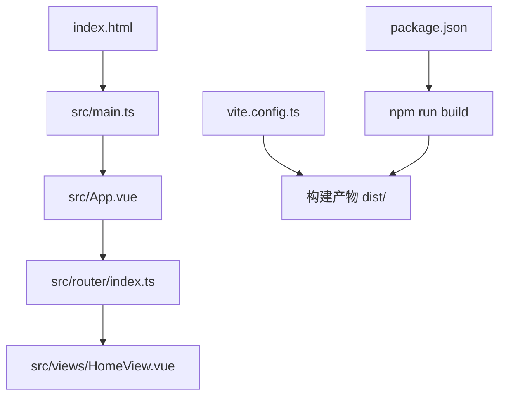
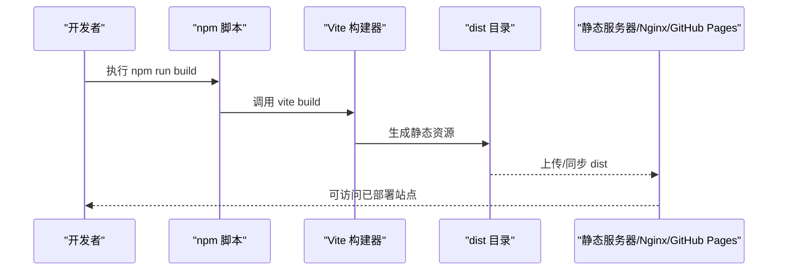
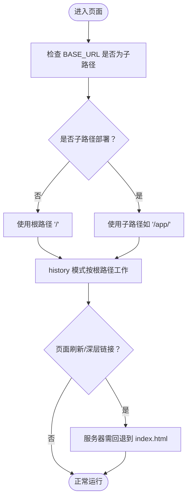
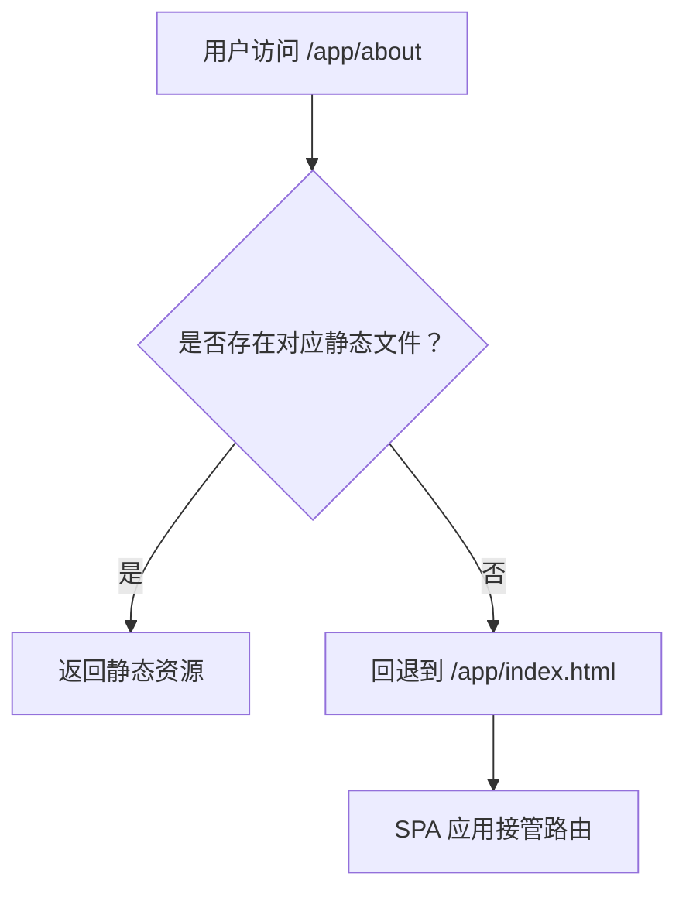
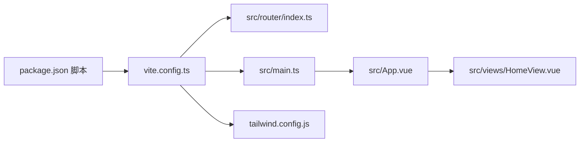

# 前端部署

<cite>
**本文引用的文件**
- [frontend/vite.config.ts](file://frontend/vite.config.ts)
- [frontend/package.json](file://frontend/package.json)
- [frontend/index.html](file://frontend/index.html)
- [frontend/src/main.ts](file://frontend/src/main.ts)
- [frontend/src/router/index.ts](file://frontend/src/router/index.ts)
- [frontend/README.md](file://frontend/README.md)
- [frontend/src/views/HomeView.vue](file://frontend/src/views/HomeView.vue)
- [frontend/tailwind.config.js](file://frontend/tailwind.config.js)
</cite>

## 目录
1. [简介](#简介)
2. [项目结构](#项目结构)
3. [核心组件](#核心组件)
4. [架构总览](#架构总览)
5. [详细组件分析](#详细组件分析)
6. [依赖分析](#依赖分析)
7. [性能考虑](#性能考虑)
8. [故障排查指南](#故障排查指南)
9. [结论](#结论)
10. [附录](#附录)

## 简介
本指南面向前端部署场景，围绕通过 npm run build 命令完成生产构建、生成 dist 目录下的静态资源，并结合 vite.config.ts 中的路径与别名配置，说明其对构建输出的影响。同时提供将构建产物部署到 Nginx、Vite 静态服务器以及 GitHub Pages 的实践建议，强调环境适配要点：相对路径处理、路由模式（hash/history）在部署时的影响，以及与后端 API 通信的跨域配置协调。

## 项目结构
前端采用 Vite + Vue 3 技术栈，关键入口与配置如下：
- 构建脚本与工具：package.json 提供 dev/build/preview 等脚本
- 应用入口：index.html 引入应用主模块 main.ts
- 应用初始化：main.ts 创建并挂载应用，注册路由与状态管理
- 路由配置：router/index.ts 使用 createWebHistory 并受 BASE_URL 影响
- 构建配置：vite.config.ts 定义插件与路径别名
- 样式与内容：Tailwind 配置声明内容扫描范围

图表来源
- [frontend/index.html](file://frontend/index.html#L1-L14)
- [frontend/src/main.ts](file://frontend/src/main.ts#L1-L15)
- [frontend/src/router/index.ts](file://frontend/src/router/index.ts#L1-L24)
- [frontend/src/views/HomeView.vue](file://frontend/src/views/HomeView.vue#L1-L232)
- [frontend/vite.config.ts](file://frontend/vite.config.ts#L1-L19)
- [frontend/package.json](file://frontend/package.json#L1-L51)

章节来源
- [frontend/README.md](file://frontend/README.md#L1-L55)
- [frontend/package.json](file://frontend/package.json#L1-L51)
- [frontend/index.html](file://frontend/index.html#L1-L14)
- [frontend/src/main.ts](file://frontend/src/main.ts#L1-L15)
- [frontend/src/router/index.ts](file://frontend/src/router/index.ts#L1-L24)
- [frontend/vite.config.ts](file://frontend/vite.config.ts#L1-L19)
- [frontend/tailwind.config.js](file://frontend/tailwind.config.js#L1-L11)

## 核心组件
- 构建脚本与产物
  - 生产构建命令：npm run build，内部调用 vite build 生成 dist 目录
  - 预览命令：npm run preview 在本地预览 dist 内容
- 路由与基础路径
  - 路由使用 createWebHistory，受 import.meta.env.BASE_URL 控制
  - 若未显式设置 BASE_URL，浏览器默认使用根路径“/”，影响 history 模式下的页面刷新与深层链接
- 路径别名与解析
  - vite.config.ts 设置 @ 别名指向 src 目录，便于 import 语句使用相对 src 的路径
  - 该别名仅在开发与构建阶段生效，不影响最终 dist 中的资源引用（打包器会解析为实际路径）

章节来源
- [frontend/package.json](file://frontend/package.json#L1-L51)
- [frontend/src/router/index.ts](file://frontend/src/router/index.ts#L1-L24)
- [frontend/vite.config.ts](file://frontend/vite.config.ts#L1-L19)

## 架构总览
下图展示从构建到部署的关键流程：开发者执行 npm run build，Vite 依据配置进行打包，生成 dist；随后将 dist 部署至目标服务器或托管平台。

图表来源
- [frontend/package.json](file://frontend/package.json#L1-L51)
- [frontend/vite.config.ts](file://frontend/vite.config.ts#L1-L19)

## 详细组件分析

### 构建与输出
- 构建命令
  - 使用 npm run build 触发生产构建，内部委托 vite build
  - 构建完成后，dist 目录包含 HTML、JS、CSS、图片等静态资源
- 输出目录
  - 默认输出目录为 dist（Vite 默认行为）
  - 如需自定义输出目录，可在 vite.config.ts 中添加构建配置项（例如 outDir）
- 资源引用
  - index.html 中的静态资源路径应使用绝对路径（以 / 开头），避免相对路径在非根路径部署时失效
  - 通过别名 @ 可简化导入路径，但不会改变最终打包后的资源路径

章节来源
- [frontend/package.json](file://frontend/package.json#L1-L51)
- [frontend/index.html](file://frontend/index.html#L1-L14)
- [frontend/vite.config.ts](file://frontend/vite.config.ts#L1-L19)

### 路由与基础路径（BASE_URL）
- 路由模式
  - 当前使用 createWebHistory，依赖浏览器 history API
  - 在 history 模式下，页面刷新或直接访问深层链接需要服务器正确回退到 index.html
- 基础路径影响
  - BASE_URL 会影响 history API 的基准路径
  - 若部署在子路径（如 /app/），需设置 BASE_URL 为该子路径，否则刷新会 404
- 部署建议
  - 根路径部署：无需设置 BASE_URL 或设为 /
  - 子路径部署：设置 BASE_URL 为部署子路径，确保 history 模式正常工作

图表来源
- [frontend/src/router/index.ts](file://frontend/src/router/index.ts#L1-L24)

章节来源
- [frontend/src/router/index.ts](file://frontend/src/router/index.ts#L1-L24)

### API 与跨域配置
- API 基础地址
  - HomeView.vue 中使用了固定后端地址（开发环境示例）
  - 生产部署时应改为动态或通过环境变量注入，避免硬编码
- 跨域与代理
  - 开发期可使用 Vite 代理解决跨域
  - 生产期需在后端服务或反向代理层配置 CORS，或统一域名部署消除跨域
- 建议
  - 将 API 地址抽象为环境变量，区分开发/测试/生产
  - 后端开启允许的 Origin、方法与头部，必要时支持凭证

章节来源
- [frontend/src/views/HomeView.vue](file://frontend/src/views/HomeView.vue#L1-L232)

### 静态服务器部署

#### Nginx 部署
- 基本思路
  - 将 dist 目录作为静态资源根目录
  - 对 SPA（history 模式）配置回退到 index.html，保证刷新与深层链接可用
- 示例要点
  - 静态资源根目录指向 dist
  - 配置回退规则，将未匹配的路径重写到 /index.html
  - 配置缓存与安全响应头（如 CSP、HSTS）
- 注意事项
  - 若部署在子路径，需配合设置 BASE_URL 与服务器回退路径一致

图表来源
- [frontend/src/router/index.ts](file://frontend/src/router/index.ts#L1-L24)
- [frontend/index.html](file://frontend/index.html#L1-L14)

#### Vite 静态服务器
- 本地预览
  - 使用 npm run preview 在本地验证 dist 内容
- 生产部署
  - 可将 dist 直接部署到任意静态服务器
  - 若使用 Vite 的静态服务器能力，注意其默认监听与安全策略

章节来源
- [frontend/package.json](file://frontend/package.json#L1-L51)

#### GitHub Pages 部署
- 基本流程
  - 将 dist 作为发布分支的根目录
  - 若部署在子路径，需设置仓库 Pages 的基础路径与 BASE_URL 保持一致
- 注意事项
  - history 模式需服务器回退到 index.html（可通过 GitHub Actions 自动化）
  - 静态资源路径使用绝对路径，避免相对路径导致的 404

章节来源
- [frontend/index.html](file://frontend/index.html#L1-L14)
- [frontend/src/router/index.ts](file://frontend/src/router/index.ts#L1-L24)

## 依赖分析
- 构建链路
  - npm run build -> vite build -> 读取 vite.config.ts -> 打包 src 与静态资源 -> 输出 dist
- 关键依赖
  - Vue 3、Vue Router、Pinia：应用功能与路由
  - Tailwind：样式扫描范围由 tailwind.config.js 指定
  - Vite 插件：Vue 支持与开发工具

图表来源
- [frontend/package.json](file://frontend/package.json#L1-L51)
- [frontend/vite.config.ts](file://frontend/vite.config.ts#L1-L19)
- [frontend/src/router/index.ts](file://frontend/src/router/index.ts#L1-L24)
- [frontend/src/main.ts](file://frontend/src/main.ts#L1-L15)
- [frontend/src/views/HomeView.vue](file://frontend/src/views/HomeView.vue#L1-L232)
- [frontend/tailwind.config.js](file://frontend/tailwind.config.js#L1-L11)

章节来源
- [frontend/package.json](file://frontend/package.json#L1-L51)
- [frontend/vite.config.ts](file://frontend/vite.config.ts#L1-L19)
- [frontend/src/router/index.ts](file://frontend/src/router/index.ts#L1-L24)
- [frontend/src/main.ts](file://frontend/src/main.ts#L1-L15)
- [frontend/src/views/HomeView.vue](file://frontend/src/views/HomeView.vue#L1-L232)
- [frontend/tailwind.config.js](file://frontend/tailwind.config.js#L1-L11)

## 性能考虑
- 资源优化
  - 启用代码分割与懒加载（路由级懒加载已存在）
  - 压缩与 Tree Shaking（Vite 默认启用）
- 缓存策略
  - 为静态资源设置长缓存，HTML 设置短缓存
  - 版本化资源名称（Vite 默认 hash）
- 资源路径
  - 使用绝对路径引用静态资源，避免相对路径在子路径部署时失效
- 构建时间
  - 分离类型检查与构建任务，减少重复编译

章节来源
- [frontend/package.json](file://frontend/package.json#L1-L51)
- [frontend/index.html](file://frontend/index.html#L1-L14)

## 故障排查指南
- 页面刷新 404（history 模式）
  - 确认服务器已将未匹配路径回退到 index.html
  - 确认 BASE_URL 与部署路径一致
- 资源 404（子路径部署）
  - 检查静态资源是否使用绝对路径（以 / 开头）
  - 确认服务器根目录指向 dist
- 路由跳转异常
  - 检查路由 history 配置与 BASE_URL
  - 若问题复杂，可临时切换为 hash 模式验证
- API 跨域错误
  - 生产期在后端或反向代理层开启 CORS
  - 避免在前端硬编码后端地址，使用环境变量注入

章节来源
- [frontend/src/router/index.ts](file://frontend/src/router/index.ts#L1-L24)
- [frontend/index.html](file://frontend/index.html#L1-L14)
- [frontend/src/views/HomeView.vue](file://frontend/src/views/HomeView.vue#L1-L232)

## 结论
- 通过 npm run build 生成 dist 静态资源，结合 vite.config.ts 的别名与插件配置，可稳定产出可部署产物
- 部署时务必关注 BASE_URL 与服务器回退策略，确保 history 模式正常工作
- 将 API 地址抽象为环境变量并在后端配置跨域，避免生产期出现跨域与路径问题
- 推荐优先使用绝对路径与版本化资源，提升缓存命中与部署稳定性

## 附录
- 快速操作清单
  - 执行 npm run build 生成 dist
  - 将 dist 部署到目标服务器或托管平台
  - 若为子路径部署，设置 BASE_URL 与服务器回退一致
  - 在后端或反向代理层配置 CORS，或统一域名部署
  - 使用绝对路径引用静态资源，避免相对路径问题