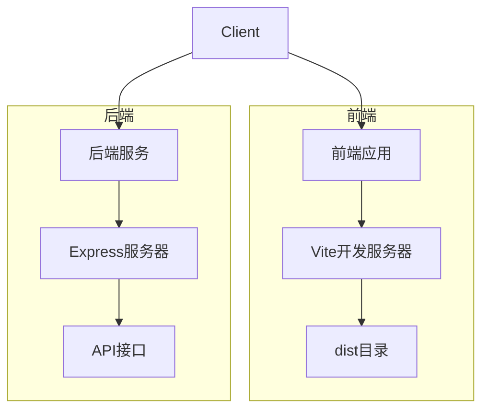
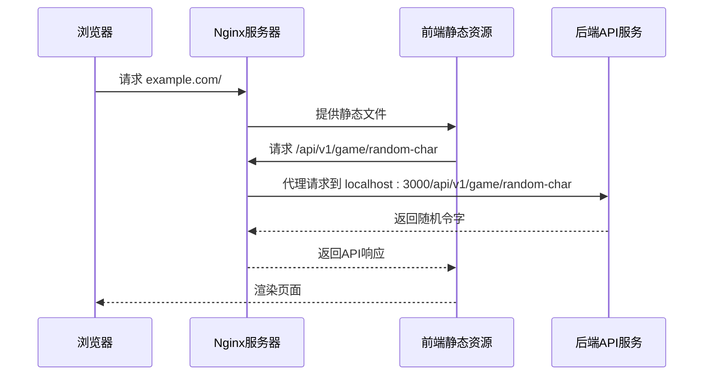

# 反向代理配置

<cite>
**本文档引用的文件**
- [vite.config.ts](file://frontend/vite.config.ts)
- [index.ts](file://backend/src/index.ts)
- [package.json](file://backend/package.json)
- [package.json](file://frontend/package.json)
- [GEMINI.md](file://GEMINI.md)
</cite>

## 目录
1. [简介](#简介)
2. [项目结构与服务入口](#项目结构与服务入口)
3. [核心组件分析](#核心组件分析)
4. [Nginx反向代理配置](#nginx反向代理配置)
5. [前后端协同机制](#前后端协同机制)
6. [生产级配置建议](#生产级配置建议)
7. [结论](#结论)

## 简介
本文档旨在提供一套完整的反向代理配置指南，指导如何通过Nginx等代理服务器将前端静态资源与后端API服务整合到同一域名下，解决跨域问题。文档基于实际项目结构，涵盖从开发配置到生产部署的完整流程，包括路由规则、HTTPS配置、缓存策略和负载均衡等关键要素。

## 项目结构与服务入口
本项目采用前后端分离架构，前端使用Vite构建，后端基于Express框架。前端静态资源位于`dist`目录，通过Vite开发服务器在`localhost:5173`运行；后端API服务在`localhost:3000`监听，所有API接口统一以`/api/v1`为前缀。



**Diagram sources**
- [vite.config.ts](file://frontend/vite.config.ts)
- [index.ts](file://backend/src/index.ts)

**Section sources**
- [vite.config.ts](file://frontend/vite.config.ts)
- [index.ts](file://backend/src/index.ts)

## 核心组件分析
前端通过Vite进行构建和开发，其配置文件`vite.config.ts`定义了基本的构建行为和路径别名。后端使用Express框架提供RESTful API服务，API路由统一以`/api/v1`为前缀，符合项目约定。前后端通过HTTP协议进行通信，前端通过AJAX请求调用后端API。

**Section sources**
- [vite.config.ts](file://frontend/vite.config.ts#L1-L19)
- [index.ts](file://backend/src/index.ts#L1-L78)

## Nginx反向代理配置
以下是Nginx的典型配置示例，用于将前端静态资源和后端API服务整合到同一域名下：

```nginx
server {
    listen 80;
    server_name example.com;

    # 前端静态资源
    location / {
        root /path/to/dist;
        try_files $uri $uri/ /index.html;
        index index.html;
    }

    # 后端API代理
    location /api/ {
        proxy_pass http://localhost:3000/;
        proxy_set_header Host $host;
        proxy_set_header X-Real-IP $remote_addr;
        proxy_set_header X-Forwarded-For $proxy_add_x_forwarded_for;
        proxy_set_header X-Forwarded-Proto $scheme;
    }
}
```

该配置实现了：
- 根路径(`/`)指向前端静态文件目录
- `/api/`路径代理至后端服务`localhost:3000`
- 自动处理前端路由的`try_files`指令
- 必要的代理头信息传递

**Section sources**
- [vite.config.ts](file://frontend/vite.config.ts)
- [index.ts](file://backend/src/index.ts)

## 前后端协同机制
前端Vite配置与后端API前缀协同工作，确保开发和生产环境的一致性。根据项目约定，所有API路由统一使用`/api/v1`前缀，这在后端Express路由中明确体现。前端在开发环境中可通过Vite的代理功能解决跨域问题，而在生产环境中则依赖Nginx反向代理实现无缝集成。



**Diagram sources**
- [vite.config.ts](file://frontend/vite.config.ts)
- [index.ts](file://backend/src/index.ts)

**Section sources**
- [vite.config.ts](file://frontend/vite.config.ts)
- [index.ts](file://backend/src/index.ts)
- [GEMINI.md](file://GEMINI.md#L15-L21)

## 生产级配置建议
### HTTPS配置
建议启用HTTPS以确保通信安全：

```nginx
server {
    listen 443 ssl;
    server_name example.com;
    
    ssl_certificate /path/to/certificate.crt;
    ssl_certificate_key /path/to/private.key;
    
    # 其他配置同上
}
```

### 缓存策略
为静态资源配置适当的缓存：

```nginx
location ~* \.(js|css|png|jpg|jpeg|gif|ico|svg)$ {
    expires 1y;
    add_header Cache-Control "public, immutable";
}
```

### 负载均衡
对于高可用部署，可配置负载均衡：

```nginx
upstream backend {
    server localhost:3000;
    server localhost:3001;
    server localhost:3002;
}

location /api/ {
    proxy_pass http://backend/;
    # 其他代理配置
}
```

**Section sources**
- [index.ts](file://backend/src/index.ts)
- [package.json](file://backend/package.json)
- [package.json](file://frontend/package.json)

## 结论
通过Nginx反向代理配置，可以有效整合前后端服务，解决跨域问题，并提供统一的访问入口。合理的路由规则、HTTPS配置、缓存策略和负载均衡设置，能够确保应用在生产环境中的安全性、性能和可靠性。前后端遵循统一的API前缀约定，有助于维护开发和生产环境的一致性。