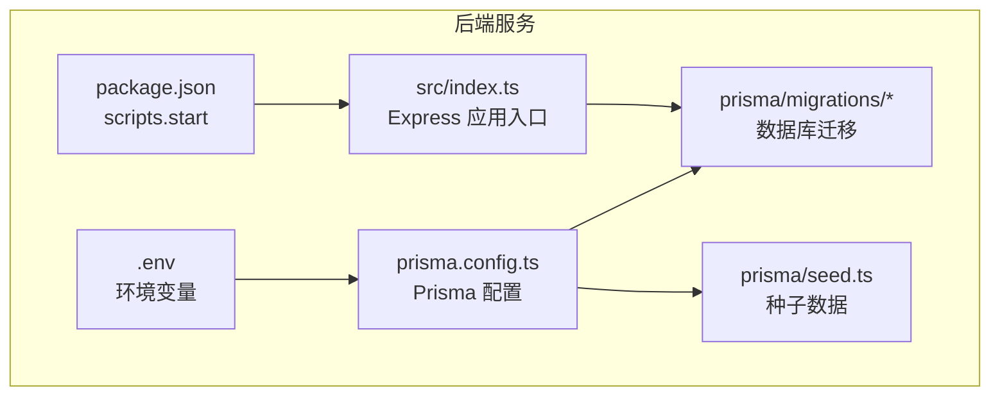
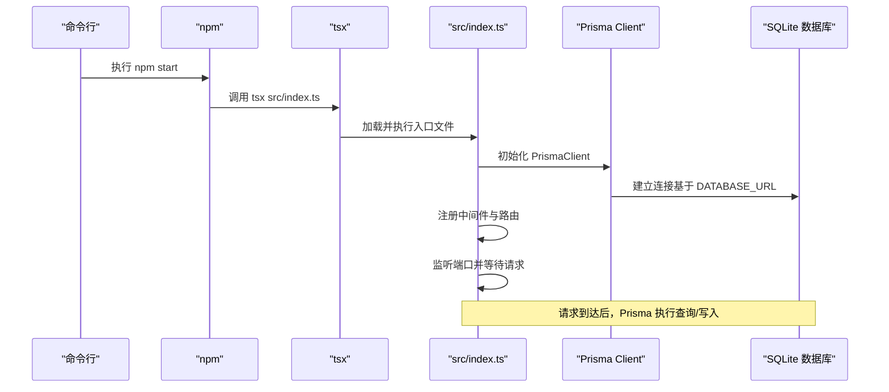
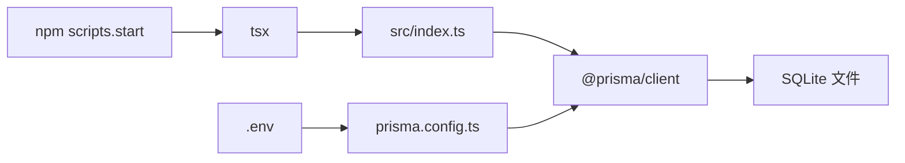

# 后端服务部署

<cite>
**本文引用的文件**
- [backend/package.json](file://backend/package.json)
- [backend/src/index.ts](file://backend/src/index.ts)
- [backend/.env](file://backend/.env)
- [backend/prisma.config.ts](file://backend/prisma.config.ts)
- [backend/prisma/seed.ts](file://backend/prisma/seed.ts)
- [backend/prisma/migrations/20251104061144_init/migration.sql](file://backend/prisma/migrations/20251104061144_init/migration.sql)
- [backend/prisma/migrations/migration_lock.toml](file://backend/prisma/migrations/migration_lock.toml)
</cite>

## 目录
1. [简介](#简介)
2. [项目结构](#项目结构)
3. [核心组件](#核心组件)
4. [架构总览](#架构总览)
5. [详细组件分析](#详细组件分析)
6. [依赖关系分析](#依赖关系分析)
7. [性能与稳定性考虑](#性能与稳定性考虑)
8. [故障排查指南](#故障排查指南)
9. [结论](#结论)
10. [附录：部署操作步骤](#附录部署操作步骤)

## 简介
本指南面向生产服务器部署后端 Express 服务，覆盖以下要点：
- 在生产服务器安装 Node.js 运行环境
- 安装项目依赖（npm install）
- 通过 npm start 启动服务的完整流程
- 解释 package.json 中 start 脚本的执行逻辑
- 说明 tsx 如何加载 TypeScript 文件
- 配置生产环境变量（.env），重点说明 DATABASE_URL 指向 SQLite 数据库文件的路径设置
- 使用 PM2 等进程管理工具守护服务的建议配置
- 强调数据库文件权限管理和环境变量安全保护的最佳实践

## 项目结构
后端服务位于 backend 目录，采用 TypeScript 编写，使用 Prisma 管理 SQLite 数据库。核心文件包括：
- 入口文件：backend/src/index.ts
- 启动脚本：backend/package.json 的 scripts.start
- 环境变量：backend/.env
- Prisma 配置：backend/prisma.config.ts
- 数据库迁移与种子数据：backend/prisma/migrations/* 与 backend/prisma/seed.ts

图表来源
- [backend/package.json](file://backend/package.json#L1-L30)
- [backend/src/index.ts](file://backend/src/index.ts#L1-L78)
- [backend/.env](file://backend/.env#L1-L1)
- [backend/prisma.config.ts](file://backend/prisma.config.ts#L1-L14)
- [backend/prisma/seed.ts](file://backend/prisma/seed.ts#L1-L53)
- [backend/prisma/migrations/20251104061144_init/migration.sql](file://backend/prisma/migrations/20251104061144_init/migration.sql#L1-L8)
- [backend/prisma/migrations/migration_lock.toml](file://backend/prisma/migrations/migration_lock.toml#L1-L3)

章节来源
- [backend/package.json](file://backend/package.json#L1-L30)
- [backend/src/index.ts](file://backend/src/index.ts#L1-L78)
- [backend/.env](file://backend/.env#L1-L1)
- [backend/prisma.config.ts](file://backend/prisma.config.ts#L1-L14)
- [backend/prisma/seed.ts](file://backend/prisma/seed.ts#L1-L53)
- [backend/prisma/migrations/20251104061144_init/migration.sql](file://backend/prisma/migrations/20251104061144_init/migration.sql#L1-L8)
- [backend/prisma/migrations/migration_lock.toml](file://backend/prisma/migrations/migration_lock.toml#L1-L3)

## 核心组件
- Express 应用入口：负责初始化 CORS、JSON 解析、路由与监听端口
- Prisma 客户端：用于访问 SQLite 数据库
- 环境变量：通过 dotenv 加载 DATABASE_URL，驱动 Prisma 数据源
- 启动脚本：使用 tsx 直接运行 TypeScript 入口文件

章节来源
- [backend/src/index.ts](file://backend/src/index.ts#L1-L78)
- [backend/package.json](file://backend/package.json#L1-L30)
- [backend/.env](file://backend/.env#L1-L1)
- [backend/prisma.config.ts](file://backend/prisma.config.ts#L1-L14)

## 架构总览
下图展示从启动到请求处理的关键流程，以及数据库访问路径。

图表来源
- [backend/package.json](file://backend/package.json#L1-L30)
- [backend/src/index.ts](file://backend/src/index.ts#L1-L78)
- [backend/prisma.config.ts](file://backend/prisma.config.ts#L1-L14)
- [backend/.env](file://backend/.env#L1-L1)

## 详细组件分析

### 启动脚本与 tsx 运行机制
- package.json 中的 start 脚本通过 tsx 直接运行 TypeScript 入口文件，无需预先编译为 JavaScript。
- tsx 会解析入口文件及其依赖，按需加载 TypeScript 模块，支持 import 语法与类型检查提示。
- 该模式适合开发与小规模生产，便于快速迭代；在高并发或需要稳定二进制分发场景，可考虑预编译。

章节来源
- [backend/package.json](file://backend/package.json#L1-L30)
- [backend/src/index.ts](file://backend/src/index.ts#L1-L78)

### Express 应用与路由
- 初始化 CORS 与 JSON 中间件，统一处理跨域与请求体解析。
- 提供三个 API：
  - GET /api/v1/game/random-char：随机返回一首诗中的一个字符
  - POST /api/v1/game/verify：校验用户输入的诗句是否包含令字且未重复
  - POST /api/v1/game/ai-turn：根据令字生成可用诗句
- 应用监听端口，默认取自环境变量 PORT，否则回退至固定值。

章节来源
- [backend/src/index.ts](file://backend/src/index.ts#L1-L78)

### 数据库与 Prisma 配置
- Prisma 配置通过 prisma.config.ts 指定 schema、迁移目录与引擎模式，并从环境变量读取数据源 URL。
- 迁移文件定义了 Poem 表结构，迁移锁文件表明使用 sqlite provider。
- 种子脚本用于初始化示例数据，删除旧数据并批量插入格式化后的诗词内容。

章节来源
- [backend/prisma.config.ts](file://backend/prisma.config.ts#L1-L14)
- [backend/prisma/migrations/20251104061144_init/migration.sql](file://backend/prisma/migrations/20251104061144_init/migration.sql#L1-L8)
- [backend/prisma/migrations/migration_lock.toml](file://backend/prisma/migrations/migration_lock.toml#L1-L3)
- [backend/prisma/seed.ts](file://backend/prisma/seed.ts#L1-L53)

### 环境变量与数据库 URL
- .env 中的 DATABASE_URL 使用 file: 协议指向 SQLite 文件路径。
- 生产环境中应确保该路径对运行用户可读写，并具备合适的权限与磁盘空间。
- 若使用相对路径，需确认工作目录与部署路径一致。

章节来源
- [backend/.env](file://backend/.env#L1-L1)
- [backend/prisma.config.ts](file://backend/prisma.config.ts#L1-L14)

## 依赖关系分析
- 启动链路：npm start -> tsx -> src/index.ts -> PrismaClient -> SQLite
- 关键依赖：express、@prisma/client、sqlite3、ts-node、typescript
- Prisma 配置依赖 dotenv，以加载 .env 中的 DATABASE_URL

图表来源
- [backend/package.json](file://backend/package.json#L1-L30)
- [backend/src/index.ts](file://backend/src/index.ts#L1-L78)
- [backend/prisma.config.ts](file://backend/prisma.config.ts#L1-L14)
- [backend/.env](file://backend/.env#L1-L1)

章节来源
- [backend/package.json](file://backend/package.json#L1-L30)
- [backend/src/index.ts](file://backend/src/index.ts#L1-L78)
- [backend/prisma.config.ts](file://backend/prisma.config.ts#L1-L14)
- [backend/.env](file://backend/.env#L1-L1)

## 性能与稳定性考虑
- 端口监听：应用默认从环境变量读取端口，建议在生产中显式设置 PORT 并绑定防火墙策略。
- 数据库并发：SQLite 在高并发写入场景存在竞争风险，建议评估业务并发量，必要时引入连接池或升级为更稳健的数据库。
- 内存与资源：tsx 作为解释器运行，内存占用通常高于编译产物；生产建议配合进程管理器进行健康监控与自动重启。
- 日志与错误：当前应用未显式配置日志输出，建议在生产中接入统一日志系统并记录关键错误。

[本节为通用建议，不直接分析具体文件]

## 故障排查指南
- 启动失败（端口被占用）：检查 PORT 设置与系统占用情况，更换端口或释放占用。
- 数据库连接失败：核对 DATABASE_URL 路径是否存在、权限是否正确、文件是否可读写。
- Prisma 报错（迁移相关）：确认 prisma/schema.prisma 存在且与迁移目录匹配，必要时重新生成迁移或修复 schema。
- 环境变量未生效：确认 .env 已被 dotenv 加载，且路径与工作目录一致。

章节来源
- [backend/src/index.ts](file://backend/src/index.ts#L1-L78)
- [backend/.env](file://backend/.env#L1-L1)
- [backend/prisma.config.ts](file://backend/prisma.config.ts#L1-L14)
- [backend/prisma/migrations/20251104061144_init/migration.sql](file://backend/prisma/migrations/20251104061144_init/migration.sql#L1-L8)

## 结论
本指南提供了在生产服务器上部署后端 Express 服务的完整路径：安装 Node.js、安装依赖、通过 npm start 启动、理解 tsx 的运行机制、配置 DATABASE_URL 指向 SQLite 文件、结合 PM2 进行守护，并强调数据库文件权限与环境变量安全的重要性。建议在生产环境中进一步完善日志、监控与备份策略，以提升系统的稳定性与可观测性。

[本节为总结性内容，不直接分析具体文件]

## 附录：部署操作步骤
- 准备服务器
  - 安装 Node.js（满足 Prisma 客户端的最低版本要求）
  - 准备数据库文件存储目录，确保运行用户对该目录具有读写权限
- 克隆与安装
  - 将项目克隆到生产服务器
  - 在 backend 目录执行安装依赖命令
- 配置环境变量
  - 在 backend/.env 中设置 DATABASE_URL，指向 SQLite 文件路径（建议使用绝对路径）
  - 可选：设置 PORT、NODE_ENV 等其他生产所需变量
- 初始化数据库
  - 执行 Prisma 迁移以创建表结构
  - 如需初始数据，可执行种子脚本
- 启动服务
  - 使用 npm start 启动服务（tsx 直接运行 TypeScript 入口）
  - 或使用 PM2 等进程管理工具进行守护
- 守护与运维
  - 使用 PM2 管理进程，配置自动重启、日志轮转与健康检查
  - 定期备份数据库文件与 .env
  - 监控端口、CPU、内存与数据库连接状态

章节来源
- [backend/package.json](file://backend/package.json#L1-L30)
- [backend/src/index.ts](file://backend/src/index.ts#L1-L78)
- [backend/.env](file://backend/.env#L1-L1)
- [backend/prisma.config.ts](file://backend/prisma.config.ts#L1-L14)
- [backend/prisma/seed.ts](file://backend/prisma/seed.ts#L1-L53)
- [backend/prisma/migrations/20251104061144_init/migration.sql](file://backend/prisma/migrations/20251104061144_init/migration.sql#L1-L8)
- [backend/prisma/migrations/migration_lock.toml](file://backend/prisma/migrations/migration_lock.toml#L1-L3)