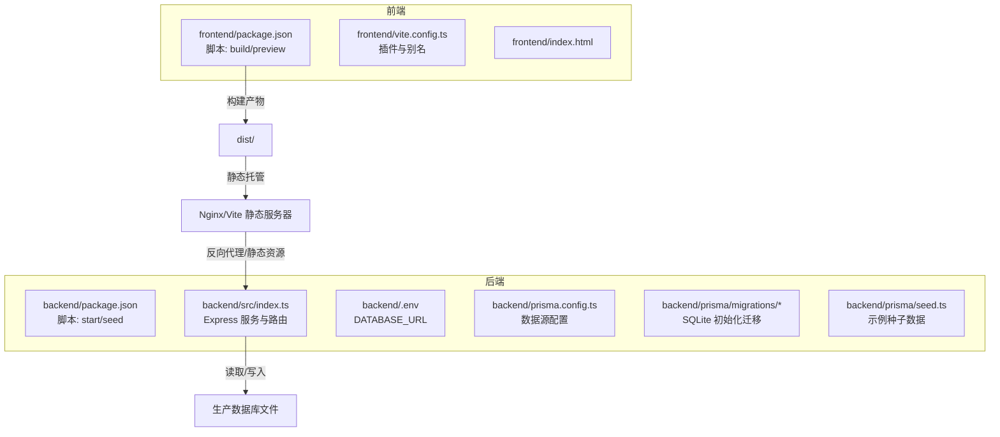
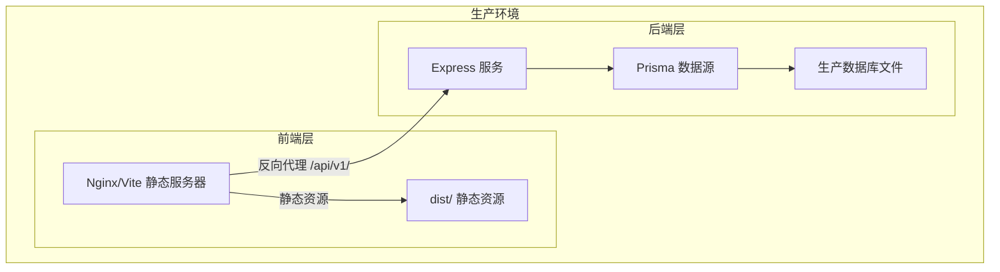
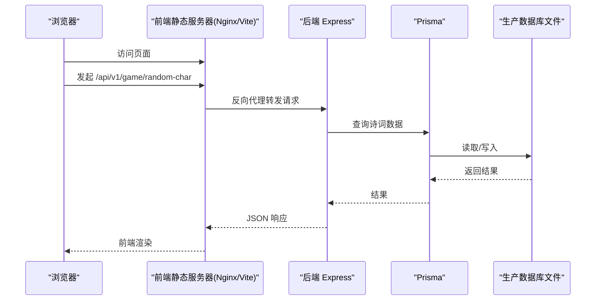
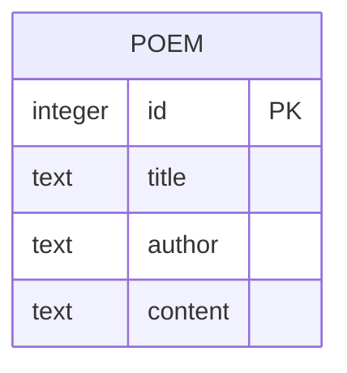
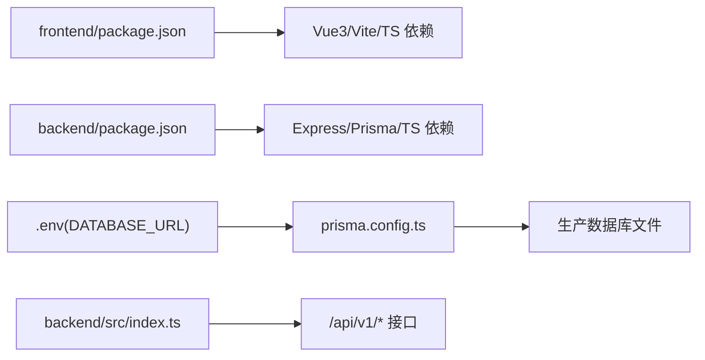

# 部署指南

<cite>
**本文引用的文件**
- [backend/package.json](file://backend/package.json)
- [backend/src/index.ts](file://backend/src/index.ts)
- [backend/.env](file://backend/.env)
- [backend/prisma.config.ts](file://backend/prisma.config.ts)
- [backend/prisma/migrations/20251104061144_init/migration.sql](file://backend/prisma/migrations/20251104061144_init/migration.sql)
- [backend/prisma/seed.ts](file://backend/prisma/seed.ts)
- [frontend/package.json](file://frontend/package.json)
- [frontend/vite.config.ts](file://frontend/vite.config.ts)
- [frontend/index.html](file://frontend/index.html)
- [GEMINI.md](file://GEMINI.md)
</cite>

## 目录
1. [简介](#简介)
2. [项目结构](#项目结构)
3. [核心组件](#核心组件)
4. [架构总览](#架构总览)
5. [详细组件分析](#详细组件分析)
6. [依赖关系分析](#依赖关系分析)
7. [性能与稳定性建议](#性能与稳定性建议)
8. [故障排查指南](#故障排查指南)
9. [结论](#结论)
10. [附录](#附录)

## 简介
本指南面向生产环境部署，提供前后端分离部署方案。前端通过 npm run build 生成静态产物，可由 Nginx 或 Vite 静态服务器托管；后端在服务器上安装 Node.js 环境，构建并启动 Express 服务（npm start），确保 DATABASE_URL 指向生产数据库文件。文档强调前后端部署路径的协调，如将前端构建产物部署到后端服务的静态资源目录，或通过反向代理统一域名。同时给出 PM2 进程管理建议与基础安全配置（环境变量保护、数据库文件权限）。

## 项目结构
- 后端采用 Node.js + Express + Prisma，提供统一前缀为 /api/v1/ 的 REST 接口。
- 前端采用 Vue3 + TypeScript + Vite，构建产物默认输出至 dist 目录。
- 数据库使用 SQLite，开发阶段使用本地文件 dev.db，生产需替换为持久化数据库文件。

图表来源
- [frontend/package.json](file://frontend/package.json#L1-L51)
- [frontend/vite.config.ts](file://frontend/vite.config.ts#L1-L19)
- [frontend/index.html](file://frontend/index.html#L1-L14)
- [backend/package.json](file://backend/package.json#L1-L30)
- [backend/src/index.ts](file://backend/src/index.ts#L1-L78)
- [backend/.env](file://backend/.env#L1-L1)
- [backend/prisma.config.ts](file://backend/prisma.config.ts#L1-L14)
- [backend/prisma/migrations/20251104061144_init/migration.sql](file://backend/prisma/migrations/20251104061144_init/migration.sql#L1-L8)
- [backend/prisma/seed.ts](file://backend/prisma/seed.ts#L1-L53)

章节来源
- [GEMINI.md](file://GEMINI.md#L1-L21)
- [frontend/package.json](file://frontend/package.json#L1-L51)
- [backend/package.json](file://backend/package.json#L1-L30)

## 核心组件
- 前端构建与运行
  - 使用 Vite 构建，脚本定义了 build、preview 等命令，适合生产打包与预览。
  - 构建产物默认输出至 dist 目录，可通过 Nginx 或 Vite 静态服务器托管。
- 后端服务与数据库
  - Express 应用监听端口，提供 /api/v1/ 前缀的接口。
  - Prisma 通过 prisma.config.ts 读取 DATABASE_URL 环境变量，开发默认使用本地 SQLite 文件 dev.db。
  - 初始迁移文件创建 Poem 表，种子脚本用于初始化示例数据。

章节来源
- [frontend/package.json](file://frontend/package.json#L1-L51)
- [frontend/vite.config.ts](file://frontend/vite.config.ts#L1-L19)
- [backend/src/index.ts](file://backend/src/index.ts#L1-L78)
- [backend/prisma.config.ts](file://backend/prisma.config.ts#L1-L14)
- [backend/prisma/migrations/20251104061144_init/migration.sql](file://backend/prisma/migrations/20251104061144_init/migration.sql#L1-L8)
- [backend/prisma/seed.ts](file://backend/prisma/seed.ts#L1-L53)

## 架构总览
生产部署推荐两种路径：
- 方案一：前后端同域
  - 将前端构建产物 dist 放置于后端静态资源目录，由后端 Express 提供静态资源访问，统一域名。
- 方案二：前后端分离
  - 前端通过 Nginx 或 Vite 静态服务器对外提供页面；后端独立运行，通过反向代理将 /api/v1/ 请求转发到后端服务。

图表来源
- [frontend/package.json](file://frontend/package.json#L1-L51)
- [backend/src/index.ts](file://backend/src/index.ts#L1-L78)
- [backend/prisma.config.ts](file://backend/prisma.config.ts#L1-L14)
- [backend/.env](file://backend/.env#L1-L1)

## 详细组件分析

### 前端构建与部署
- 构建流程
  - 使用 npm run build 生成 dist 目录静态文件。
  - 可选：使用 npm run preview 在本地预览构建效果。
- 静态托管
  - 方案 A：将 dist 直接作为后端静态资源目录，统一域名，避免跨域问题。
  - 方案 B：使用 Nginx 或 Vite 静态服务器对外提供页面，后端通过反向代理处理 /api/v1/ 请求。
- 路由与入口
  - index.html 中挂载根节点，入口脚本位于 src/main.ts，构建后由 Vite 打包到 dist。

章节来源
- [frontend/package.json](file://frontend/package.json#L1-L51)
- [frontend/vite.config.ts](file://frontend/vite.config.ts#L1-L19)
- [frontend/index.html](file://frontend/index.html#L1-L14)

### 后端服务与数据库
- 服务启动
  - 使用 npm start 启动 Express 应用，默认监听端口由环境变量控制。
- 接口约定
  - 所有接口以 /api/v1/ 为前缀，便于反向代理与统一管理。
- 数据库配置
  - DATABASE_URL 通过 .env 传入，Prisma 从 prisma.config.ts 读取该值。
  - 开发默认使用 SQLite 文件 dev.db，生产需替换为持久化数据库文件（例如远程 MySQL/PostgreSQL 或本地持久化 SQLite 文件）。
- 初始化与迁移
  - 初始迁移文件创建 Poem 表，种子脚本可用于初始化示例数据。

图表来源
- [backend/src/index.ts](file://backend/src/index.ts#L1-L78)
- [backend/prisma.config.ts](file://backend/prisma.config.ts#L1-L14)
- [backend/.env](file://backend/.env#L1-L1)

章节来源
- [backend/src/index.ts](file://backend/src/index.ts#L1-L78)
- [backend/.env](file://backend/.env#L1-L1)
- [backend/prisma.config.ts](file://backend/prisma.config.ts#L1-L14)
- [backend/prisma/migrations/20251104061144_init/migration.sql](file://backend/prisma/migrations/20251104061144_init/migration.sql#L1-L8)
- [backend/prisma/seed.ts](file://backend/prisma/seed.ts#L1-L53)

### 数据模型与迁移
- Poem 表包含主键、标题、作者、内容等字段，用于存储诗词数据。
- 初始迁移文件定义了表结构，生产部署时需确保迁移已执行。

图表来源
- [backend/prisma/migrations/20251104061144_init/migration.sql](file://backend/prisma/migrations/20251104061144_init/migration.sql#L1-L8)

章节来源
- [backend/prisma/migrations/20251104061144_init/migration.sql](file://backend/prisma/migrations/20251104061144_init/migration.sql#L1-L8)

## 依赖关系分析
- 前端依赖
  - Vue3、Vue Router、Pinia、Vite 插件等，构建脚本由 package.json 定义。
- 后端依赖
  - Express、Prisma、@prisma/client、sqlite3、ts-node、cors 等。
- 关键配置
  - DATABASE_URL 通过 .env 注入，Prisma 从 prisma.config.ts 读取。
  - Express 应用提供 /api/v1/ 前缀接口。

图表来源
- [frontend/package.json](file://frontend/package.json#L1-L51)
- [backend/package.json](file://backend/package.json#L1-L30)
- [backend/.env](file://backend/.env#L1-L1)
- [backend/prisma.config.ts](file://backend/prisma.config.ts#L1-L14)
- [backend/src/index.ts](file://backend/src/index.ts#L1-L78)

章节来源
- [frontend/package.json](file://frontend/package.json#L1-L51)
- [backend/package.json](file://backend/package.json#L1-L30)
- [backend/.env](file://backend/.env#L1-L1)
- [backend/prisma.config.ts](file://backend/prisma.config.ts#L1-L14)
- [backend/src/index.ts](file://backend/src/index.ts#L1-L78)

## 性能与稳定性建议
- 静态资源优化
  - 前端构建启用压缩与缓存策略，结合 CDN 加速（可选）。
- 反向代理与负载均衡
  - 使用 Nginx 或反向代理统一域名，将 /api/v1/ 转发到后端服务，减少跨域与证书复杂度。
- 进程管理
  - 使用 PM2 管理后端进程，支持自动重启、日志聚合与健康检查。
- 数据库与文件系统
  - 生产数据库文件放置在具备持久化能力的存储介质上，设置合适的文件权限与备份策略。
- 端口与网络
  - 后端监听端口由环境变量控制，确保防火墙放行对应端口。

[本节为通用建议，无需特定文件引用]

## 故障排查指南
- 接口 404/400
  - 确认前端是否正确调用 /api/v1/ 前缀接口，后端路由是否按约定实现。
- 数据库连接失败
  - 检查 DATABASE_URL 是否正确指向生产数据库文件或服务地址，确认 .env 已生效。
- 构建产物未生效
  - 确认 dist 目录已部署到静态服务器或后端静态资源目录，路径与 Nginx/Vite 配置一致。
- CORS 问题
  - 后端已启用 CORS 中间件，若仍出现跨域，请检查反向代理与域名配置。

章节来源
- [backend/src/index.ts](file://backend/src/index.ts#L1-L78)
- [backend/.env](file://backend/.env#L1-L1)

## 结论
本指南提供了前后端分离的生产部署路径与关键配置要点。前端通过 npm run build 生成静态产物，后端通过 npm start 启动服务并使用 Prisma 连接生产数据库。推荐将前端产物部署在后端静态资源目录或通过反向代理统一域名，配合 PM2 实现进程管理与基础安全配置，确保系统稳定运行。

[本节为总结性内容，无需特定文件引用]

## 附录
- 前端构建命令
  - npm run build
  - npm run preview
- 后端启动命令
  - npm start
- 数据库配置
  - 在 .env 中设置 DATABASE_URL，指向生产数据库文件或服务地址。
- 项目约定
  - API 路由统一前缀 /api/v1/，便于部署与代理。

章节来源
- [frontend/package.json](file://frontend/package.json#L1-L51)
- [backend/package.json](file://backend/package.json#L1-L30)
- [backend/.env](file://backend/.env#L1-L1)
- [GEMINI.md](file://GEMINI.md#L1-L21)