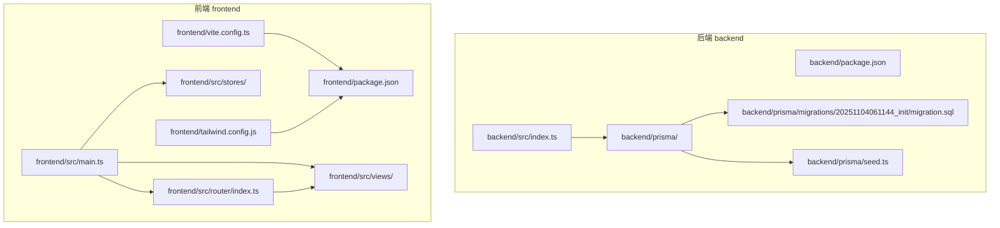
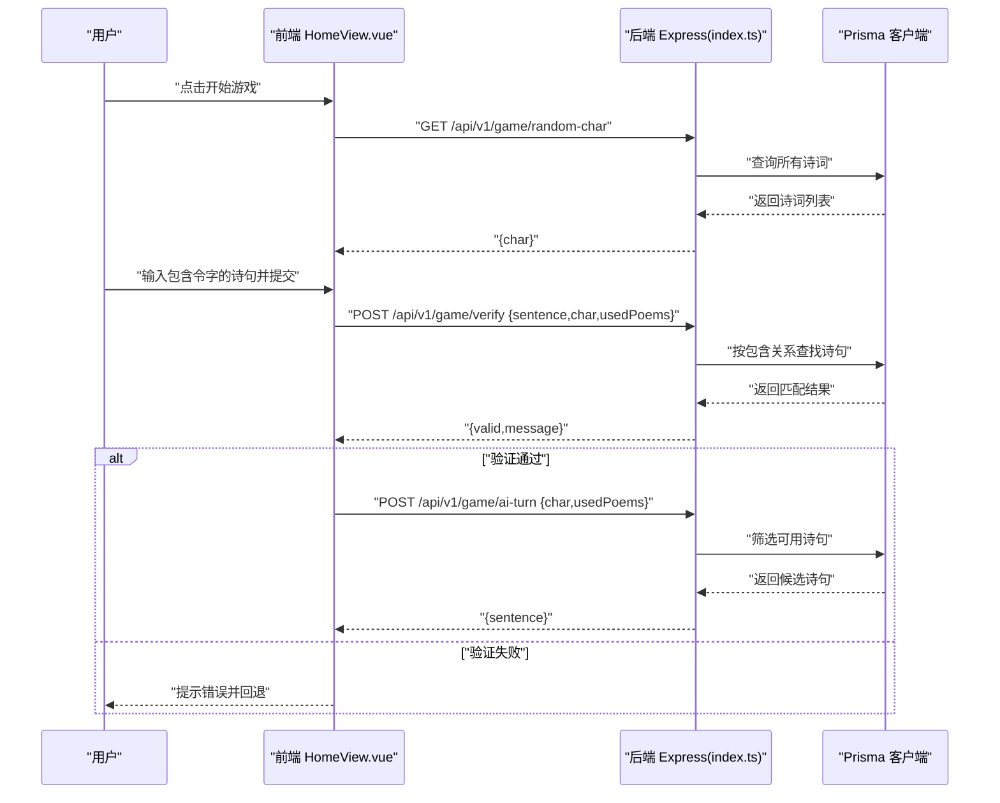
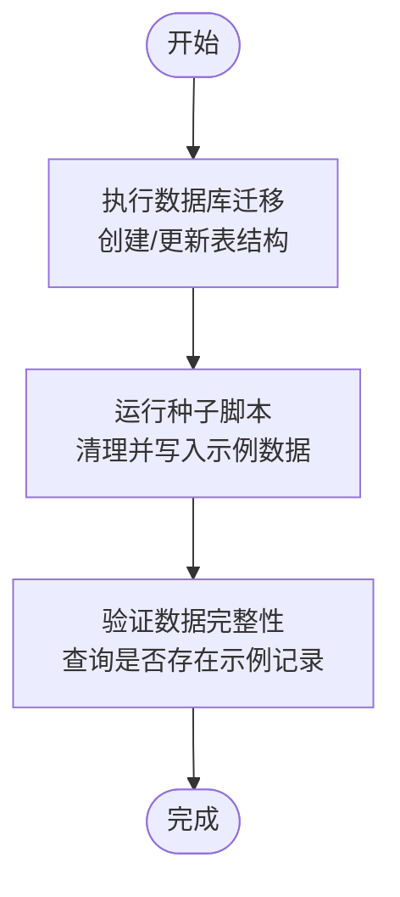
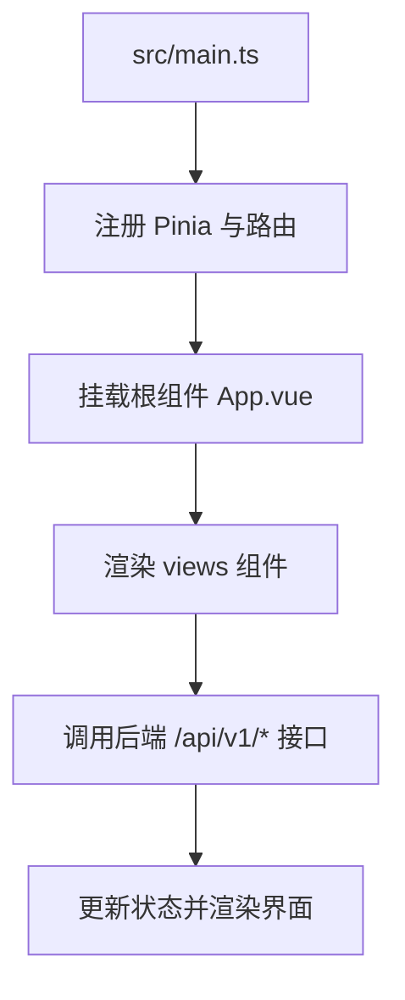
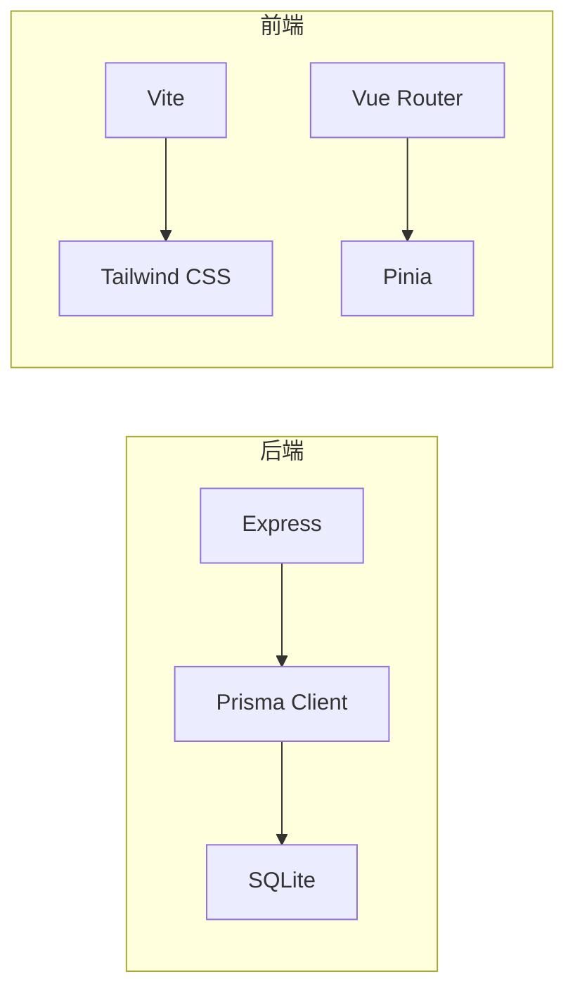

# 目录结构详解

<cite>
**本文引用的文件**
- [backend/src/index.ts](file://backend/src/index.ts)
- [backend/prisma/seed.ts](file://backend/prisma/seed.ts)
- [backend/prisma/migrations/20251104061144_init/migration.sql](file://backend/prisma/migrations/20251104061144_init/migration.sql)
- [backend/package.json](file://backend/package.json)
- [frontend/src/main.ts](file://frontend/src/main.ts)
- [frontend/src/router/index.ts](file://frontend/src/router/index.ts)
- [frontend/src/views/HomeView.vue](file://frontend/src/views/HomeView.vue)
- [frontend/src/views/AboutView.vue](file://frontend/src/views/AboutView.vue)
- [frontend/src/stores/counter.ts](file://frontend/src/stores/counter.ts)
- [frontend/vite.config.ts](file://frontend/vite.config.ts)
- [frontend/tailwind.config.js](file://frontend/tailwind.config.js)
- [frontend/package.json](file://frontend/package.json)
- [GEMINI.md](file://GEMINI.md)
</cite>

## 目录
1. [引言](#引言)
2. [项目结构](#项目结构)
3. [核心组件](#核心组件)
4. [架构总览](#架构总览)
5. [详细组件分析](#详细组件分析)
6. [依赖关系分析](#依赖关系分析)
7. [性能考量](#性能考量)
8. [故障排查指南](#故障排查指南)
9. [结论](#结论)
10. [附录](#附录)

## 引言
本文件面向新成员与维护者，系统梳理 feihua_ling 的目录组织与职责边界，重点覆盖：
- 后端 backend/ 模块：Prisma 数据库迁移与种子数据、Express 入口与 API 设计
- 前端 frontend/ 模块：页面组件、路由、状态管理、静态资源与构建配置
- 结合 GEMINI.md 中的约定（如 API 前缀、组件存放路径）说明目录命名规范如何提升可读性与可维护性
- 提供清晰的导航地图，帮助快速定位功能与扩展点

## 项目结构
项目采用前后端分离的双根目录结构，分别独立管理依赖与运行方式：
- backend/：后端服务，基于 Node.js + Express + Prisma，提供飞花令游戏所需的 API
- frontend/：前端应用，基于 Vue3 + TypeScript + Vite + Tailwind CSS，负责用户交互与展示

图表来源
- [backend/src/index.ts](file://backend/src/index.ts#L1-L78)
- [backend/prisma/migrations/20251104061144_init/migration.sql](file://backend/prisma/migrations/20251104061144_init/migration.sql#L1-L8)
- [backend/prisma/seed.ts](file://backend/prisma/seed.ts#L1-L53)
- [frontend/src/main.ts](file://frontend/src/main.ts#L1-L15)
- [frontend/src/router/index.ts](file://frontend/src/router/index.ts#L1-L24)
- [frontend/vite.config.ts](file://frontend/vite.config.ts#L1-L19)
- [frontend/tailwind.config.js](file://frontend/tailwind.config.js#L1-L11)
- [frontend/package.json](file://frontend/package.json#L1-L51)
- [backend/package.json](file://backend/package.json#L1-L30)

章节来源
- [GEMINI.md](file://GEMINI.md#L1-L21)
- [backend/package.json](file://backend/package.json#L1-L30)
- [frontend/package.json](file://frontend/package.json#L1-L51)

## 核心组件
- 后端 Express 入口：提供三个核心 API，分别用于获取令字、校验用户诗句、以及 AI 回合生成
- Prisma 数据层：通过迁移创建 Poem 表，通过种子脚本初始化示例诗词数据
- 前端应用入口：注册 Pinia、路由与全局样式，挂载根组件
- 前端路由与视图：HomeView 承载游戏主流程，AboutView 作为占位页面
- 前端状态管理：counter 示例 Store 展示 Pinia 使用方式
- 构建与样式：Vite 插件链路与 Tailwind 内容扫描范围

章节来源
- [backend/src/index.ts](file://backend/src/index.ts#L1-L78)
- [backend/prisma/migrations/20251104061144_init/migration.sql](file://backend/prisma/migrations/20251104061144_init/migration.sql#L1-L8)
- [backend/prisma/seed.ts](file://backend/prisma/seed.ts#L1-L53)
- [frontend/src/main.ts](file://frontend/src/main.ts#L1-L15)
- [frontend/src/router/index.ts](file://frontend/src/router/index.ts#L1-L24)
- [frontend/src/views/HomeView.vue](file://frontend/src/views/HomeView.vue#L1-L232)
- [frontend/src/views/AboutView.vue](file://frontend/src/views/AboutView.vue#L1-L16)
- [frontend/src/stores/counter.ts](file://frontend/src/stores/counter.ts#L1-L13)
- [frontend/vite.config.ts](file://frontend/vite.config.ts#L1-L19)
- [frontend/tailwind.config.js](file://frontend/tailwind.config.js#L1-L11)

## 架构总览
后端以 Express 提供 REST 风格 API，前端通过 fetch 调用后端接口，实现“令字抽取—玩家出句—AI 应对”的回合制交互。

图表来源
- [frontend/src/views/HomeView.vue](file://frontend/src/views/HomeView.vue#L1-L232)
- [backend/src/index.ts](file://backend/src/index.ts#L1-L78)

## 详细组件分析

### 后端：Express 主入口与 API 设计
- 角色定位：作为后端服务入口，负责处理游戏相关 API 请求
- 关键职责：
  - 获取随机令字：从诗词库中随机挑选一首诗与一个字符
  - 验证用户诗句：校验是否包含令字、是否重复使用、是否存在于库中
  - AI 回合：根据令字筛选可用诗句，返回一条合适的句子
- 设计要点：
  - 统一 API 前缀：/api/v1/，便于版本化与扩展
  - 参数校验：缺失参数直接返回错误
  - 错误处理：针对空库、找不到诗句、AI 无可选句等情况给出明确信息
- 性能与扩展：
  - 当前实现为内存级随机选择，适合小规模数据
  - 可引入索引与分页、缓存热门诗词，优化高频查询

章节来源
- [backend/src/index.ts](file://backend/src/index.ts#L1-L78)
- [GEMINI.md](file://GEMINI.md#L16-L21)

### 数据层：Prisma 迁移与种子数据
- 迁移文件：
  - 作用：定义 Poem 表结构（id、title、author、content）
  - 影响：确保团队数据库结构一致，支持增量演进
- 种子脚本：
  - 作用：清理旧数据、格式化示例数据、批量写入
  - 影响：提供初始可用数据，便于开发与演示
- 初始化流程建议：
  - 新环境先执行迁移，再执行种子脚本
  - 在 CI 中自动化迁移与种子，保证测试环境一致性

图表来源
- [backend/prisma/migrations/20251104061144_init/migration.sql](file://backend/prisma/migrations/20251104061144_init/migration.sql#L1-L8)
- [backend/prisma/seed.ts](file://backend/prisma/seed.ts#L1-L53)

章节来源
- [backend/prisma/migrations/20251104061144_init/migration.sql](file://backend/prisma/migrations/20251104061144_init/migration.sql#L1-L8)
- [backend/prisma/seed.ts](file://backend/prisma/seed.ts#L1-L53)
- [backend/package.json](file://backend/package.json#L1-L30)

### 前端：应用入口与页面组件
- 应用入口：
  - 注册 Pinia、路由与全局样式
  - 创建并挂载根应用实例
- 页面组件：
  - HomeView.vue：承载游戏主流程（开始、历史、输入、消息提示）
  - AboutView.vue：占位页面，演示路由懒加载
- 交互逻辑：
  - 通过 fetch 调用后端 API，处理响应与错误
  - 维护游戏状态（令字、历史、轮次、提示语）

图表来源
- [frontend/src/main.ts](file://frontend/src/main.ts#L1-L15)
- [frontend/src/views/HomeView.vue](file://frontend/src/views/HomeView.vue#L1-L232)
- [frontend/src/router/index.ts](file://frontend/src/router/index.ts#L1-L24)

章节来源
- [frontend/src/main.ts](file://frontend/src/main.ts#L1-L15)
- [frontend/src/views/HomeView.vue](file://frontend/src/views/HomeView.vue#L1-L232)
- [frontend/src/views/AboutView.vue](file://frontend/src/views/AboutView.vue#L1-L16)
- [frontend/src/router/index.ts](file://frontend/src/router/index.ts#L1-L24)

### 前端：路由与状态管理
- 路由配置：
  - 使用 history 模式，定义首页与关于页
  - 关于页采用异步加载，减少首屏体积
- 状态存储：
  - counter 示例展示 Pinia 的基本用法（ref、computed、action）
  - 可在此基础上扩展游戏状态（当前轮次、已用诗句集合、分数等）

章节来源
- [frontend/src/router/index.ts](file://frontend/src/router/index.ts#L1-L24)
- [frontend/src/stores/counter.ts](file://frontend/src/stores/counter.ts#L1-L13)

### 前端：构建与样式配置
- Vite 配置：
  - 启用 Vue 插件与 DevTools 插件
  - 设置路径别名 @ 指向 src，提升导入可读性
- Tailwind 配置：
  - content 覆盖根 HTML 与 src 下各类文件，确保按需生成样式
  - theme.extend 保持默认主题，避免过度定制

章节来源
- [frontend/vite.config.ts](file://frontend/vite.config.ts#L1-L19)
- [frontend/tailwind.config.js](file://frontend/tailwind.config.js#L1-L11)
- [frontend/package.json](file://frontend/package.json#L1-L51)

## 依赖关系分析
- 后端依赖：
  - Express 提供 Web 服务能力
  - Prisma 客户端访问 SQLite 数据库
  - CORS 支持跨域请求
- 前端依赖：
  - Vue3 + Vue Router + Pinia 构成 SPA 基础
  - Vite 提供开发与构建工具链
  - Tailwind CSS 提供原子化样式方案

图表来源
- [backend/package.json](file://backend/package.json#L1-L30)
- [frontend/package.json](file://frontend/package.json#L1-L51)

章节来源
- [backend/package.json](file://backend/package.json#L1-L30)
- [frontend/package.json](file://frontend/package.json#L1-L51)

## 性能考量
- 数据访问：
  - 当前验证与 AI 选择均在内存中进行，适合小规模数据
  - 建议后续引入全文检索或索引，提升按内容匹配效率
- 网络请求：
  - 前端 fetch 调用应增加超时与重试策略，提升弱网体验
- 构建优化：
  - 利用 Vite 的异步路由与按需加载，减少首屏体积
  - Tailwind 按需扫描可降低产物体积

## 故障排查指南
- 后端常见问题：
  - 端口占用：确认监听端口未被占用，或调整环境变量
  - 数据库连接：检查 Prisma 客户端初始化与迁移是否完成
  - API 返回 404：确认路由前缀与路径是否正确
- 前端常见问题：
  - 跨域错误：确认后端已启用 CORS
  - 路由空白：检查路由配置与组件导出
  - 样式未生效：确认 Tailwind content 路径与构建命令

章节来源
- [backend/src/index.ts](file://backend/src/index.ts#L1-L78)
- [frontend/src/main.ts](file://frontend/src/main.ts#L1-L15)
- [frontend/src/router/index.ts](file://frontend/src/router/index.ts#L1-L24)
- [frontend/tailwind.config.js](file://frontend/tailwind.config.js#L1-L11)

## 结论
本项目通过清晰的前后端分层与约定化的目录结构，实现了简洁而可扩展的游戏交互。后端以 Prisma 管理数据，前端以 Vue 生态构建交互，配合统一的 API 前缀与组件/工具存放约定，显著提升了可读性与可维护性。建议后续在数据访问与网络健壮性方面做进一步优化，以支撑更大规模的数据与用户并发。

## 附录
- 目录命名规范与约定（来自 GEMINI.md）：
  - API 路由统一前缀 /api/v1/
  - 组件放在 src/components/
  - 工具函数放在 src/utils/
  - 测试文件使用 .test.ts 后缀
- 导航地图（新成员速查）
  - 后端入口与 API：backend/src/index.ts
  - 数据迁移与种子：backend/prisma/migrations/、backend/prisma/seed.ts
  - 前端入口与路由：frontend/src/main.ts、frontend/src/router/index.ts
  - 页面组件：frontend/src/views/HomeView.vue、frontend/src/views/AboutView.vue
  - 状态管理：frontend/src/stores/counter.ts
  - 构建与样式：frontend/vite.config.ts、frontend/tailwind.config.js

章节来源
- [GEMINI.md](file://GEMINI.md#L1-L21)
- [backend/src/index.ts](file://backend/src/index.ts#L1-L78)
- [backend/prisma/seed.ts](file://backend/prisma/seed.ts#L1-L53)
- [frontend/src/main.ts](file://frontend/src/main.ts#L1-L15)
- [frontend/src/router/index.ts](file://frontend/src/router/index.ts#L1-L24)
- [frontend/src/views/HomeView.vue](file://frontend/src/views/HomeView.vue#L1-L232)
- [frontend/src/views/AboutView.vue](file://frontend/src/views/AboutView.vue#L1-L16)
- [frontend/src/stores/counter.ts](file://frontend/src/stores/counter.ts#L1-L13)
- [frontend/vite.config.ts](file://frontend/vite.config.ts#L1-L19)
- [frontend/tailwind.config.js](file://frontend/tailwind.config.js#L1-L11)