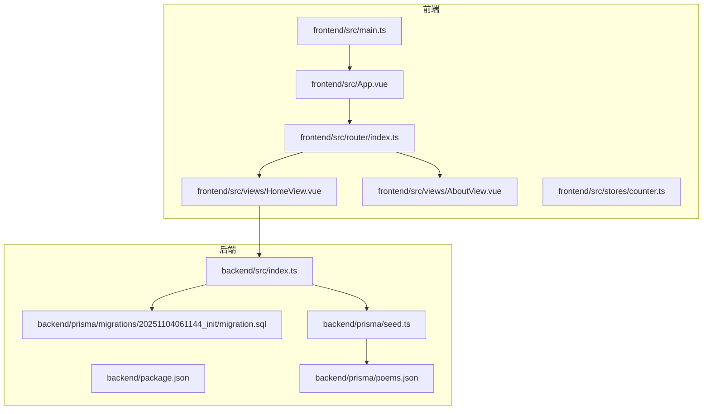
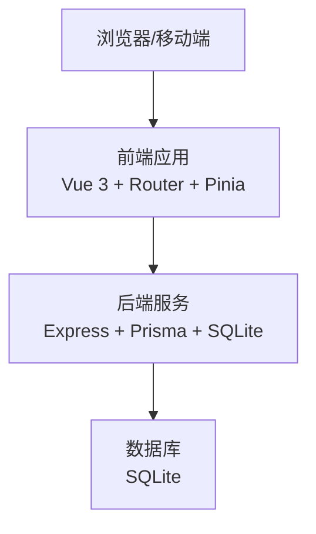
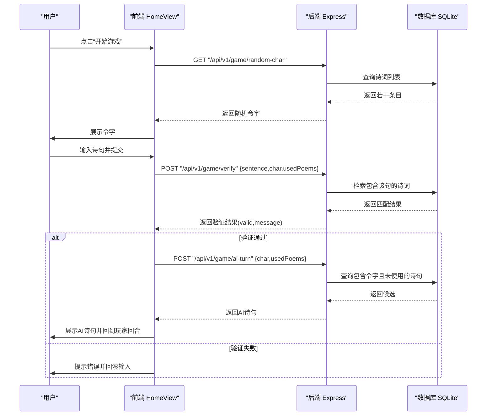
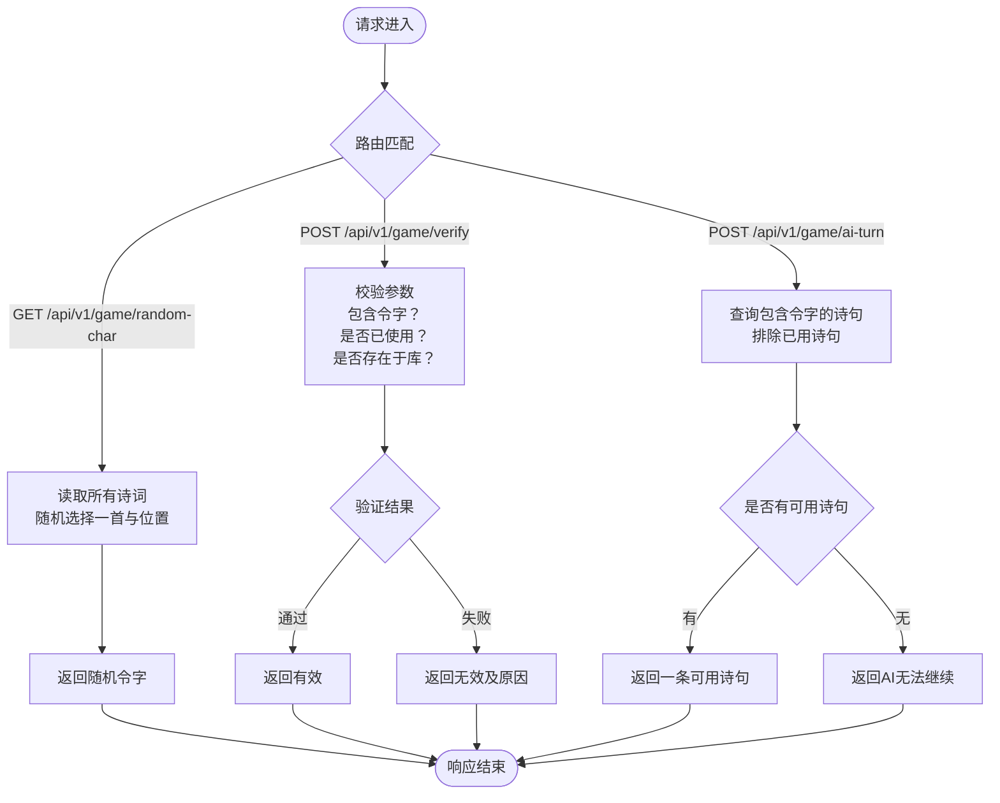

# 系统概述

<cite>
**本文引用的文件**
- [GEMINI.md](file://GEMINI.md)
- [backend/src/index.ts](file://backend/src/index.ts)
- [backend/package.json](file://backend/package.json)
- [backend/prisma/migrations/20251104061144_init/migration.sql](file://backend/prisma/migrations/20251104061144_init/migration.sql)
- [backend/prisma/seed.ts](file://backend/prisma/seed.ts)
- [backend/prisma/poems.json](file://backend/prisma/poems.json)
- [frontend/src/main.ts](file://frontend/src/main.ts)
- [frontend/src/App.vue](file://frontend/src/App.vue)
- [frontend/src/router/index.ts](file://frontend/src/router/index.ts)
- [frontend/src/views/HomeView.vue](file://frontend/src/views/HomeView.vue)
- [frontend/src/views/AboutView.vue](file://frontend/src/views/AboutView.vue)
- [frontend/src/stores/counter.ts](file://frontend/src/stores/counter.ts)
- [frontend/package.json](file://frontend/package.json)
</cite>

## 目录
1. [引言](#引言)
2. [项目结构](#项目结构)
3. [核心组件](#核心组件)
4. [架构总览](#架构总览)
5. [详细组件分析](#详细组件分析)
6. [依赖分析](#依赖分析)
7. [性能考虑](#性能考虑)
8. [故障排查指南](#故障排查指南)
9. [结论](#结论)
10. [附录](#附录)

## 引言
本项目是一个面向移动端的飞花令H5小游戏，采用前后端分离架构：前端使用Vue 3 + TypeScript + Pinia + Vue Router，后端使用Node.js + Express + Prisma + SQLite。系统通过统一的API前缀“/api/v1/”提供服务，核心功能包括：
- 令字生成：从诗词库中随机抽取一个字符作为本轮令字
- 诗句验证：校验玩家输入是否包含令字、是否已使用过、是否存在于诗词库
- AI回合：根据令字筛选可用诗句，模拟AI出招
- 防重复机制：记录已使用的诗句，避免重复使用

项目遵循团队约定，统一API前缀、组件与工具函数目录规范，便于协作与扩展。

## 项目结构
仓库采用多包结构（monorepo风格），前后端分别位于独立目录，便于独立开发与部署：
- backend：后端服务，包含Express服务器、Prisma ORM与SQLite迁移脚本
- frontend：前端应用，包含路由、状态管理、视图组件与样式
- GEMINI.md：项目约定与编码规范说明

图表来源
- [frontend/src/main.ts](file://frontend/src/main.ts#L1-L15)
- [frontend/src/App.vue](file://frontend/src/App.vue#L1-L19)
- [frontend/src/router/index.ts](file://frontend/src/router/index.ts#L1-L24)
- [frontend/src/views/HomeView.vue](file://frontend/src/views/HomeView.vue#L1-L118)
- [backend/src/index.ts](file://backend/src/index.ts#L1-L78)
- [backend/prisma/migrations/20251104061144_init/migration.sql](file://backend/prisma/migrations/20251104061144_init/migration.sql#L1-L8)
- [backend/prisma/seed.ts](file://backend/prisma/seed.ts#L1-L53)
- [backend/prisma/poems.json](file://backend/prisma/poems.json#L1-L1)

章节来源
- [GEMINI.md](file://GEMINI.md#L1-L21)
- [frontend/src/main.ts](file://frontend/src/main.ts#L1-L15)
- [frontend/src/App.vue](file://frontend/src/App.vue#L1-L19)
- [frontend/src/router/index.ts](file://frontend/src/router/index.ts#L1-L24)
- [frontend/src/views/HomeView.vue](file://frontend/src/views/HomeView.vue#L1-L118)
- [backend/src/index.ts](file://backend/src/index.ts#L1-L78)
- [backend/prisma/migrations/20251104061144_init/migration.sql](file://backend/prisma/migrations/20251104061144_init/migration.sql#L1-L8)
- [backend/prisma/seed.ts](file://backend/prisma/seed.ts#L1-L53)
- [backend/prisma/poems.json](file://backend/prisma/poems.json#L1-L1)

## 核心组件
- 前端游戏界面（HomeView）：负责发起游戏、展示历史、处理用户输入与AI回合
- 后端API：提供令字生成、诗句验证、AI回合三个核心接口
- 数据层：Prisma + SQLite，包含Poem表结构与种子数据
- 路由与状态：Vue Router负责页面导航；Pinia用于示例状态管理

章节来源
- [frontend/src/views/HomeView.vue](file://frontend/src/views/HomeView.vue#L1-L118)
- [backend/src/index.ts](file://backend/src/index.ts#L1-L78)
- [backend/prisma/migrations/20251104061144_init/migration.sql](file://backend/prisma/migrations/20251104061144_init/migration.sql#L1-L8)
- [backend/prisma/seed.ts](file://backend/prisma/seed.ts#L1-L53)
- [frontend/src/router/index.ts](file://frontend/src/router/index.ts#L1-L24)
- [frontend/src/stores/counter.ts](file://frontend/src/stores/counter.ts#L1-L13)

## 架构总览
系统采用前后端分离架构，前端通过HTTP调用后端API完成游戏交互。后端以Express提供REST风格接口，Prisma负责数据库访问与迁移，SQLite作为本地存储。

图表来源
- [frontend/src/views/HomeView.vue](file://frontend/src/views/HomeView.vue#L1-L118)
- [backend/src/index.ts](file://backend/src/index.ts#L1-L78)
- [backend/prisma/migrations/20251104061144_init/migration.sql](file://backend/prisma/migrations/20251104061144_init/migration.sql#L1-L8)

## 详细组件分析

### 前端组件：HomeView（游戏主界面）
- 功能职责
  - 初始化游戏状态（开始按钮、历史记录、令字、消息提示）
  - 获取令字：调用后端“/api/v1/game/random-char”
  - 提交诗句：调用后端“/api/v1/game/verify”，进行令字包含性、重复性与存在性校验
  - AI回合：调用后端“/api/v1/game/ai-turn”，展示AI出句并更新历史
  - 输入控制：仅玩家回合允许输入与提交
- 关键流程
  - 用户点击开始 -> 请求令字 -> 更新UI
  - 玩家输入 -> 验证 -> 成功则进入AI回合，失败则回滚并提示错误
  - AI回合 -> 返回诗句 -> 更新历史 -> 回到玩家回合或结束

图表来源
- [frontend/src/views/HomeView.vue](file://frontend/src/views/HomeView.vue#L1-L118)
- [backend/src/index.ts](file://backend/src/index.ts#L1-L78)
- [backend/prisma/migrations/20251104061144_init/migration.sql](file://backend/prisma/migrations/20251104061144_init/migration.sql#L1-L8)

章节来源
- [frontend/src/views/HomeView.vue](file://frontend/src/views/HomeView.vue#L1-L118)

### 后端服务：Express API
- 接口概览
  - GET “/api/v1/game/random-char”：随机返回一个令字
  - POST “/api/v1/game/verify”：验证诗句是否包含令字、是否已使用、是否存在诗词库
  - POST “/api/v1/game/ai-turn”：根据令字与已用诗句筛选AI可用诗句
- 数据模型
  - Poem 表：id、title、author、content
- 数据初始化
  - 通过种子脚本将多首诗词写入数据库，content为拼接后的整句

图表来源
- [backend/src/index.ts](file://backend/src/index.ts#L1-L78)
- [backend/prisma/migrations/20251104061144_init/migration.sql](file://backend/prisma/migrations/20251104061144_init/migration.sql#L1-L8)

章节来源
- [backend/src/index.ts](file://backend/src/index.ts#L1-L78)
- [backend/prisma/migrations/20251104061144_init/migration.sql](file://backend/prisma/migrations/20251104061144_init/migration.sql#L1-L8)
- [backend/prisma/seed.ts](file://backend/prisma/seed.ts#L1-L53)

### 数据层：Prisma + SQLite
- 表结构
  - Poem(id, title, author, content)
- 迁移
  - 初始迁移创建Poem表
- 种子数据
  - 通过脚本批量插入多首诗词，content为段落拼接后的完整诗句
- 注意事项
  - 当前种子数据文件路径返回404，需确认实际数据源与脚本执行环境

章节来源
- [backend/prisma/migrations/20251104061144_init/migration.sql](file://backend/prisma/migrations/20251104061144_init/migration.sql#L1-L8)
- [backend/prisma/seed.ts](file://backend/prisma/seed.ts#L1-L53)
- [backend/prisma/poems.json](file://backend/prisma/poems.json#L1-L1)

### 前端路由与应用入口
- 应用入口：注册Pinia与路由，挂载根组件
- 路由：定义首页与关于页，支持懒加载
- 视图：HomeView承载游戏逻辑；AboutView为占位页面

章节来源
- [frontend/src/main.ts](file://frontend/src/main.ts#L1-L15)
- [frontend/src/router/index.ts](file://frontend/src/router/index.ts#L1-L24)
- [frontend/src/views/AboutView.vue](file://frontend/src/views/AboutView.vue#L1-L16)

## 依赖分析
- 技术选型与影响
  - 前端：Vue 3 + TypeScript + Pinia + Vue Router，提供组件化与类型安全，利于大型应用维护
  - 后端：Express + Prisma + SQLite，轻量易部署，适合原型与小规模应用
  - 通信：前后端通过HTTP API交互，统一前缀“/api/v1/”便于版本化与扩展
- 依赖关系
  - 前端依赖axios（当前代码未直接使用）与构建工具链
  - 后端依赖Prisma客户端、SQLite驱动与Express中间件
- 可能的耦合点
  - 前端硬编码后端地址“http://localhost:3000/api/v1”，建议通过环境变量或配置中心管理
  - 种子数据文件路径异常，需修复以确保数据初始化

图表来源
- [frontend/src/views/HomeView.vue](file://frontend/src/views/HomeView.vue#L1-L118)
- [backend/src/index.ts](file://backend/src/index.ts#L1-L78)
- [backend/package.json](file://backend/package.json#L1-L30)
- [frontend/package.json](file://frontend/package.json#L1-L51)

章节来源
- [frontend/package.json](file://frontend/package.json#L1-L51)
- [backend/package.json](file://backend/package.json#L1-L30)

## 性能考虑
- 前端
  - 使用虚拟滚动或分页展示历史记录，避免超长列表导致渲染卡顿
  - 在AI回合增加节流/防抖，避免频繁请求
- 后端
  - 诗句验证与AI筛选基于字符串包含，建议在content字段建立索引以提升查询性能
  - 对高频接口增加缓存策略（如令字生成的短期缓存）
- 数据库
  - SQLite适合小规模数据，若诗词数量增长，建议评估迁移至更成熟的数据库或引入分页查询

## 故障排查指南
- 无法获取令字
  - 检查后端服务是否启动，确认端口与CORS配置
  - 检查数据库是否初始化成功（种子脚本执行）
- 诗句验证失败
  - 确认请求体包含sentence、char、usedPoems
  - 确认诗句确实包含令字且未被使用
  - 确认诗词库中存在该句
- AI回合无响应
  - 检查是否仍有可用诗句（usedPoems是否过度占用）
  - 检查后端返回状态与错误信息
- 种子数据问题
  - 确认种子脚本执行成功，数据文件路径正确

章节来源
- [backend/src/index.ts](file://backend/src/index.ts#L1-L78)
- [backend/prisma/seed.ts](file://backend/prisma/seed.ts#L1-L53)
- [frontend/src/views/HomeView.vue](file://frontend/src/views/HomeView.vue#L1-L118)

## 结论
本项目以简洁的技术栈实现了飞花令的核心玩法，前后端分离架构清晰，API前缀统一，便于后续扩展与维护。建议在以下方面持续改进：
- 将后端地址改为环境变量，提升部署灵活性
- 优化数据库索引与查询性能
- 增加单元测试与端到端测试覆盖
- 扩展AI策略与难度等级

## 附录
- 项目约定（来自GEMINI.md）
  - 编码规范：TypeScript严格模式、ESLint、注释中文
  - 架构说明：前端Vue3 + TS + Tailwind；后端Node.js + Express + Prisma
  - 项目约定：API统一前缀“/api/v1/”；组件放在“src/components/”；工具函数放在“src/utils/”；测试文件“.test.ts”

章节来源
- [GEMINI.md](file://GEMINI.md#L1-L21)